<style>
body {
    font-family: "Cabin", sans-serif;
}
p {
    font-family: "Cabin", sans-serif;
}
</style>


<a href="mailto:bedricks@ohsu.edu"><i class="fa fa-envelope fa-fw"></i>&nbsp; bedricks@ohsu.edu</a><br>
<a href="mailto:hillali@ohsu.edu"><i class="fa fa-envelope fa-fw"></i>&nbsp; hillali@ohsu.edu</a><br>
<a href="#"><i class="fa fa-map-marker fa-fw"></i>&nbsp; OHSU Gaines Hall 19 & 21 (we're neighbors)</a>


# Preliminaries 

For this workshop, Steven and I started with a whiteboard session where we came up with a bunch of ideas for exploring word use in these presidential debate transcripts. After much discussion, coffee, and lots of "it would be so cool if we could..." ideas, we settled on these questions to start our exploratory data analysis (EDA):

1. Which words were the most popular at the debates?
    - We'll calculate frequency of each word.
2. Who speaks the most?
    - We'll calculate share of words spoken by each candidate at each debate.
3. Do some candidates use more complex words than others?
    - We'll calculate word length and number of syllables per word to quantify "word complexity".
4. Do some candidates have a more diverse vocabulary than others?
    - We'll use candidate type-token ratios as an index of "lexical diversity": TTRs reflect the ratio of unique words to total words spoken; higher ratios suggesting a more diverse vocabulary and lower ratios suggesting a less diverse vocabulary.
5. Which words are most characteristic of each candidate?
    - We'll use loglikelihood to measure this.
6. Who is talking about whom?


# Install and load packages

We'll use a number of R packages for this workshop (remember: install once per machine, load once per work session). You'll need all the following packages installed first. [Here is a function](https://gist.github.com/stevenworthington/3178163) for doing this in one fell swoop:


```r
ipak <- function(pkg) {
    new.pkg <- pkg[!(pkg %in% installed.packages()[, "Package"])]
    if (length(new.pkg)) 
        install.packages(new.pkg, dependencies = TRUE)
    sapply(pkg, require, character.only = TRUE)
}
```


```r
pkgs <- c("readr", "dplyr", "tidyr", "stringr", "lubridate", "ggplot2", "wordcloud", 
    "devtools", "RColorBrewer", "dygraphs", "xts")  # list packages needed
ipak(pkgs)  # take function, and give it that list
```

Now we'll need to load 2 packages that are available only on Github, so we'll use the `devtools` package to run the function `install_github` to install then load those two packages. Note that the `devtools::` command is not needed here because we already loaded that package above. But this command is helpful if you just want to use a single function from a package like we are doing here.


```r
devtools::install_github("jbkunst/d3wordcloud")
library(d3wordcloud)
devtools::install_github("dill/beyonce")
library(beyonce)
```


# Read in the transcripts

We'll use the `readr` package to read in our master_counts.csv file.


```r
master_counts <- read_csv("./data/master_counts.csv", col_names = FALSE)
```

Now we have created an R object called `master_counts`, and it contains all the data stored in the csv file we made in Python. Let's find out what kind of object we just made- fingers are crossed that it is a dataframe, which makes life easier in R...


```r
str(master_counts)  # str here stands for structure
```

```
Classes 'tbl_df', 'tbl' and 'data.frame':	63763 obs. of  6 variables:
 $ X1: chr  "04 Feb 2016" "04 Feb 2016" "04 Feb 2016" "04 Feb 2016" ...
 $ X2: chr  "democrats" "democrats" "democrats" "democrats" ...
 $ X3: chr  "moderator" "candidate" "candidate" "candidate" ...
 $ X4: chr  "TODD" "SANDERS" "CLINTON" "SANDERS" ...
 $ X5: chr  "campaign" "results" "endorse" "california" ...
 $ X6: int  2 1 1 1 1 1 3 1 2 2 ...
 - attr(*, "spec")=List of 2
  ..$ cols   :List of 6
  .. ..$ X1: list()
  .. .. ..- attr(*, "class")= chr  "collector_character" "collector"
  .. ..$ X2: list()
  .. .. ..- attr(*, "class")= chr  "collector_character" "collector"
  .. ..$ X3: list()
  .. .. ..- attr(*, "class")= chr  "collector_character" "collector"
  .. ..$ X4: list()
  .. .. ..- attr(*, "class")= chr  "collector_character" "collector"
  .. ..$ X5: list()
  .. .. ..- attr(*, "class")= chr  "collector_character" "collector"
  .. ..$ X6: list()
  .. .. ..- attr(*, "class")= chr  "collector_integer" "collector"
  ..$ default: list()
  .. ..- attr(*, "class")= chr  "collector_guess" "collector"
  ..- attr(*, "class")= chr "col_spec"
```

Neat, data.frame is one of the classes, and you can see that we have 6 variables. Since we have a dataframe, we can re-name our 6 variables with more sensible names than X1, X2, etc. by using `names()`.


```r
names(master_counts) <- c("date", "party", "speaker_type", "speaker", "word", 
    "counts")
```

Did that work? We'll use `dplyr::glimpse` instead of `str` to do a quick sanity-check; compare the outputs for yourself.


```r
glimpse(master_counts)  # dplyr verb for dataframes
```

```
Observations: 63,763
Variables: 6
$ date         <chr> "04 Feb 2016", "04 Feb 2016", "04 Feb 2016", "04 ...
$ party        <chr> "democrats", "democrats", "democrats", "democrats...
$ speaker_type <chr> "moderator", "candidate", "candidate", "candidate...
$ speaker      <chr> "TODD", "SANDERS", "CLINTON", "SANDERS", "SANDERS...
$ word         <chr> "campaign", "results", "endorse", "california", "...
$ counts       <int> 2, 1, 1, 1, 1, 1, 3, 1, 2, 2, 1, 1, 1, 1, 1, 1, 1...
```

# Data wrangling

## Remove non-candidates

Looking at the above output, you can see that one of our variables is named `speaker_type`, which looks to be one of two character strings: moderator or candidate. Let's look more closely at this.


```r
master_counts %>%
  select(speaker_type) %>% # select just this 1 variable
  distinct() # yup, just one of 2 things
```

```
# A tibble: 2 × 1
  speaker_type
         <chr>
1    moderator
2    candidate
```

```r
master_counts %>%
  filter(speaker_type == "candidate") %>% # cands only
  distinct(speaker) %>% # unique names only
  arrange(speaker) # put list in alphabetical order
```

```
# A tibble: 31 × 1
    speaker
      <chr>
1  AUDIENCE
2  BROWNLEE
3      BUSH
4    CARSON
5    CHAFEE
6  CHRISTIE
7   CLINTON
8    CRAMER
9      CRUZ
10 EPPERSON
# ... with 21 more rows
```

So we confirmed that we have moderators and candidates as speakers, but woops! We see we have an 'AUDIENCE' candidate in the democratic party (who booed x2), and a lot of other unusual sounding speakers who are classified as candidates. Lesson of the day: always perform sanity checks with #otherpeoplesdata. Here is our plan:

1. Make a list of all the speakers that are actual candidates, then filter only those candidates into my new dataframe, which we'll call `cand_counts`. 
2. We also discovered a bug on UCSB site for downloading transcripts from the Aug GOP debate, which cuts off about halfway through, so we will also exclude that debate.
3. See where EPPERSON used the word "k"? We might want to look back at the Python script for parsing the transcripts and figure out what happened there, but for now we'll exclude 1-letter words. But we need a way to measure the length of each word, so we know when length = 1. We'll use the `stringr` package to calculate `str_length`, then use `dplyr::filter` to exclude rows where length = 1.


```r
real_cands <- c("CLINTON", "SANDERS", "CHAFEE", "WEBB", "OMALLEY", "BUSH", "CARSON", 
    "CHRISTIE", "CRUZ", "HUCKABEE", "KASICH", "FIORINA", "RUBIO", "PAUL", "TRUMP", 
    "SANTORUM")
```


```r
cand_counts <- master_counts %>%
  filter(speaker_type == "candidate" & # candidates only
           (speaker %in% real_cands) & # but real candidates only
           !(date =="06 Aug 2015") & # forget about this debate for now
           !(str_length(word) <= 1)) # exclude short words
```

If you look in your global environment now, you can see that my `cand_counts` dataframe still has 6 variables, just like my `master_counts` dataframe, but now I only have 43213 as opposed to 63763 rows or observations in my dataframe.

## Remove stopwords

We'll use the `quanteda` package's English stopwords list to remove words that we likely don't care about. 


```r
quanteda::stopwords("english")  # see list of stopwords
`?`(stopwords  # read note of caution
)
```

As it states in the `quanteda` note of caution, stops words are an arbitrary choice and your mileage may vary here. Now we'll use our second verb for dataframes, `dplyr::filter`, to keep only those words stored in the word variable that are **not** in this list of stopwords. In R, `!` is the logical operator that means "NOT." 


```r
cand_counts <- cand_counts %>% filter(!(word %in% stopwords("english")))  # keeps only rows with words not in list
```


## Dealing with dates 

The date of each debate is currently a character variable- we need to change it to a date! We'll use `lubridate` to make R recognize that a string like `04 Feb 2016` has specific information stored in it (as opposed to `fruit salad`, for example). Namely, the string `04 Feb 2016` tells me 3 important variables: day, month, and year, and in that order. Recognizing that information will allow us to sort by so that the debates are shown in chronological order when we start plotting. You could also calculate number of days/months/years between two debates. We'll let R know that we are inputting a string that is formatted day-month-year, so `lubridate::dmy()` is the right command for this job.


```r
library(lubridate)
dmy("04 Feb 2016")  # test this out- does it work?
```


```r
cand_counts <- cand_counts %>% mutate(date_time = dmy(date))
glimpse(cand_counts)  # what changed?
```

```
Observations: 41,609
Variables: 7
$ date         <chr> "04 Feb 2016", "04 Feb 2016", "04 Feb 2016", "04 ...
$ party        <chr> "democrats", "democrats", "democrats", "democrats...
$ speaker_type <chr> "candidate", "candidate", "candidate", "candidate...
$ speaker      <chr> "SANDERS", "CLINTON", "SANDERS", "SANDERS", "CLIN...
$ word         <chr> "results", "endorse", "california", "hat", "naval...
$ counts       <int> 1, 1, 1, 1, 1, 3, 1, 2, 1, 1, 1, 1, 8, 2, 1, 1, 1...
$ date_time    <date> 2016-02-04, 2016-02-04, 2016-02-04, 2016-02-04, ...
```


## Adding word-level data

Now, let's calculate some new variables to describe the individual words spoken by the candidates: the length and number of syllables for each word. We'll use the `stringr` package, which gives us verbs for dealing with variables that contain character strings. We'll use it to strip the punctuation from each word (so "i'll" becomes "ill") then count the number of letters. Play around with these commands to get a feel for how the functions work (bonus points if you can identify who said the fruit salad line in the debates)!


```r
line <- "The fruit salad of their life is what I will look at"
str_length(line)  # from stringr, number of characters (including spaces)
syllables(line)  # from quanteda, number of syllables
str_length("fruit")
syllables("fruit")
```

We'll add these new variables using `dplyr::mutate` to our `cand_counts` dataframe. 


```r
cand_counts <- cand_counts %>%
  mutate(word_nop = str_replace_all(word, "[[:punct:]]",""), # strip punctuation
         word_length = str_length(word_nop), # stringr package
         syl_count = syllables(word)) %>% # quanteda package
  select(-word_nop) # drop that, we won't use it again
head(cand_counts)
```

```
# A tibble: 6 × 9
         date     party speaker_type speaker       word counts  date_time
        <chr>     <chr>        <chr>   <chr>      <chr>  <int>     <date>
1 04 Feb 2016 democrats    candidate SANDERS    results      1 2016-02-04
2 04 Feb 2016 democrats    candidate CLINTON    endorse      1 2016-02-04
3 04 Feb 2016 democrats    candidate SANDERS california      1 2016-02-04
4 04 Feb 2016 democrats    candidate SANDERS        hat      1 2016-02-04
5 04 Feb 2016 democrats    candidate CLINTON      naval      1 2016-02-04
6 04 Feb 2016 democrats    candidate CLINTON    another      3 2016-02-04
# ... with 2 more variables: word_length <int>, syl_count <int>
```

Both our new variables, `word_length` and `syl_count` should be integers. Is that right? How can you tell?

# Units of measurement vs analysis

An important thing to think about when starting out with any new dataset is to ask yourself: what is the unit of measurement? Usually the answer to this question starts with "I have one-row-per-___". Take a close look at our `cand_counts` dataframe. We have one-row-per-debate/speaker/word combination. For example, my first row currently looks like this:


```r
head(cand_counts, n = 1)
```

```
# A tibble: 1 × 9
         date     party speaker_type speaker    word counts  date_time
        <chr>     <chr>        <chr>   <chr>   <chr>  <int>     <date>
1 04 Feb 2016 democrats    candidate SANDERS results      1 2016-02-04
# ... with 2 more variables: word_length <int>, syl_count <int>
```

We know that certainly there are other rows with that same date, and that there are other rows with that same date where the speaker is also `SANDERS`. But we know that the count of 1 there tells us that Bernie said the word `results` during that February 4 debate just once. 

On the other hand, given data in this one-row-per-debate/speaker/word dataframe, we can wrangle our data into different units for analysis, as long as those units can be calculated from what was measured. There are several possible units of measurement we can get to from here: 

* One-row-per-debate: this data includes things like the date and order of the debate, the number of candidates present at the debate, total number of words spoken at the debate, etc. 
* One-row-per-candidate/debate. If we want to make any comparisons between candidates, for example, on 

## Per-debate data

There is some important debate-level information we'll want to use for our EDA. These include:

1. The number of candidates on stage at each debate.
2. The total number of words spoken at each debate.
3. The chronological order the debates happened within each party.

Let's start with (1) and (2). We'll do these two counting tasks at the same time using more `dplyr`.


```r
debates <- cand_counts %>%
  group_by(date_time, party) %>%
  summarise(tot_speakers = n_distinct(speaker), # count unique speakers
            tot_tokens = sum(counts)) # sum word counts
debates
```

```
Source: local data frame [12 x 4]
Groups: date_time [?]

    date_time       party tot_speakers tot_tokens
       <date>       <chr>        <int>      <int>
1  2015-09-16 republicans           10      11382
2  2015-10-13   democrats            4       6405
3  2015-10-28 republicans           10       7220
4  2015-11-10 republicans            8       7218
5  2015-11-14   democrats            2       4197
6  2015-12-15 republicans            9       8705
7  2015-12-19   democrats            2       5419
8  2016-01-14 republicans            7       8341
9  2016-01-17   democrats            2       4100
10 2016-01-28 republicans            7       6212
11 2016-02-04   democrats            2       5939
12 2016-02-06 republicans            7       8536
```

You can see now that we have one-row-per-debate (which, since the debates for the two different parties happen on different dates, means that we automatically also have one-row-per-debate/party combination). We can do a quick plot here to show the relationship between total words spoken and total speakers per debate. I'll do this by creating a new object, `sp` (for speaker plot), and add (`+`) each layer one at a time.


```r
sp <- ggplot(debates, aes(x = date_time, y = tot_speakers, colour = party, group = party))
sp <- sp + geom_point()  # put dots at the x/y values
sp <- sp + geom_line()  # connect the dots
sp <- sp + scale_x_date(name = "")  # x-axis is a time variable
sp <- sp + scale_color_manual(values = c("dodgerblue", "firebrick"))
sp <- sp + scale_y_continuous(name = "number of candidates", breaks = seq(0, 
    10, 2))
sp <- sp + coord_cartesian(ylim = c(0, 10))
sp
```

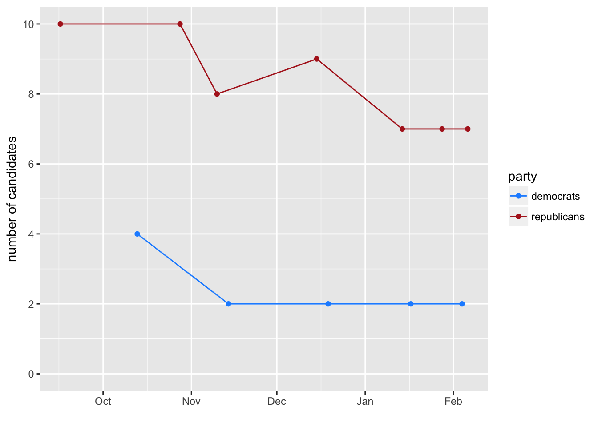

This plot is a good sanity check- we know that the total number of speakers has gone down with (almost) each debate in the GOP, but not so much in the democratic ones since there have been 2 candidates for 4 debates now. So now onto (3): we want to make a variable for the order of the debates, separately for each party. We'll use `dplyr` again to add our new variable, `debate_num`.


```r
debates <- debates %>%
  ungroup() %>%
  arrange(party, date_time) %>% # dems first, GOP second
  group_by(party) %>% # grouped by party
  mutate(debate_num = seq_along(date_time)) # count unique values in order
debates # did it work?
```

```
Source: local data frame [12 x 5]
Groups: party [2]

    date_time       party tot_speakers tot_tokens debate_num
       <date>       <chr>        <int>      <int>      <int>
1  2015-10-13   democrats            4       6405          1
2  2015-11-14   democrats            2       4197          2
3  2015-12-19   democrats            2       5419          3
4  2016-01-17   democrats            2       4100          4
5  2016-02-04   democrats            2       5939          5
6  2015-09-16 republicans           10      11382          1
7  2015-10-28 republicans           10       7220          2
8  2015-11-10 republicans            8       7218          3
9  2015-12-15 republicans            9       8705          4
10 2016-01-14 republicans            7       8341          5
11 2016-01-28 republicans            7       6212          6
12 2016-02-06 republicans            7       8536          7
```


Next, we need to combine the per-debate data we made (`debate_data`) with our per-word data (`cand_counts`). We'll call this new data frame `debates`.


```r
debates <- debates %>%
  ungroup() %>% # this was grouped before, need to un-do
  left_join(cand_counts) %>%
  mutate(speaker = as.factor(speaker),
         party = as.factor(party),
         debate_num = as.factor(debate_num)) # useful for later plotting
```

What can we do with this new data? This is actually a little tricky, because remember that we have this separate `counts` variable, which we can't ignore. We'll need to figure out how to weight each of these variables by its count, which won't make much sense at the word level, but will make for a more accurate estimate of average length and number of syllables for each candidate. So let's stop thinking about per-word data, and start thinking about the data we have for each candidate. 

## Per-candidate data

Now we are ready for prime time! We need to calculate summary statistics at the candidate level. But because we are interested in looking at the candidates' performances across debates, we'll calculate these summary statistics for each candidate at each debate. Here are 6 variables we need:

1. Number of tokens: how many words did each candidate speak during each debate?
2. Number of types: how many **unique** words did each candidate speak during each debate?
3. Share of words spoken (`share_tokens`): the proportion of words spoken during the debate by each candidate. This variable uses a per-debate variable, total words spoken (`tot_tokens`) as the denominator.
4. Type-token ratio (`ttr`): the ratio of unique words (types) divided by total words (tokens) spoken by each candidate
5. Mean word length (`avg_length`): mean word length used by each candidate. This variable uses a per-word variable, length of each word (`word_length`), weighted by `counts` as the numerator.
6. Mean syllable count (`avg_syl`): mean number of syllables per word used by each candidate. This variable uses a per-word variable, syllable count per word (`syl_count`), weighted by `counts` as the numerator.


```r
cand_by_debate <- debates %>%
  group_by(party, speaker, debate_num, date_time, tot_tokens, tot_speakers) %>% 
  summarise(tokens = sum(counts), #all words spoken
            types = n_distinct(word), #all unique words spoken
            num_length = sum(word_length*counts), #numerator in mutate later
            num_syl = sum(syl_count*counts)) %>% #numerator in mutate later
  mutate(share_tokens = tokens/tot_tokens, 
         ttr = types/tokens, 
         avg_length = num_length/tokens,
         avg_syl = num_syl/tokens) %>% 
  select(-num_length, -num_syl) %>% # don't need these anymore
  ungroup() # don't need grouping anymore

glimpse(cand_by_debate)
```

```
Observations: 70
Variables: 12
$ party        <fctr> democrats, democrats, democrats, democrats, demo...
$ speaker      <fctr> CHAFEE, CLINTON, CLINTON, CLINTON, CLINTON, CLIN...
$ debate_num   <fctr> 1, 1, 2, 3, 4, 5, 1, 2, 3, 4, 5, 1, 1, 2, 3, 4, ...
$ date_time    <date> 2015-10-13, 2015-10-13, 2015-11-14, 2015-12-19, ...
$ tot_tokens   <int> 6405, 6405, 4197, 5419, 4100, 5939, 6405, 4197, 5...
$ tot_speakers <int> 4, 4, 2, 2, 2, 2, 4, 2, 2, 2, 2, 4, 10, 10, 8, 9,...
$ tokens       <int> 762, 2305, 2192, 2921, 1952, 3006, 2103, 2005, 24...
$ types        <int> 411, 1018, 1073, 1223, 955, 1204, 881, 866, 1016,...
$ share_tokens <dbl> 0.11896956, 0.35987510, 0.52227782, 0.53902934, 0...
$ ttr          <dbl> 0.5393701, 0.4416486, 0.4895073, 0.4186922, 0.489...
$ avg_length   <dbl> 6.093176, 6.090239, 6.150091, 6.078740, 6.073770,...
$ avg_syl      <dbl> 1.937008, 1.934924, 1.946168, 1.958233, 1.918545,...
```

Now, length and the number of syllables for each word are represented here by means- but there is another way. We could instead count the number of words spoken by each candidate at each word length.


```r
get_length_counts <- cand_counts %>%
  group_by(party, speaker, word_length) %>%
  summarise(length_count = sum(counts)) %>% # counting words by length
  ungroup() %>% 
  group_by(speaker) %>%
  mutate(tokens = sum(length_count), # counting words across lengths
         by_length_prop = length_count/tokens,
         length_cat = cut(word_length, breaks = c(1, 2, 3, 4, 5, 25),
                          labels = c("2", "3", "4", "5", "6+")),
         max_count = ifelse(by_length_prop == max(by_length_prop), 1, 0))
```


```r
# do these proportions sum to 1?
get_length_counts %>% group_by(speaker) %>% summarise(sum_check = sum(by_length_prop))
```

We'll start with a word length plot, which I'll make as an object called `wlp`.


```r
# stacked bar chart
mygop <- c("#0072B2", "#009E73", "#D55E00", "#CC79A7", "#F0E442", "#56B4E9")
wlp <- get_length_counts %>% ggplot(aes(x = speaker, y = by_length_prop, fill = factor(length_cat)))
wlp <- wlp + geom_bar(stat = "identity", alpha = 0.8)
wlp <- wlp + scale_fill_manual(values = mygop, name = "word length")
wlp <- wlp + scale_y_continuous(expand = c(0, 0))
wlp <- wlp + theme_fivethirtyeight()
wlp <- wlp + theme(axis.text.x = element_text(angle = 45, hjust = 1))
wlp
```

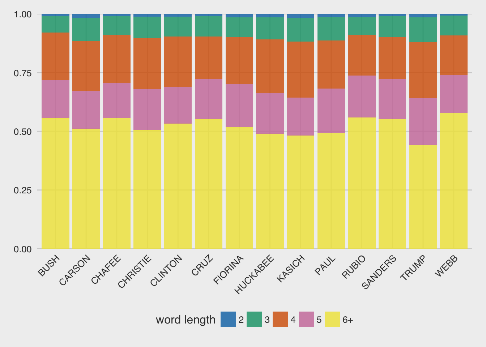


```r
# color by word length, speaker on x, position dodge
mygop <- c("#0072B2", "#009E73", "#D55E00", "#CC79A7", "#F0E442", "#56B4E9")
gg_length <- ggplot(get_length_counts, aes(x = speaker, y = by_length_prop, 
    fill = factor(length_cat)))
gg_length <- gg_length + geom_bar(stat = "identity", position = "dodge", alpha = 0.8)
gg_length <- gg_length + scale_fill_manual(values = mygop, name = "word length")
gg_length <- gg_length + scale_y_continuous(expand = c(0, 0))
gg_length <- gg_length + theme_fivethirtyeight()
gg_length <- gg_length + theme(axis.text.x = element_text(angle = 45, hjust = 1))
gg_length <- gg_length + theme(panel.grid.major.x = element_blank())
gg_length
```

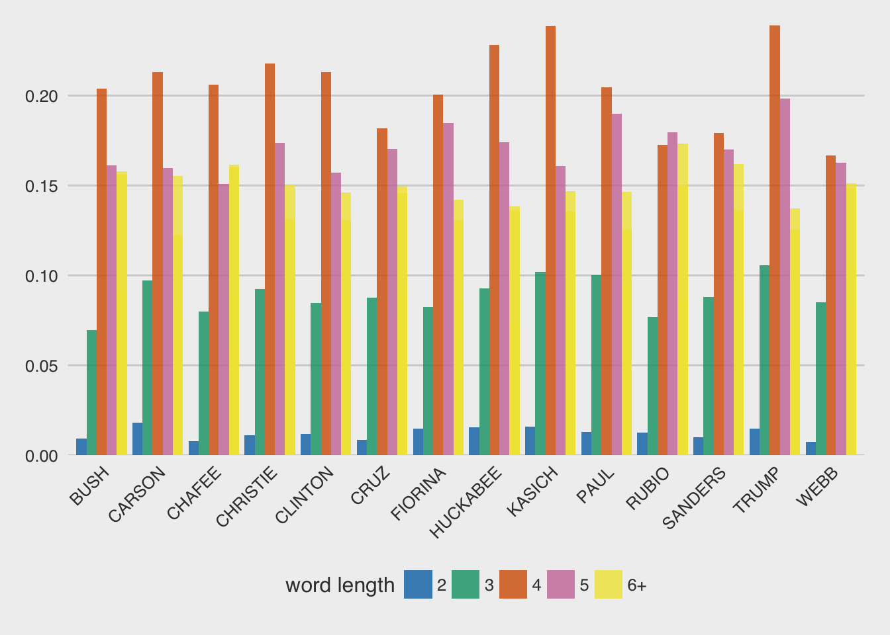


```r
# color by word length, speaker on x, position dodge
mygop <- c("#0072B2", "#009E73", "#D55E00", "#CC79A7", "#F0E442", "#56B4E9")
gg_length <- ggplot(get_length_counts, aes(x = length_cat, y = by_length_prop))
gg_length <- gg_length + geom_bar(stat = "identity", alpha = 0.8)
gg_length <- gg_length + facet_grid(speaker ~ .)
gg_length <- gg_length + scale_fill_manual(values = mygop, name = "word length")
gg_length <- gg_length + scale_y_continuous(expand = c(0, 0))
gg_length <- gg_length + theme_fivethirtyeight()
gg_length <- gg_length + theme(panel.grid.major.x = element_blank())
gg_length
```

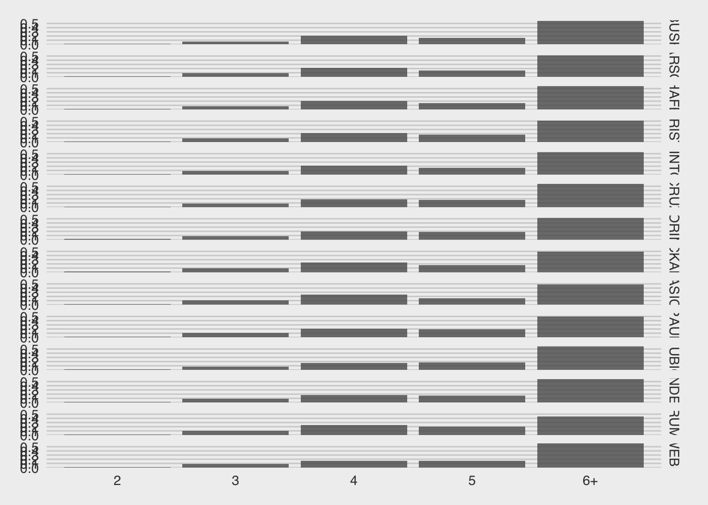


```r
# color by word length, speaker on x, facet by length_cat
mygop <- c("#0072B2", "#009E73", "#D55E00", "#CC79A7", "#F0E442", "#56B4E9")
gg_length <- ggplot(get_length_counts, aes(y = by_length_prop, fill = factor(length_cat)))
gg_length <- gg_length + geom_bar(stat = "identity", position = "dodge", alpha = 0.8)
gg_length <- gg_length + facet_grid(length_cat ~ speaker)
gg_length <- gg_length + scale_fill_manual(values = mygop, name = "word length")
gg_length <- gg_length + scale_y_continuous(expand = c(0, 0))
gg_length <- gg_length + theme_fivethirtyeight()
gg_length <- gg_length + theme(panel.grid.major.x = element_blank())
gg_length
```


Let's try to visualize this data. 


```r
lolli_plot <- ggplot(get_length_counts, aes(x = word_length, y = by_length_prop, 
    colour = factor(max_count))) + geom_segment(aes(xend = word_length, y = 0, 
    yend = by_length_prop), alpha = 0.7, lwd = 1) + geom_point(size = 2) + scale_colour_manual(values = c("firebrick", 
    "dodgerblue"), guide = FALSE) + scale_x_discrete(breaks = seq_along(get_length_counts$word_length), 
    name = "word length") + scale_y_continuous(name = "proportion of words") + 
    facet_wrap(~speaker)

lolli_plot %+% subset(get_length_counts, party == "republicans")
```

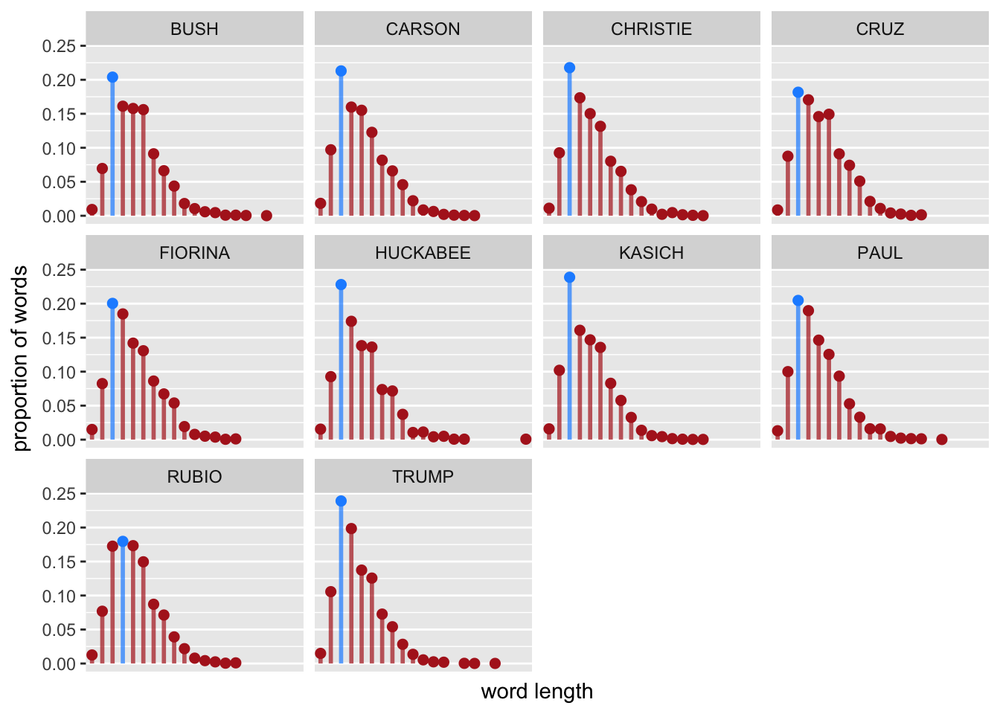


# Party Animals

Let's start just by comparing the two parties.

```r
ggplot(cand_by_debate, aes(x = party, y = avg_length)) + geom_boxplot()
```

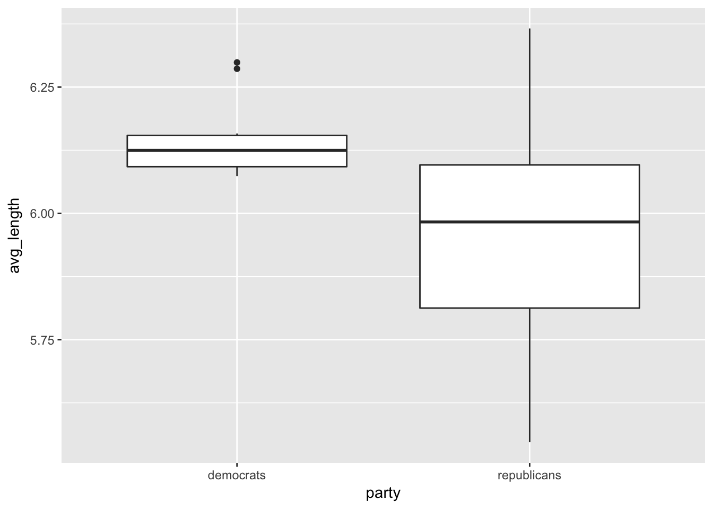


```r
ggplot(cand_by_debate, aes(x = party, y = avg_syl, group = speaker, fill = speaker)) + 
    geom_boxplot()
```

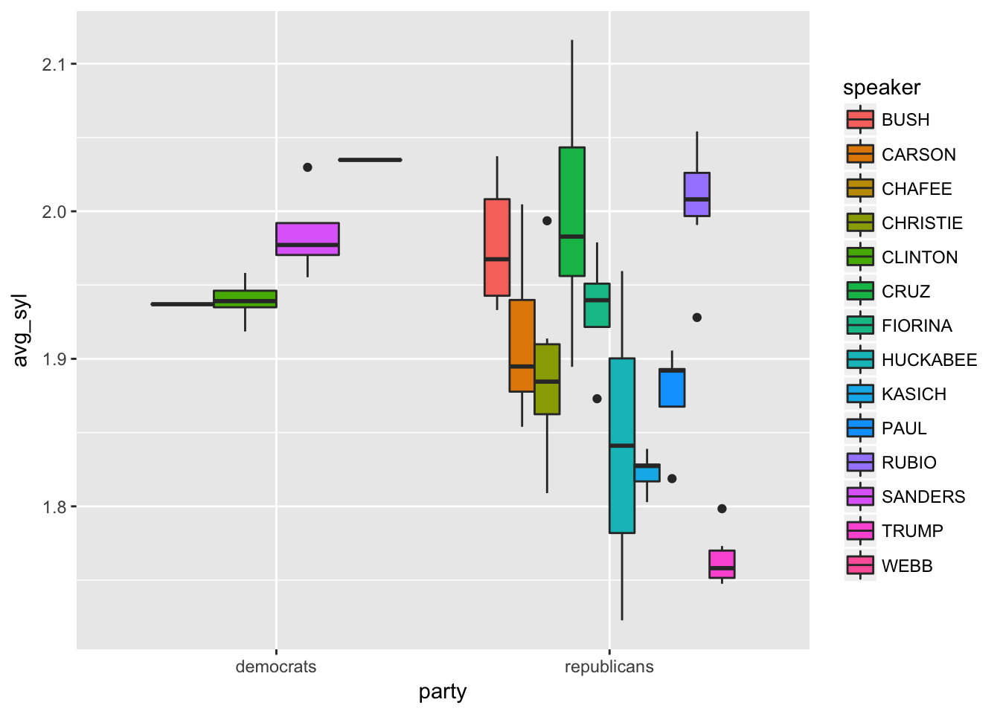


```r
ggplot(cand_by_debate, aes(x = speaker, y = avg_syl, fill = speaker)) + geom_boxplot() + 
    facet_wrap(~party, scales = "free_x")
```

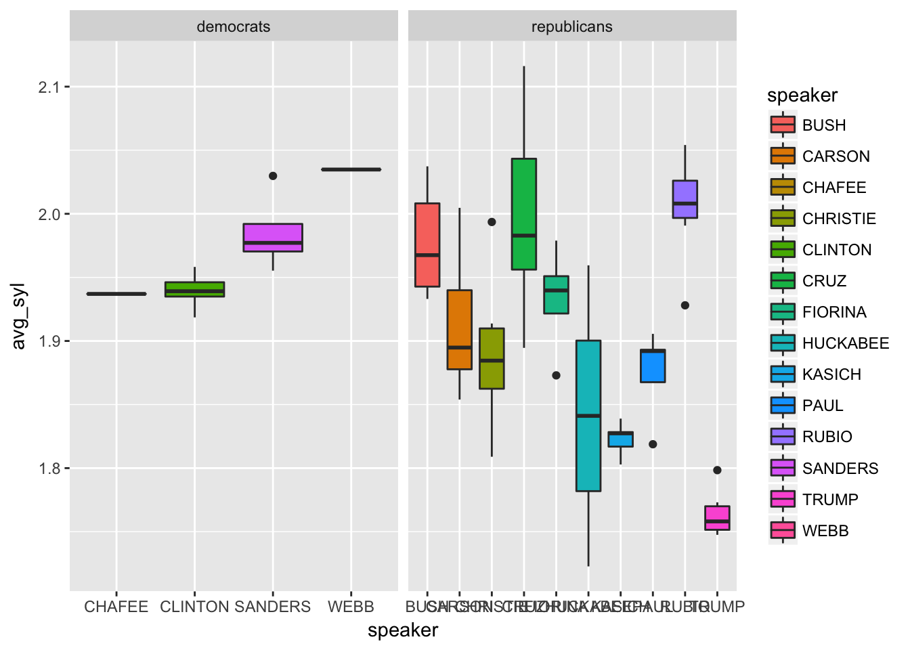

These are some seriously ugly plots. Here's a riddle: when is a boxplot not a box? Answer: when there is no variability, our box turns into a horizontal line, which you can see is the case for at least 3 candidates. Since I am plotting data per candidate per debate, this means that those candidates only have data for one debate. There are also a lot of candidates- let's winnow the field.

# Winnowing the field 

Let's look at the candidates who we know are still in as of 2016-02-27. First, let's create a variable that tells us who is in and who is out.


```r
gop_in <- c("RUBIO", "BUSH", "CRUZ", "TRUMP", "CARSON", "KASICH")
dem_in <- c("SANDERS", "CLINTON")
cand_by_debate <- cand_by_debate %>% mutate(still_in = factor(ifelse(speaker %in% 
    c(gop_in, dem_in), 1, 0)))  # 1 is in
```

# Share of words spoken {.tabset}

## GOP: in vs. out

Out of curiousity, let's plot the the share of words spoken by each candidate per debate and see if those who are out tended to speak less.


```r
cand_by_debate %>%
  filter(party == "republicans") %>%
  ggplot(aes(x = reorder(speaker, share_tokens), # sorted speakers
             y = share_tokens, # share of words
             group = speaker, # separate out speakers
             colour = still_in)) + # colour by in vs out
  geom_boxplot() +
  geom_point(position = position_dodge(width = .75))
```

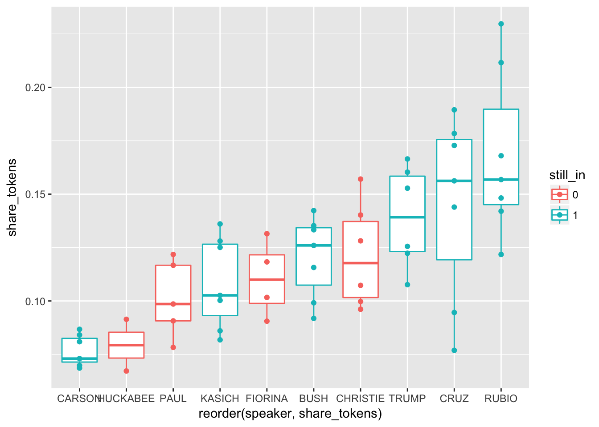


Now we are going to create a new dataset with only those candidates that are still in.


```r
in_cands <- cand_by_debate %>%
  filter(speaker %in% c(gop_in, dem_in)) # just the candidates I listed above
in_cands %>% # sanity check
  select(party, speaker) %>% # select just 2 variables
  distinct(speaker) # unique speakers
```

```
# A tibble: 8 × 1
  speaker
   <fctr>
1 CLINTON
2 SANDERS
3    BUSH
4  CARSON
5    CRUZ
6  KASICH
7   RUBIO
8   TRUMP
```

OK great, looks like that worked. 

Let's start building a new plot.

## Who speaks the most?

We'll start by plotting share of words spoken by each candidate at each debate.


```r
speaker_share <- ggplot(data = in_cands, # the dataframe
       aes(x = debate_num, y = share_tokens, colour = speaker)) + 
  geom_point(size = 4) + # points are the geom
  scale_x_discrete(name = "") + # don't need to label
  scale_y_continuous(name = "share of words") + # do need to label
  theme_minimal()
speaker_share
```

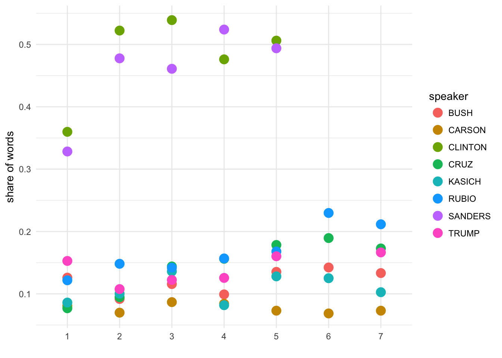

Let's plot the parties separately, since obviously Clinton/Sanders do a lot more relative talking. We can take the plot we already made and force ggplot to use a different dataframe by using the `%+%` operator.


```r
speaker_share %+% subset(in_cands, party == "republicans")
```

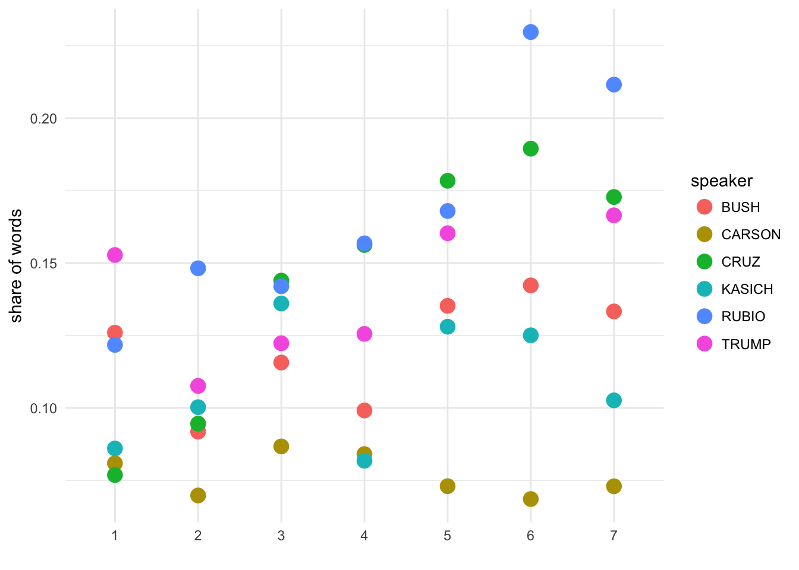

What single word would I change in this code to see the democrats?

## Fierce colors


```r
install.packages("devtools")
devtools::install_github("dill/beyonce")
library(beyonce)
beyonce_palette(66)
beyonce_palette(66)[4:11]
```


```r
fierce_share <- ggplot(data = in_cands, 
                                aes(x = debate_num, 
                                    y = share_tokens, 
                                    colour = speaker)) +
  geom_point(size = 4) + 
  scale_x_discrete(name = "") + # this is pretty clearly the candidates' speakers
  scale_y_continuous(name = "share of words") +
  theme_minimal()
fierce_share
```


GOP only


```r
fierce_share %+% subset(in_cands, party == "republicans") + scale_colour_manual(values = beyonce_palette(66)[3:8], 
    name = "Candidate")
```

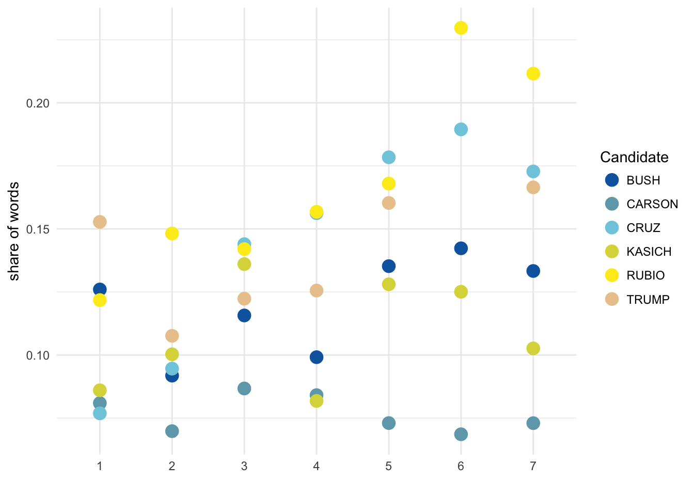


GOP- add a geom layer = lines


```r
fierce_share %+% subset(in_cands, party == "republicans") + geom_line(aes(group = speaker), 
    lwd = 1) + scale_colour_manual(values = beyonce_palette(66)[2:7], name = "Candidate")
```

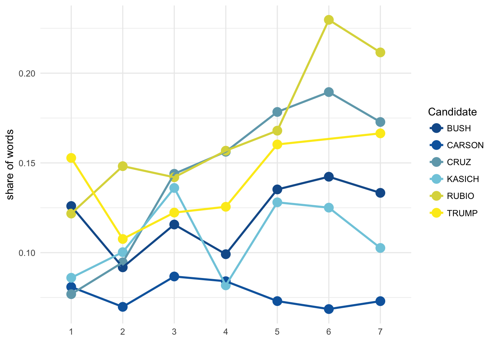


democrats only


```r
fierce_share %+% subset(in_cands, party == "democrats") + geom_line(aes(group = speaker), 
    lwd = 1) + scale_colour_manual(values = beyonce_palette(66)[10:11], name = "Candidate")
```

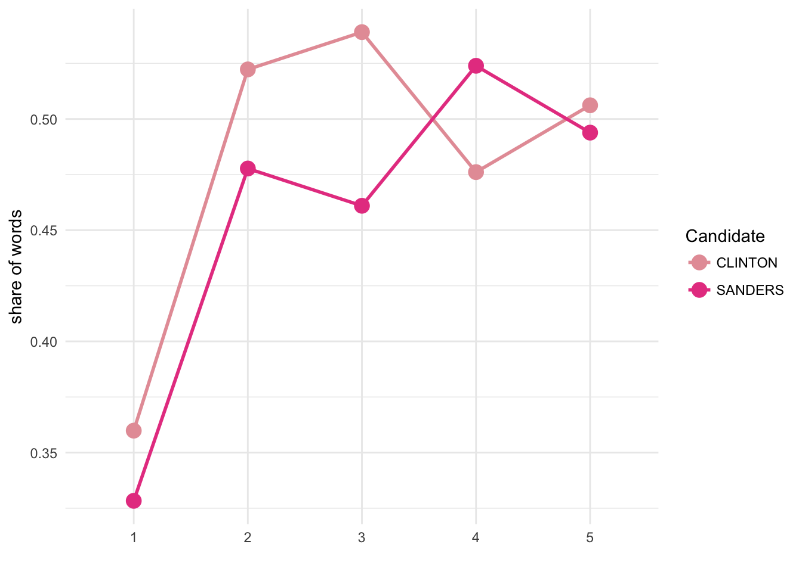


or we could FACET by party


```r
fierce_share + geom_line(aes(group = speaker)) + facet_wrap(~party, scales = "free_x") + 
    scale_colour_manual(values = beyonce_palette(66)[c(3:7, 9:11)], name = "Candidate")
```

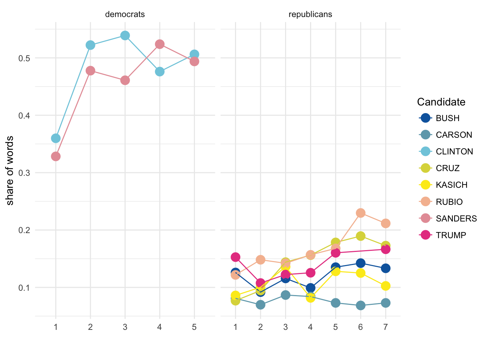


instead, facet by candidate to compare debates within each candidate


```r
fierce_facet <- ggplot(data = cand_by_debate, aes(x = debate_num, y = share_tokens, 
    colour = speaker, fill = speaker, group = speaker)) + geom_point(size = 3) + 
    scale_colour_manual(values = beyonce_palette(66)) + scale_fill_manual(values = beyonce_palette(66)) + 
    scale_x_discrete(name = "") + scale_y_continuous(name = "share of words spoken") + 
    theme_bw() + theme(legend.position = "none")
```


GOP only


```r
fierce_facet %+% subset(in_cands, party == "republicans") + geom_line() + facet_wrap(~speaker)  # connect the dots 
```

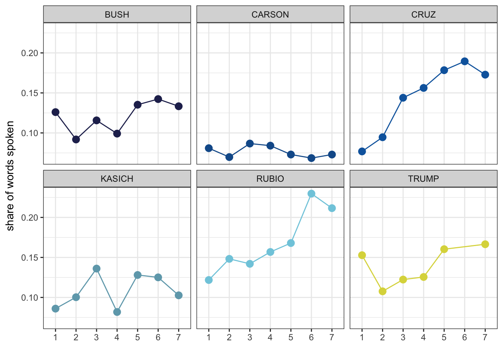


# Popular words

Which words are popular in these debates? What are our candidates talking the most about? For these analyses, we need to use our `cand_counts` dataframe. Do a `dplyr::glimpse` to remind yourself what is going on in there.


```r
cand_counts %>% group_by(word) %>% summarise(tot_count = sum(counts)) %>% top_n(10, 
    tot_count) %>% arrange(desc(tot_count))
```

```
# A tibble: 10 × 2
        word tot_count
       <chr>     <int>
1     people      1249
2       know       821
3      think       817
4      going       815
5    country       698
6       need       667
7        get       610
8       well       572
9  president       543
10       one       530
```

OK, people, huh? Let's make a wordcloud using the `wordcloud` package, because people like making those with text data! We'll use `RColorBrewer` for pretty colors.


```r
word_corpus <- cand_counts %>% group_by(word) %>% summarise(corpus_count = sum(counts))
set.seed(123)
wordcloud(word_corpus$word, word_corpus$corpus_count, scale = c(5, 0.1), max.words = 50, 
    random.order = FALSE, colors = brewer.pal(8, "PuBuGn")[-(1:4)], rot.per = 0.25, 
    use.r.layout = FALSE)
```

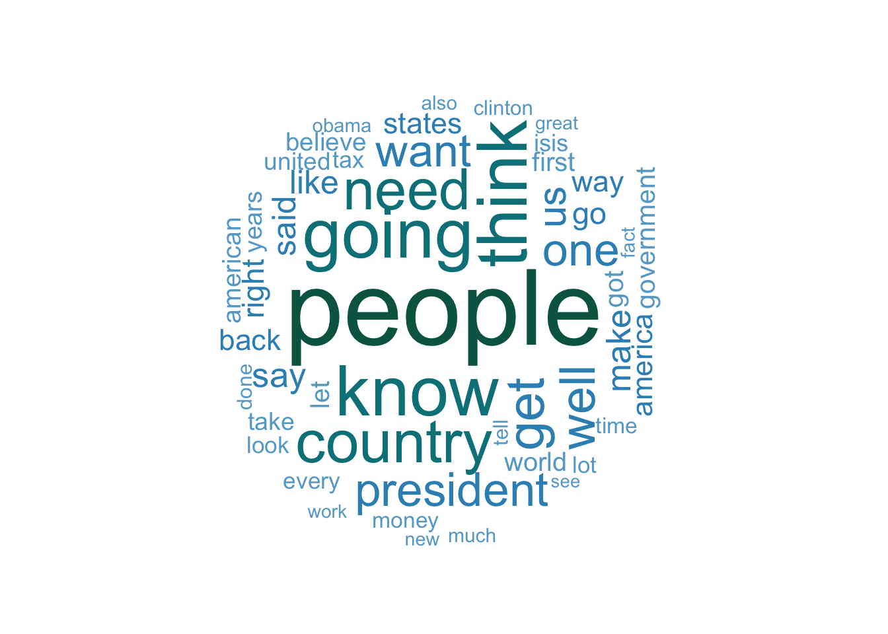

Now this is a static wordcloud. We can also make one that is interactive using the `d3wordcloud` package we installed from Github earlier.


```r
library(d3wordcloud)
d3wordcloud(word_corpus$word, word_corpus$corpus_count, tooltip = TRUE)
```

<!--html_preserve--><div id="htmlwidget-400430048e91b9daed6f" style="width:672px;height:480px;" class="d3wordcloud html-widget"></div>
<script type="application/json" data-for="htmlwidget-400430048e91b9daed6f">{"x":{"data":{"text":["a-half","aaa","abandon","abandoned","abandoning","abandons","abdullah","abetting","abided","abiding","abigail","abigal","abilities","ability","able","abnormal","abolish","abolished","abolishes","abortion","abortionists","abortions","abraham","abroad","absence","absolute","absolutely","absorb","absurd","absurdity","abundance","abundantly","abuse","abused","abuser","abuses","abusing","academia","academy","accelerate","accelerated","accept","acceptable","accepting","access","accessing","accident","accidental","accommodation","accommodations","accomplish","accomplished","accomplishing","accomplishment","accomplishments","according","account","accountability","accountable","accountants","accounted","accounts","accumulated","accurate","accusation","accused","achievable","achieve","achieved","achievement","achieving","acknowledge","acquiescing","acquire","acquiring","acquisition","across","across-the-board","act","acted","acting","action","actionable","actions","active","actively","activism","activist","activities","activity","actor","actors","acts","actual","actually","ad","adams","add","added","addict","addicted","addiction","adding","addition","additional","address","addressed","addresses","addressing","adds","adequate","adequately","adhered","adjudicated","adjusted","adjusting","adjustments","administer","administering","administration","administration's","administrations","admirals","admiration","admit","admitted","admitting","admonition","adopt","adopted","adopting","adoption","adore","ads","adult","adults","advance","advanced","advancing","advantage","advantaged","advantageous","advantages","adventurism","adversaries","adversary","adverse","advertise","advertising","advice","advise","adviser","advisers","advising","advocacy","advocate","advocated","advocates","advocating","affairs","affect","affected","affecting","affection","affiliated","affiliates","affirmative","afford","affordability","affordable","afghan","afghanistan","afraid","africa","african","african-american","african-americans","after-school","after-tax","aftermath","afternoon","afterwards","age","agencies","agency","agenda","agents","ages","aggravate","aggression","aggressive","aggressively","agitator","agitator-in-chief","ago","agonizing","agree","agreeable","agreed","agreement","agreements","agrees","agricultural","agriculture","ahead","aid","aide","aides","aiding","aig","aimed","ain't","air","airbus","aircraft","airliner","airliners","airman","airplane","airplanes","airport","airports","airspace","airstrikes","airstrips","aisle","akron","al","al-assad","al-awlaki","al-hasakah","al-maliki","al-nusra","al-qaeda","alabama","alan","alarming","alawite","alcohol","alcoholism","alert","alexander","algorithms","alienate","aliens","aligned","aligning","alike","alinsky-like","alive","all-of-the-above","alleged","allegedly","allegiance","allende","alliance","alliances","allies","allow","allowed","allowing","allows","alluding","ally","almost","alone","along","alongside","already","alright","also","altar","altered","alternate","alternative","alternatives","although","altogether","always","alzheimer's","alzheimers","amateurish","amazed","amazing","amazingly","amazon","ambassador","ambition","ambitions","ambitious","ame","amend","amendment","amendments","america","america's","american","american-led","american's","americans","ammunition","amnesia","amnesty","amok","among","amongst","amount","amounts","amplified","amplify","amtrak","amusement","amusing","amy","analogy","analysis","analysts","analyzed","analyzing","anbar","anchors","and-trade","anderson","andrea","angel","angeles","angels","anger","angry","anniversary","announce","announced","announcement","annoys","annual","another","another's","answer","answered","answering","answers","antecedents","anthony","anti-american","anti-establishment","anti-immigrant","anti-latino","anti-monopoly","anti-muslim","anti-terrorism","anti-trade","anti-wall","antidote","antiquated","antiwar","anwar","anxiety","anxious","anybody","anybody's","anymore","anyone","anyone's","anything","anytime","anyway","anywhere","apart","apartment","apiece","apocalyptic","apologist","apologize","apologized","apologizes","appalachian","apparatus","apparently","appealed","appeals","appear","appearance","appears","applaud","applause","apple","applies","apply","applying","appoint","appointed","appointee","appointees","appointing","appointment","appointments","appreciate","appreciation","apprehended","apprentice","approach","approaches","appropriate","appropriately","approved","april","arab","arabia","arabians","arabs","arbitrarily","arbitrary","arc","arcane","archaic","architect","arduous","area","areas","arena","arguable","argue","argued","arguing","argument","arguments","arise","arizona","arkansas","arm","armageddon","armed","armies","arming","armor","armored","arms","army","around","arrest","arrested","arrival","arrive","arrived","arrogance","arrogant","arsenal","arsonist","art","artful","article","artificial","artificially","ascend","ashraf","asia","asia-pacific","aside","ask","asked","asking","asks","aspect","aspects","aspirational","aspirations","aspire","assad","assad's","assault","assaulted","assembled","assembling","assess","assessment","asset","assets","assimilate","assimilation","assist","assistance","assistant","assisting","associate","associated","association","assume","assuming","assumption","assure","assured","astonishingly","asunder","asymmetric","atf","atlantic","atmosphere","atmosphere's","atomic","attached","attack","attacked","attacker","attacking","attacks","attempted","attempting","attempts","attend","attention","attentive","attitude","attorney","attorney's","attorneys","attract","attractive","audience","audit","audit-the-fed","audited","auditing","aumf","aunts","australians","authenticity","author","authoritarian","authorities","authority","authorization","authorize","autism","autistic","auto","automatic","automatically","automation","autonomy","autoparts","availability","available","avenue","avenues","average","averaging","aversion","aviv","avoid","avoided","award","aware","away","awful","awhile","axis","ayatollah","babies","baby","back","back-and-forth","backbone","backed","backend","backfire","backfired","background","backgrounds","backing","backs","backwards","bad","badly","bag","baghdad","bahrain","bahrain's","bail","bailed","bailout","baker","bakers","balance","balanced","balances","balancing","ball","ballistic","ballot","baltic","baltics","baltimore","ban","bank","banker","bankers","banking","bankrupt","bankruptcy","bankrupted","bankrupting","banks","banned","banning","bar","barack","barak","barb","barbara","barbaric","barbarism","barbarous","barely","bargain","barney","barracks","barred","barrel","barriers","barring","bars","bartender","bartering","base","based","baseline","basement","bash","bashar","basic","basically","basics","basis","basket","bathed","bathing","bathrooms","battalions","batted","battle","battle-tested","battled","battlefield","battleground","battles","bay","beacon","beanbag","bear","beard","beards","bearing","beat","beaten","beating","beats","beautiful","beautifully","beauty","became","becky","become","becomes","becoming","bed","beer","befalling","began","beggars","begged","begging","begin","beginning","begins","begun","behalf","behavior","behaviors","behead","beheaded","beheading","behemoth","behind","beings","beirut","belgians","belgium","belief","beliefs","believe","believed","believes","believing","belligerence","belong","belonged","belongs","belt","ben","ben's","bench","bend","beneficiaries","benefit","benefits","benghazi","beret","bergdahl","berlin","bermuda","bernanke","bernardino","bernie","beside","best","bestseller","bestsellers","bet","betray","betrayal","betrayed","betrays","better","beyond","bi-partisan","bias","bibi","bible","biden","big","big-money","bigger","biggest","bigot","bigotry","bigots","bilateral","bill","billion","billionaire","billionaires","billions","bills","bin","bind","biofuels","biometric","bipartisan","bipartisanship","birth","birthday","birther","birthright","bit","bites","bitter","black","blah","blame","blaming","bland","blanket","bleak","bled","blend","blends","bless","blessed","blessing","blessings","blew","blimp","blind","blindfold","blindfolded","blitzer","bloated","blob","block","blocks","blood","bloodiest","bloody","blow","blowing","blown","blue","blunder","blunders","bluster","board","boardroom","boards","boat","bob","bobby","bodily","body","bodyguards","boeing","bogged","boisterous","boko","bold","boldly","bolsheviks","bomb","bombastic","bombed","bomber","bombers","bombing","bombings","bombs","bond","bonus","bonuses","booing","book","books","boom","boomers","booming","booms","boot","boots","border","border-adjustable","border's","bordering","borders","born","borrow","borrowers","borrowing","bosnia","boss","boston","bothers","bottom","bottom-up","bought","bound","boundaries","bounty","bowling","box","boxer","boy","boyfriends","boys","bracket","brady","braggadocio","braggadocious","bragging","brags","brain","brainwashing","branch","branches","brand","branstad","brave","bravery","bravest","brazil","breach","breaches","break","breaking","breaks","breast","breeches","bret","bretton","briar","bribing","brick-and-mortar","brides","bridge","bridges","bridging","brief","briefing","briefings","brigades","bright","brightest","brilliant","bring","bringing","brings","brink","british","brits","broad","broadcast","broadened","broader","broadly","broadsides","broke","broken","broker","brooklyn","brother","brother's","brotherhood","brothers","brought","brown","brownies","bruce","brush","brutal","bubble","buck","buckley","bucks","budget","budgetary","budgeting","budgets","buffet","buffett","build","building","buildings","builds","built","bulk","bulking","bull","bullet","bullets","bullies","bully","bullying","bulwark","bunch","bunched","bunching","burden","burdens","burdensome","bureau","bureaucracies","bureaucracy","bureaucratic","bureaucrats","buried","burlington","burned","burning","burns","bury","bus","bush","bush-cheney","bush's","bushes","business","businesses","businessman","businessmen","businesspeople","bust","buster","busts","busy","butcher","button","buttons","buy","buyer","buying","buzzing","bystander","bystanders","cabinet","caesar's","caesars","cafe","cafta","cage","cages","calamity","calculation","caliber","california","caliphate","call","called","calling","callously","calls","calm","calvin","came","camera","cameras","campaign","campaigned","campaigning","campaigns","camping","camps","campus","canada","canadian","canadians","canary","canceling","cancer","candidate","candidate's","candidates","candy","cannabis","cap","cap-and-trade","capabilities","capability","capable","capacities","capacity","capita","capital","capitalism","capitalist","capitalize","capitals","captains","captive","capture","captured","captures","capturing","car","caravans","carbon","card","cards","care","cared","career","careers","careful","carefully","careless","cares","carl","carla","carlos","carly","carly's","carnage","carolina","carolina's","caroline","carpenters","carpet","carried","carry","carrying","cars","carson","carson's","cart","carta","cartel","cartels","carter","cartoon","carve-out","cascading","case","cases","cash","casino","casinos","cast","casts","cataract","catastrophe","catastrophic","catcher","category","caterpillar","catherine","catholic","cattle","caucus","caucused","caucuses","caught","cause","caused","causes","causing","cautioned","cavalcade","cayman","cbs","cdc","ceiling","celebrate","celebrating","celebrator","cell","cells","cemetery","censor","center","centered","centers","central","cents","centuries","century","ceo","ceo's","ceos","certain","certainly","certainty","certificate","certified","certify","chad","chafee","chain","chained","chair","chaired","chairing","chairman","chairs","challenge","challenges","challenging","chamber","champion","chance","chances","change","changed","changes","changing","channel","channels","chanting","chants","chaos","chaotic","chapter","character","characterize","charge","charged","charges","charging","charitable","charities","charity","charleston","charlie","charming","charred","charts","chase","chased","cheap","cheat","cheating","check","checking","checks","chemical","cheney","cherish","cherry","chest","chicago","chicken","chief","chiefs","child","child's","childhood","childish","children","children's","chile","chill","china","china's","chinese","chip","choice","choices","choose","chooses","choosing","chopping","chops","chose","chosen","chris","christ","christian","christians","christie","christie's","christmas","chronic","chuck","chunks","church","churches","churchill","cia","cigars","circuit","circuits","circumstance","circumstances","citadel","cite","cities","citizen","citizenry","citizens","citizenship","city","civics","civil","civilian","civilians","civilization","civilizations","civilized","claim","claimed","claiming","claims","clamor","clarification","clarified","clarify","clarion","clarity","clash","class","classic","classifications","classified","classifying","clean","clean-up","cleaning","cleansing","cleanup","clear","clear-eyed","cleared","clearly","clergy","cleric","clerics","clerk","clerking","cleveland","cliffs","climate","cling","clinic","clinically","clinics","clinton","clinton's","clintonite","clintons","clip","close","closed","closely","closer","closest","closing","clothing","clue","clyburn","cnbc","cnn","cnn's","co-chair","co-chairman","co-chairmen","co-sponsor","co-sponsoring","coal","coalition","coalition-building","coalitions","coast","code","codename","codified","cognizant","cohiba","coin","coins","cold","colder","collaboration","collaborative","collapse","collapsing","collar","colleague","colleagues","collect","collected","collecting","collection","collector","college","colleges","color","colorado","colors","columbus","column","columnist","columns","combat","combatant","combination","combine","combined","come","comeback","comes","comey","comfortable","comic","comic-book","coming","command","command-and-control","commander","commander-in","commander-in-chief","commandment","commands","comment","commentator","commentators","commented","comments","commerce","commercial","commercials","commission","commissioner","commit","commitment","commitments","commits","committed","committee","committees","committing","commodities","common","commonsense","communicated","communicating","communication","communications","communism","communists","communities","community","community-based","compact","companies","company","compaq","compare","compared","comparing","comparison","comparisons","compassionate","compatriots","compelling","compensation","compete","competence","competent","competing","competition","competitive","competitors","complain","complaining","complete","completed","completely","completing","complex","complexity","compliance","complicated","complied","comply","component","compound","comprehension","comprehensive","comprehensively","compromise","compromised","computer","computers","conceal","concealed-weapon","concede","concentration","concept","conception","concern","concerned","concerning","concerns","concert","concerted","concessions","concluded","conclusion","concrete","concur","condition","conditions","conducive","conduct","conducted","conducting","conference","confess","confesses","confidence","confident","confine","confirmation","confiscate","confiscated","conflict","conflicts","confront","confronted","confronting","confuse","confused","confusion","congratulate","congratulations","congress","congressional","congressman","conjunction","connect","connected","connection","connections","conquer","conscience","consciousness","conscription","consensus","consent","consequence","consequences","consequential","conservation","conservatism","conservative","conservatives","conserve","consider","consideration","considering","consistency","consistent","consistently","consolidating","consolidation","consorted","constant","constantly","constituent","constituents","constitution","constitutional","constrain","constructed","construction","constructive","consult","consultants","consulting","consumer","consumers","consumption","contacted","contain","contained","containment","contaminated","contempt","contemptuously","contentious","contest","context","continents","contingencies","contingent","continue","continued","continues","continuing","continuingly","contractors","contracts","contradicts","contrast","contribute","contributed","contributing","contribution","contributions","contributor","contributors","control","controlled","controls","controversial","controversies","controversy","convenience","convention","conventional","conversation","conversations","converse","converter","conveyed","convict","convicted","convince","convinced","convinces","cool","coolidge","cooperate","cooperating","cooperation","cooperative","coopted","coordinate","coordinating","copayments","copenhagen","cops","core","cornell","corners","cornerstone","coroner","corporate","corporation","corporations","corps","correct","corrected","correctness","correlation","corridors","corrode","corrupt","corrupted","corruption","cost","cost-driving","cost-effective","costing","costly","costs","cotton","could've","council","counsel","counseling","count","counted","counterbalance","counterintelligence","counterparts","counterterrorism","counties","counting","countless","countries","country","country's","counts","county","couple","courage","courageous","course","court","courthouse","courts","cover","coverage","covered","covers","cozy","cpi","crack","cracked","cracks","crap","crash","crashed","crashing","crazed","crazies","craziness","crazy","create","created","creates","creating","creation","creative","creativity","creator","creators","credentials","credibility","credible","credit","credits","creep","crescent","crime","crimea","crimes","criminal","criminalization","criminally","criminals","crippling","crises","crisis","crist","criteria","critical","critically","criticism","criticisms","criticize","criticized","criticizing","critique","croney-capitalism","crony","cronyism","crooks","crop","crops","cross","crossed","crosses","crossing","crossroads","crow","crowd","crucifying","crumbling","crush","crushed","crushes","crushing","cruz","crying","cuba","cuban","culprits","cultural","culture","cumbersome","cumulative","cunning","cup","cure","cured","cures","currency","current","currently","curve","custody","customers","customized","cut","cuts","cutting","cyber","cyber-attacks","cyberattack","cybersecurity","cynical","d-minus","dabiq","dad","dad's","dads","daily","dais","damage","damaged","damascus","damn","dana","danger","dangerous","dare","darn","dartmouth","data","database","databases","date","daughter","daughters","dav","david","davids","davis","day","day-to-day","daycare","daylight","days","de-conflicted","de-conflicting","de-funded","de-link","de-militarize","de-valued","dea","dead","deadly","deal","dealers","dealing","dealings","deals","dealt","dean","death","deaths","debate","debated","debates","debating","debilitated","debt","debt-free","debts","debut","decade","decades","deceit","deceitful","deceived","december","decency","decent","decent-paying","decide","decided","decides","deciding","decile","decimated","decimating","decision","decision-making","decisions","decisive","decisively","deck","declaratory","declare","declared","decline","declined","declining","decorated","decorations","decrease","decreasing","dedicate","dedicated","deductibles","deduction","deductions","deemed","deep","deeper","deeply","deere","defeat","defeated","defeating","defend","defended","defender","defending","defends","defense","defenseless","defensive","deficit","deficits","defies","define","defined","defines","defining","definitely","definition","definitions","definitive","defrauding","defray","defund","defunded","defy","degrade","degraded","degrading","degree","degrees","delano","delauro","delay","delegated","delegates","delegation","deliberate","delighted","delineates","deliver","delivered","delivering","delivers","deluge","demagogue","demand","demanded","demanding","demands","democracies","democracy","democrat","democratic","democrats","demographics","demonic","demonize","demonstrably","demonstrate","demonstrated","demoralized","denied","denier","denies","denmark","denounced","dent","dental","denver","deny","denying","department","departments","depend","dependent","depending","deplorable","deploy","deployed","deployments","deport","deported","deporting","deposed","depositors","depression","deprive","deprived","depth","depths","deregulate","deregulated","deregulation","derivative","derivatives","des","descended","describe","described","describing","description","desert","deserve","deserved","deserves","deserving","design","designate","designed","desire","desires","desk","despair","desperately","despite","despot","destabilization","destabilize","destabilized","destabilizing","destiny","destroy","destroyed","destroying","destroys","destruction","detail","detailed","detailing","details","detain","detainee","detainees","detect","detention","detergent","deteriorate","determination","determine","determined","determining","deterrence","deterrent","dethrone","detonate","detroit","devaluations","devalue","devaluing","devastated","devastating","devastation","develop","developed","developer","developing","development","developmentally","developments","device","devote","devoted","dhs","diabetes","diagnosis","dialogue","diane","dianne","dick","dictate","dictator","dictators","dictatorship","dictatorships","dictionary","die","died","diet","differ","difference","differences","different","differently","difficult","difficulty","digest","digging","dignity","diligence","dime","diminish","diminished","diminishes","dimming","dinner","dinners","dioxide","diplomacy","diplomat","diplomatic","diplomats","direct","directed","direction","directions","directly","director","dirty","dis-investing","disabilities","disability","disabled","disaffected","disagree","disagreed","disagreeing","disagreement","disagreements","disagrees","disappear","disappeared","disappearing","disappointed","disappointing","disassociate","disaster","disastrous","discipline","disclosed","disclosing","disconnect","discontinue","discount","discouraged","discourages","discovered","discoveries","discredited","discretion","discretionary","discriminated","discrimination","discriminatory","discuss","discussed","discussing","discussion","discussions","disease","diseases","disembodied","disengage","disengaged","disengagement","disgrace","disgraceful","disgusted","disgusting","dishonesty","disingenuous","disintegrate","dislike","dislodge","dismantle","dismantling","dismayed","disparage","disparaging","disparate","disparities","disparity","dispel","dispenses","disperse","displaced","displayed","disposable","disposal","disproportionately","disproven","dispute","disputed","disqualified","disregard","disrupt","disrupted","disrupter","disruptive","dissent","dissenters","disservice","distinct","distinction","distinguish","distracted","distressed","distribute","distributes","district","diversified","diversity","divert","divide","divided","divider","divider-in-chief","divides","dividing","division","divisions","divisiveness","divorced","dix","dnc","dobson","doctor","doctored","doctors","doctrine","documentary","documented","dod","dodd-frank","dog","dollar","dollars","doma","domain","dome","domenici","domestic","domestically","dominant","dominate","dominated","donald","donald's","donation","donations","done","donors","doomed","door","doors","doorstep","dormant","dormitories","doses","dotted","double","double-digit","double-speak","doubled","doubling","doubt","doubts","douglas","downgraded","downing","downstream","downtown","downtrodden","downturn","downward","dozen","dozens","dr","draft","draft's","drafted","drama","dramatic","dramatically","draw","drawn","dream","dreamers","dreams","dreamt","drew","drill","drilling","drinking","drive","drive-by","driven","driver","drivers","driving","drone","drones","drop","dropped","dropping","drops","drought","drove","droves","drug","drug-addicted","drug-related","drugs","dry","dry-cleaning","dubuque","duck","dudes","due","dulce","dulce's","dumb","dumbest","dummies","dump","dumping","dumps","duplicative","duty","dwight","dying","dynamic","dynamically","dysfunction","dysfunctional","e-mail","e-mails","e-verify","ear","earlier","early","earn","earned","earning","ears","earth","ease","easier","easiest","easily","easing","east","eastern","easy","eat","eating","ebola","echelon","echoing","economic","economically","economics","economies","economist","economists","economy","edge","edges","edging","edith","editorial","educated","educating","education","educational","edward","effect","effective","effectively","effects","efficiency","efficiently","effort","efforts","ego","egregious","egypt","egyptian","egyptians","eight","eighth","eighty","eisenhower","either","elder","elderly","elect","electability","elected","electing","election","election's","elections","electively","electorate","electric","electrical","electricians","electricity","electromagnetic","electronics","element","elements","elephant","elevating","eleven","eligible","eliminate","eliminated","eliminates","eliminating","elite","elizabeth","ellison","eloquence","else","else's","elsewhere","em","email","emails","emanuel","embarrassing","embarrassment","embassies","embassy","embed","embedded","embellishments","embodies","embrace","embraced","embracing","emerge","emergency","emigrate","emily","eminent","emirati","emissary","emissions","emma","emp","empanelled","emphasis","emphasize","empire","employ","employed","employee","employees","employer","employers","employing","employment","empower","empowered","empowering","empowerment","emptied","empty","emptying","en","enable","enabled","enables","enabling","enacted","enamored","encountered","encourage","encouraged","encouraging","encrypt","encrypted","encryption","end","endanger","endangering","endeavor","ended","ending","endless","endorse","endorsed","endorsement","endorsements","ends","enemies","enemy","energies","energize","energy","enforce","enforced","enforcement","enforcing","engage","engaged","engagement","engages","engaging","engine","engineers","england","english","enhance","enhanced","enjoy","enjoyed","enlarge","enlist","enormous","enormously","enough","enrich","enriching","enslaves","ensue","ensure","ensures","ensuring","entails","entanglements","enter","entered","entering","enterprise","entertained","entertainer","entertainers","entertaining","enthusiasm","entire","entirely","entities","entitlement","entitlements","entity","entrenched","entrepreneur","entrepreneurial","entrepreneurship","entry","entry-exit","environment","environmental","epa","epa's","epidemic","episode","equal","equation","equip","equipment","equipped","equity","equivalent","era","eradicate","eradicated","eric","eroding","err","errant","error","escalating","escape","escaped","escaping","escorted","esoteric","esp","especially","espouses","essence","essential","essentially","establish","established","establishment","estate","estimated","estonia","eternity","ethanol","ethical","ethics","ethnic","ethnicity","europe","european","europeans","evade","evaluates","evaluating","evaluation","evangelicals","eve","even","evening","evening's","evenly","eventually","ever","every","everybody","everybody's","everyday","everyone","everyone's","everyplace","everything","everytime","everywhere","evidence","evidentiary","evil","eviscerating","exact","exactly","exaggerated","exaltation","examine","examined","example","examples","exceed","excellence","excellent","except","exception","exceptional","exceptionalism","exceptions","excesses","excessive","exchange","exchanges","excising","excited","excitement","exclusively","excruciating","excuse","execute","executed","executive","executives","exemplified","exemplifying","exemption","exemptions","exempts","exercise","exercises","exercising","exist","existed","existence","existential","existing","exists","exit","exit-entry","exoatmosphere","expand","expanded","expanding","expands","expansion","expatriate","expect","expectations","expected","expediency","expedient","expedited","expenditure","expenditures","expense","expenses","expensing","expensive","experience","experienced","experiment","expert","expertise","experts","expire","expiring","explain","explained","explaining","explains","explanation","explanatory","explode","exploit","exploiting","explore","explosion","export","exportation","exporter","exports","expose","exposed","exposing","expressed","expression","extend","extended","extensive","extent","external","extra","extract","extraordinarily","extraordinary","extreme","extremely","extremism","extremist","extremists","exxonmobil","eye","eyeballs","eyes","eyesight","face","facebook","faced","faceless","faces","facilitate","facilities","facility","facing","fact","factions","factor","factories","factors","factory","facts","faculty","fail","failed","failing","failings","failure","failures","fair","fairer","fairest","fairly","fairness","faith","faithfully","fake","fall","fallen","falling","false","falseness","familiar","families","family","family's","famous","famously","fan","fancies","fanciest","fancy","fannie","fans","fantastic","fantasy","far","farm","farmer","farmers","farmland","farms","farther","fascinating","fashion","fashionable","fashioned","fast","faster","fastest","fat","father","fathers","fault","favor","favorable","favorably","favored","favors","fawning","fbi","fcc","fda","fdic","fdr","fdr's","fear","feared","fearful","fears","feasible","feat","feather","feature","february","feckless","fed","federal","federalize","federally","feed","feeding","feel","feeling","feelings","feels","fees","feet","feingold","feinstein","fell","fellow","felonies","felony","felt","female","fence","fences","fencing","fencings","ferguson","ferryboat","fester","festered","fetus","fever","fewer","fiance","fiances","fiction","field","fields","fiercest","fifteen","fifth","fifty","fifty-eight","fifty-one","fight","fighter","fighters","fighting","fights","figure","figured","figures","file","filed","files","filibuster","filibuster-proof","filibustering","filing","filipinos","fill","filled","filling","filtered","final","finally","finance","finances","financial","financier","financing","find","finding","fine","fined","finer","fines","finest","finger","fingerprint","fingerprints","finish","finished","finland","fiorina","fire","firearms","fired","firefighter","firefighters","fireman","firewalls","firing","firm","firms","first","first-hand","first-term","first-time","firsthand","fisa","fiscal","fiscally","fish","fishing","fit","fits","five","five-and-a-half-hours","five-point","five-year","fix","fixed","fixed-wing","fixes","fixing","flags","flames","flat","flat-out","flattered","fled","fleeing","fleet","flew","flexibility","flies","flint","flip","flips","floating","flood","flooding","floor","florida","florists","flow","flowed","flowers","flowing","flown","flows","fluids","fly","fly-over","fly-to","flying","flynn","focus","focused","focusing","foe","folder","foley","foleys","folk","folks","follow","follow-up","followed","following","follows","fomenting","fond","food","food-tester","fool","foolhardy","fooling","foolish","football","foothold","footing","forbid","force","forced","forceful","forces","forcing","ford","foreclosing","forefront","foreign","foremost","foreshadowing","forest","forever","forfeit","forge","forged","forget","forgive","forgiveness","forgot","forgotten","form","formed","former","forming","forms","formula","fort","forth","fortify","fortunate","fortune","forward","forwarded","fossil","foster","fought","found","foundation","foundational","founded","founders","founding","four","four-fold","four-square","fourth","fourthly","frack","fracking","fragile","frame","france","francis","francisco","frank","frankly","fraud","fraudulent","freddie","free","freedom","freedoms","freely","freer","freest","freeze","freezing","french","frenzy","frequently","freshman","friday","friend","friendlier","friends","frighten","front","frontally","frustrated","frustrating","frustration","fudged","fuel","fueled","fuels","fulfill","fulfilled","full","full-page","fully","fun","function","fund","fundamental","fundamentally","funded","funding","funds","funerals","furious","furthermore","fury","future","futures","gaddafi","gadhafi","gain","gained","gaining","gains","galvanize","galvanized","galvanizing","gambling","game","gamed","games","gang","gangs","gangster","gap","garden","garner","gary","gas","gasoline","gate","gatekeeper","gateway","gather","gathered","gathering","gator","gave","gay","gay-marriage","gays","gdp","ge","gee","gender","general","general's","generalized","generally","generals","generate","generation","generation's","generational","generations","generosity","generous","geneva","genocide","gentleman","gentlemen","geologic","geopolitical","george","georgetown","georgia","gerald","gerard","germany","gerry","gesture","get","gets","getting","ghani","giant","gift","gifted","gifts","gigantic","gillibrand","girl","girlfriends","girls","gitmo","give","given","gives","giving","glad","gladly","glass","glass-steagall","glass-stegall","glazing","glitches","global","globalization","globally","globe","glossed","go","goal","goals","god","god-given","god's","goes","going","gold","golden","goldman","golf","gone","gonna","good","good-paying","goodies","goodness","goods","goodwill","gop","gore","gore's","gosh","got","gotcha","gotta","gotten","gouging","govenor","govern","governance","governed","government","government's","governmental","governments","governor","governor's","governors","governorship","grab","grace","grade","gradually","graduate","graduated","graduates","graduating","graduation","graham","grandchildren","granddaughter","granddaughter's","grande","grandfather","grandiose","grandkids","grandmother","grandmothers","grandparents","grandson","granite","grannies","grant","granting","grants","grasp","grassroots","grateful","grave","gravitated","great","greater","greatest","greatly","greatness","greed","green","greenspan","greenspan-sanders","grenade","grew","grid","gridlock","grijalva","groceries","gronkowski","gross","ground","grounded","grounds","groundwork","group","groups","grow","growing","grown","grows","growth","gruesome","guantanamo","guantanamo's","guarantee","guaranteed","guaranteeing","guarantees","guard","guardsmen","guatemala","guess","guest","guest-worker","guide","guidelines","guides","guilty","guinness","gulf","gun","gun-free","gunmakers","guns","gut","guts","gutted","gutting","guy","guys","habitable","habits","habitually","hack","hacked","hacking","hacks","haiti","haley","half","half-a-trillion","half-billion","half-heartedly","half-trillion","hall","halls","halt","halted","hamas","hamburger","hamilton","hammered","hammers","hampering","hampshire","hand","hand-to-hand","handful","handicap","handily","handing","handle","handled","hands","handshake","handsome","hang","hanging","hangup","hank","happen","happened","happening","happens","happily","happy","haram","hard","hard-earned","hard-earning","hard-working","harden","harder","hardest","hardline","hardly","hardships","hardworking","harkin","harm","harry","harsh","harvard","harvest","harwood","hasakah","hasan","hashed","hassan","hat","hate","hater","hatred","haunt","have-nots","haven","havens","haves","hawaii","head","head-on","headed","heading","headline","headquarters","heads","heal","healed","healing","health","health--and","healthcare","healthier","healthy","hear","heard","hearing","hearings","heart","heartbreaking","heartlessly","hearts","hearty","heat","heaven","heaven's","heavily","heavy","heck","hedge","hedge-fund","heidi","height","heinous","held","hell","heller","hello","help","helped","helpful","helping","helps","hemisphere","henry","herbert","heroes","heroically","heroin","heroin-addicted","heroine","hewitt","hewlett","hey","hezbollah","hhs","hi","hide","hides","hiding","high","high-fives","high-growth","high-risk","higher","higher-wage","highest","highly","highways","hilary","hill","hillary","hillary's","hillarycare","hinted","hintz","hip","hire","hired","hiring","hispanic","hispanics","historic","historical","historically","history","hit","hits","hitting","hoax","hogshead","hold","holder","holders","holding","holds","hole","holes","holidays","holocaust","holy","home","homeland","homeless","homepage","homes","homework","homicidal","hominems","homophobe","homosexuality","honest","honestly","honesty","hong","honor","honorable","honored","honors","hood","hooked","hope","hoped","hopeful","hopefully","hopes","hoping","horrendous","horrible","horribly","horrific","horrified","horrifying","horror","horse","horse-thieves","horton","hospital","hospitality","hospitals","host","hostage","hostages","hosting","hot","hotel","hotels","hotly","hour","hours","house","household","houses","housing","houston","howard","however","hsas","hubs","huckabee","huckabee's","hud","hug","huge","hugely","hugh","hugs","huh","human","human-trafficked","humanely","humanitarian","humanity","humble","humiliation","hundred","hundreds","hung","hunt","hunter","hunting","hurricane","hurricanes","hurt","hurting","hurts","husband","husband's","hussein","hydro","hydroelectric","hypocrisy","hypocritical","icahn","ice","icon","iconic","idea","ideal","idealistic","ideally","ideas","identical","identify","identity","ideologically","ideology","ieds","ignore","ignoring","ii","iii","ike","ill","illegal","illegally","illegals","illicit","illness","illusory","illustrate","illustrates","illustration","imagination","imaginative","imagine","imagined","imaging","imagining","imbalance","imbed","imf","immediate","immediately","immigrant","immigrants","immigration","imminent","immoral","immunity","impact","impacted","impacting","impacts","impaneled","impatient","imperative","impinging","implement","implemented","implementing","implicating","implode","import","important","importantly","imports","impose","imposed","imposing","impossible","impoverished","impractical","impregnated","impressed","impression","impressionable","imprisoning","improve","improved","improvements","improving","impugning","impulse","impune","in-and-out-of-the-door","in-chief","in-laws","in-patient","in-state","inability","inaccurate","inadequate","inadvertently","inappropriate","inaudible","inaugurated","inauguration","incapable","incapacitated","incarcerate","incarcerated","incarcerating","incarceration","incent","incentives","incentivize","inception","incest","incident","inciter","inciting","inclined","include","includes","including","income","incomes","incompetence","incompetent","incomplete","inconceivable","incorrect","incorrectly","increase","increased","increases","increasing","increasingly","incredible","incredibly","incrementally","increments","incumbent","incumbents","incursion","incursions","indebted","indeed","indefinite","independence","independent","independents","index","india","indiana","indicated","indicates","indication","indigent","indignantly","indignation","indiscriminate","individual","individually","individuals","indivisible","indonesia","industrial","industrialized","industries","industry","ineffective","ineffectual","ineligible","inept","ineptitude","inequality","inequities","inevitability","inevitably","inextricably","infantry","infected","infection","infiltrate","infiltrated","infiltrating","infinitely","infinity","inflame","inflation","influence","influenced","influences","influencing","inform","information","informational","infrastructure","inherent","inherit","inherited","initial","initially","initiated","initiatives","injury","injustice","inner","innocent","innocents","innovated","innovating","innovation","innovative","innovator","innovators","innuendo","input","inquiry","inroads","insane","inscription","insecure","insecurity","insert","inside","insider","insiders","insight","insinuated","insinuation","insist","insolvent","inspect","inspecting","inspections","inspector","inspiration","inspire","inspired","instability","installations","installed","instance","instances","instant","instead","instilled","instinct","instinctively","institute","instituted","institution","institutional","institutions","instruments","insult","insulted","insulting","insults","insurance","insures","integrating","integration","integrity","intellect","intellectual","intelligence","intelligent","intend","intended","intensify","intensity","intention","intentions","intercept","interceptors","intercepts","interest","interested","interesting","interestingly","interests","interfacing","interfere","interfering","interim","interject","intern","internal","international","internationally","internet","interplay","interpret","interpretation","interpretations","interpreted","interrogating","interrogation","interrupt","interrupted","interrupting","intervene","intervened","intervention","interventions","interview","interviewed","interviews","intimidate","intimidating","intimidation","intrinsic","introduce","introduced","introducing","invasion","invasions","invented","inversion","inversions","invest","invested","investigation","investigations","investing","investment","investments","investor","investors","invincible","invitation","invite","invited","inviting","invocation","invoked","involve","involved","involvement","ious","iowa","iowa's","iowan","iowans","ipad","iphone","iran","iran's","iranian","iranians","iraq","iraqi","iraqis","irish-italian","iron","irony","irregularities","irresponsibility","irresponsible","irresponsibly","irs","isis","isis's","islam","islamic","islamist","islamists","islamophobic","island","islands","isolate","isolated","isolation","isolationist","israel","israel's","issue","issue-oriented","issued","issues","it'll","items","iv","ivanka","jackson","jail","jails","jake","james","jane","january","japan","japanese","jeanette","jeb","jeb's","jeff","jefferson","jeffrey","jerked","jerry","jersey","jersey's","jerusalem","jesus","jewish","jfk","jihad","jihadi","jihadism","jihadist","jihadists","jim","jim's","jimmy","jindal","job","job-killer","jobless","jobs","joe","joey","john","john's","johnny","johnson","join","joined","joining","joins","joint","joke","jonathan","jones","jong-un","jordan","jordanian","jordanians","josh","josh's","journal","journalism","journalist","journalists","journals","journey","joy","jr","juan","judeo-christian","judge","judged","judgement","judgment","judicial","juice","julia","jump","jump-start","jumped","jumping","jumps","june","junior","jurisdiction","jurists","justice","justices","justly","jv","k-through","kabul","kamatsu","kandahar","karen","karl","kasich","kasich's","katharine","katherine","kathie","katie","keane","keen","keene","keep","keeping","keeps","keith","kelly","kennedy","kennedy-esque","kennedy's","kentucky","kenya","kept","kerry","kevin","key","keystone","khamenei","khomeini","kick","kicking","kid","kidding","kidnapped","kids","kill","killed","killer","killers","killing","killings","kim","kind","kindly","kinds","king","kingdom","kings","kirsten","kiss","kissinger","kitchen","knee","knees","knew","knight","knock","knocked","know","know-how","know-nothings","knowing","knowingly","knowledge","known","knows","koch","korea","korea's","korean","koreans","kosovo","kremes","krispy","krueger","krugman","kudlow","kurdish","kurds","kuwait","kuwaitis","lab","labels","labor","laboratory","lack","lacking","laconia","ladder","laden","ladies","lady","laffer","lagging","laid","lake","laments","land","landmark","lands","landscaping","lane","lanes","language","lapierre","large","largely","larger","largest","larry","las","laser","last","late","later","latino","latvia","laugh","laughed","laughing","laughter","launch","launched","launches","launching","laundry","law","law-abiding","lawlessness","lawrence","laws","lawsuit","lawsuits","lawyer","lawyers","lax","lay","laying","lays","lbj","lead","leader","leaders","leadership","leading","leads","league","leaked","lean","leap","leaps","learn","learned","learning","least","leave","leaves","leaving","lebanon","led","left","left-wing","leg","legacy","legal","legalization","legalizing","legally","legion","legislate","legislation","legislative","legislators","legislature","legitimacy","legitimate","legs","lehman","lend","lender","length","less","lessen","lesser","lesson","lesson's","lessons","lester","let","lethal","lets","letting","level","level-headed","leveling","levels","leverage","leveraging","levers","levin","lgbt","liability","liable","liar","liberal","liberalized","liberals","liberate","liberated","libertarians","liberties","liberty","library","libya","libyan","libyans","license","lick","lid","lids","lie","lied","lies","life","life's","lifetime","lift","lifted","lifting","light","lighting","lights","like","liked","likely","likes","limbaugh","limit","limited","limits","limousine","lincoln","lindsey","line","lined","lines","lining","link","linking","liquify","list","listed","listen","listened","listening","lists","litany","literally","lithuania","litigation","litmus","little","live","lived","livelihoods","lives","living","livingston","load","loading","loads","loan","loans","lobbies","lobby","lobbying","lobbyist","lobbyists","local","located","location","locations","lock","lockerbie","locking","lockup","locusts","logical","lone","long","long-range","long-term","longer","longest","longstanding","look","looked","looking","looks","loop","loophole","loopholes","loose","lords","los","lose","losers","loses","losing","loss","losses","lost","lot","lots","loud","loudly","love","loved","lovely","loves","loving","low","low-cost","low-income","low-level","lower","lower-income","lowered","lowering","lowest","loyalties","lucent","luck","luckily","lucky","ludig","lump","lunatic","lung","lurking","lust","luther","luttig","lying","mac","macarthur","machine","madam","maddened","made","madman","madolf","madrasses","mae","magic","magical","magna","magnificent","maid","mail","mailman","mails","maimed","main","maine","mainstream","maintain","maintained","maintaining","major","majorities","majority","make","maker","makers","makes","making","male","males","malevolent","mall","malpractice","man","manage","manageable","managed","management","manager","managers","manages","managing","manchester","mandate","mandates","mandating","mandatory","manhattan","manhattan-like","maniac","manipulate","manipulating","manipulation","mankind","manned","manner","manning","manpower","mansion","mantle","manufacturer","manufacturer's","manufacturers","manufacturing","many","map","marathon","march","marched","marching","marco","marco's","margaret","marginalized","margins","maria","marijuana","marine","marines","mark","market","marketing","marketplace","markets","marriage","married","marrying","martha","martin","mary","maryland","masks","mass","massacre","massacres","massage","masse","masses","massive","massively","master","mastermind","masterminds","match","matches","material","materials","materiel","math","matter","matters","mattis","mature","maximize","maximizes","maximum","may","maybe","mayor","mayor's","mayors","mccain","mccain-feingold","mccain's","mccarthy","mcchrystal","mcconnell","mcveigh","mean","meaning","meaningful","means","means-test","meant","meantime","meanwhile","measure","measures","meat","mechanisms","medal","medellin","media","median","medicaid","medicaid-for-all","medical","medicare","medicare-for-all","medications","medicine","medieval","mediterranean","medium-range","medium-sized","medvedev","meet","meeting","meetings","meets","megyn","member","members","memo","memorandum","memorial","memorized","memphis","men","mensheviks","mental","mentality","mentally","mention","mentioned","mentioning","mentions","merciful","mercy","merge","merit","merit-based","meritocracy","mess","message","messages","messaging","messed","messes","messianic","met","metadata","methods","mets","mexican","mexican-american","mexicans","mexico","mexico's","michael","michigan","mid-east","mid-flight","mid-level","middle","middle-class","middleman","midst","might","migrants","migration","migratory","mike","mile","miles","militants","militarily","militaristic","military","military-operational","militias","mill","millenial","millennial","miller","million","millionaire","millionaires","millions","millisecond","mills","milwaukee","mind","minds","mindset","mine","miner","miners","minimal","minimum","minister","minor","minorities","minority","minors","minute","minuteman","minutes","miracle","miranda","miriam","mirror","mis-said","mischaracterization","miserably","misinterpreting","misleading","mismanaged","mismatch","misrepresent","misrepresentation","misrepresented","miss","miss-stated","missed","missile","missiles","missing","mission","missionary","missions","mississippi","misspoke","mistake","mistaken","mistakes","mister","mistreated","mistreatment","misunderstanding","misunderstands","misunderstood","mitch","mitt","mitt's","mix","mixed","mm-hmm","mmm","moammar","mobile","mobility","mobilize","model","modeling","models","moderate","moderates","moderating","moderators","modern","modernity","modernization","modernize","modernized","modernizing","moines","moins","mom","mom's","moment","moments","momentum","moms","monday","monetary","money","money's","moneys","monies","monitor","monitoring","monopolistic","monopoly","monster","month","months","moon","moons","mop","mopped","moral","morale","morality","morgan","morning","morsi","mortal","mortgage","mortgages","moscow","mosque","mosques","mossadegh","mostly","mosul","mother","mother's","mothers","motivates","motive","motors","mountains","move","moved","movement","movements","moves","movie","moving","mr","mrs","ms","msnbc","mubarak","much","mud","muddy","mug","mugged","mullahs","multi","multi-billion","multi-generations","multinational","multinationals","multiple","multitude","murder","murdered","murderers","murdering","murderous","murders","muscular","music","muslim","muslim-american","muslim-americans","muslims","must","mutual","myriam","mythical","mythology","myths","nabisco","nafta","nail","naive","naloxone","name","named","nameless","namely","names","naming","nancy","narcan","narrative","narrow","narrowly","nasdaq","nasty","nation","nation-building","nation-states","nation's","national","nationalized","nations","nationwide","native","nato","natural","natural-born","naturalized","nature","naval","navigate","navy","navy's","nbc","near","nearly","neat","necessarily","necessary","necessitate","necessity","need","needed","needle","needs","needy","negative","neglected","negotiate","negotiated","negotiating","negotiations","negotiator","neighbor","neighborhood","neighborhoods","neighbors","neil","neither","neoconservatives","nephew","nervous","nest","net","netanyahu","network","networks","neurosurgeon","nevada","never","nevertheless","new","newborn","newer","news","newspaper","newspapers","next","nfl","nice","nicely","nicer","nickel","nidal","niger","night","nightmare","nih","nihilism","nikki","nina","nine","nineteen","ninety-three","ninth-grade","no-brainer","no-fly","no-gun","nobel","nobela","nobodies","nobody","nobody's","nod","noise","nominated","nomination","nominee","nominees","non","non-dealing","non-defense","non-state","non-traditional","non-violent","non-work","none","nonsense","nonviolent","norm","normal","normalization","normalize","normally","north","northeast","norway","nose","note","noted","nothing","notice","noticed","notices","noticing","notification","notified","notion","notwithstanding","nouri","novak","november","nowhere","nra","nsa","nub","nuclear","nukes","number","number-one","numbers","numerically","numerous","nurse","nurses","nursing","nutrition","o'malley","o'malley's","o'neil","obama","obama-clinton","obama's","obamacare","obey","object","objecting","objective","obligation","oblivion","obnoxious","obscenity","observation","obstacles","obstructed","obstructionists","obtaining","obvious","obviously","occasion","occasions","occupies","occupy","occupying","occur","occurred","occurring","occurs","odds","of-life","off-kilter","offended","offender","offense","offenses","offensive","offensively","offer","offered","offering","office","officer","officers","offices","official","officials","offshore","often","oh","ohio","ohioans","oil","ok","okay","oklahoma","old","old-fashioned","older","oldest","oligarchs","oligarchy","on-the-job","one","one-horse","one-liners","one-tenth","one-third","one-time","one-way","one-year-old","one's","ones","ongoing","online","onslaught","onto","ooh","op","open","opened","opening","openings","openly","opens","operate","operating","operation","operational","operations","operatives","operators","opiates","opinion","opioid","opioids","opm","opponent","opponents","opportunist","opportunities","opportunity","oppose","opposed","opposite","opposition","oppression","oppressive","ops","optimism","optimist","optimistic","opting","option","options","orbit","orchestra","ordain","order","ordering","orderly","orders","ordinary","organization","organizations","organized","organizing","organs","orientation","original","originally","orlando","orphaned","orphans","osama","other's","others","otherwise","ounce","ousted","out-of","out-of-control","out-of-pocket","out-of-state","outcome","outcomes","outdated","outflow","outlawed","outlined","outlining","outposts","outrage","outraged","outrageous","outrageously","outraging","outreach","outset","outside","outsider","outsiders","outsource","outstanding","outward","oval","over-leveraging","overall","overboard","overcome","overdose","overdoses","overhang","overhead","overnight","overreach","overridden","override","overseas","oversight","overstay","overstayed","overstaying","overstays","overthrew","overthrow","overthrowing","overthrown","overturn","overturned","overwhelm","overwhelming","owe","owed","owned","owner","owners","ownership","owning","owns","oxycontin","oxygen","oz","pac","pace","pacific","pacifist","packard","packed","pacs","pact","page","pages","paid","pain","paint","painting","pakistan","pale","panama","pandering","panel","panels","paper","paperback","paperwork","parade","paradigm","paralyze","paralyzed","paranoid","paraphrasing","pardon","pardoned","parent","parent's","parental","parenthood","parents","paris","park","parking","parks","parliamentary","part","part-time","partial","partial-birth","participant","participate","participated","participating","participation","particular","particularly","parties","partisan","partisanship","partner","partners","parts","party","party's","pass","passage","passed","passing","passion","passionate","passport","passports","past","pastels","pat","pataki","patch","path","pathetic","pathway","patience","patient","patiently","patients","patriot","patriotic","patrol","patsies","patton","paul","paul's","paulson","pause","pausing","pay","paycheck","paychecks","payer","paying","payment","payments","payroll","pays","pbs","pc","peace","peaceful","peacemaker","peanuts","pediatric","pediatricians","pedigree","pell","pelosi","pen","penalize","penalized","penalizing","penalty","pencil","penetrate","penny","pension","pensions","pentagon","people","people's","per","per-child","percent","percentage","percentage-wise","perception","perfect","perfectly","perform","performance","performing","perhaps","period","peripheral","perkins","permanent","permanently","permission","permit","permits","permitted","perpetrates","perpetual","perseverance","persian","person","personal","personally","personnel","perspective","persuade","pessimist","pessimistic","petitioning","petraeus","petroleum","petty","petulant","peyton","pfizer","ph","pharmaceutical","pharmaceuticals","phase","phenomenal","philadelphia","philosopher","philosopher-kings","philosophers","philosophical","philosophy","phobia","phone","phones","photo","photograph","photographers","phrase","physical","physically","pick","picked","picket","picking","picks","pickup","picture","pie","piece","pieces","pile","pill","pills","pilots","pin","pinnacle","pinprick","pinpricks","pioneer","pipe","pipeline","pipelines","pipes","pivot","pivotal","pizza","place","placed","places","plain","plan","plane","planes","planet","planet's","planetary","planned","planners","planning","plans","plant","plants","plate","platform","platforms","platter","play","played","player","players","playing","plead","please","pleased","pleasure","pledge","pledged","plenty","plight","plot","plots","plotting","plow","plowed","plowing","ploy","plumbers","plummeted","plunge","plus","pntr","pocket","pockets","podium","point","pointed","pointing","points","poised","poison","poisoned","poisoning","poland","police","policeman","policemen","policies","policing","policy","polio","polished","political","politically","politician","politicians","politicize","politics","poll","polling","polls","pollute","polluted","polluters","ponzi","pool","pools","poor","poorer","poorest","poorly","pop","pope","popular","populated","population","populations","porch","portability","portable","portend","portion","pose","posed","poses","posing","position","positions","positive","possess","possessing","possibilities","possibility","possible","possibly","post","post-world","postcard","posting","posture","pot","potential","potentially","pound","pour","poured","pouring","poverty","powell","power","powerful","powerless","powers","practical","practically","practice","practices","practicing","pragmatic","praised","pray","prayed","prayers","praying","pre","pre-existing","pre-k","preach","precedence","precinct","precious","precipitously","precisely","predator","predecessor","predecessors","predict","predictable","predominant","predominantly","preemptive","preemptively","preexisting","preferred","pregnancy","pregnant","premise","premiums","preparation","prepare","prepared","preparers","preparing","prescribed","prescribing","prescription","presence","present","presented","presenting","preserve","presidency","president","president's","presidential","presidents","press","pressure","pressuring","presumptuous","pretend","pretty","prevailed","prevailing","prevent","prevented","preventing","prevention","preventive","prevents","previous","previously","price","prices","pricks","priebus","primarily","primary","prime","princeton","principal","principals","principle","principle-centered","principled","principles","print","prior","priorities","prioritize","priority","prison","prisoners","prisons","pristine","privacy","private","private-sector","privatization","privatize","privatized","privatizing","privilege","privileged","privileges","prize","pro","pro-abortion","pro-american","pro-choice","pro-family","pro-growth","pro-life","proactive","probably","probationary","problem","problems","procedure","procedures","proceed","proceeding","proceedings","process","processed","processes","proclamations","procurement","produce","produced","producer","producers","produces","producing","product","production","productivity","products","profession","professional","professionals","professor","professors","profiling","profit","profitable","profits","profligate","profound","profoundly","profusion","program","programs","progress","progressive","progressives","progressivism","prohibit","prohibited","project","projected","projecting","projection","projections","proliferate","proliferation","prominent","promise","promised","promises","promising","promote","promoter","promoting","promotion","promptly","promulgated","pronunciation","proof","prop","propaganda","propagandist","propagandizing","proper","properly","property","proponent","proponents","proportion","proportionality","proposal","proposals","propose","proposed","proposing","proposition","proprietor","prosecute","prosecuted","prosecutor","prosecutors","prospects","prosper","prosperity","prosperous","protect","protected","protecting","protection","protectionist","protections","protects","protest","proud","proudly","prove","proved","proven","proves","provide","provided","provider","provides","providing","province","proving","provision","provisions","provocative","proximity","proxy","ptsd","ptt","public","publicizing","publicly","publish","pudding","puerto","pull","pulled","pulling","pulpit","pulse","pump","punch","punched","pundits","punish","punished","punishment","punitive","puppet","purchase","purchasers","purchases","purchasing","purple","purpose","purposely","purposes","pursue","pursued","pursuing","push","pushed","pushing","put","putin","putin's","puts","putting","puzzled","qaeda","qaida","qaida-like","qatar","qe","quadrupled","quagmire","qualification","qualified","qualitatively","quality","quantitative","quarantine","quarantined","quarantining","quarrel","quarter","quarterback","quarters","quds","question","questioned","questions","quick","quickly","quiet","quietly","quit","quite","quo","quote","race","rachel","racial","racism","racist","raddatz","radical","radicalism","radicalization","radicalize","radicalized","radicalizing","radically","radicals","radio","raft","rail","rained","raise","raised","raises","raising","rallies","rally","rallying","ram","ramadi","rampant","ran","rancher","ranchers","rand","rand's","random","randy","range","ranked","rankings","ransom","ransoms","rape","raped","rapid","rapidly","rapists","raqqa","rash","rate","rates","rather","rating","ratings","ration","rational","rationing","rattling","raucous","raul","re","re-assume","re-election","re-embrace","re-establish","re-introduced","re-look","reach","reached","reaching","react","reacting","reaction","read","readiness","reading","reads","ready","reagan","reagan's","real","real-estate","realistic","realities","reality","realize","really","reaped","rear","reason","reasonable","reasonably","reasons","reassure","rebate","rebel","rebels","rebuild","rebuilding","rebuilt","rebuke","recall","receive","received","receives","receiving","recent","recently","reception","receptive","recession","recidivism","recipe","recipient","recipients","reciprocal","reciprocate","reckless","recklessness","reclaim","recognition","recognize","recognized","recognizes","recognizing","recommendation","recommendations","recommended","recommending","reconsider","reconstitute","record","record's","records","recounted","recourse","recover","recovered","recovery","recreational","recruit","recruited","recruiter","recruiting","rectify","red","redefine","redefined","redistributing","redistribution","redo","reduce","reduced","reducing","reduction","reductions","redundant","reelected","reelection","reengage","reese","reestablish","reexamine","reexamined","refer","referenced","referendum","referred","referring","refers","refinance","reflect","reflected","reflects","reflexively","refocus","reform","reformed","reformer","reforming","reforms","refrain","refrained","refreshing","refugee","refugees","refuges","refundable","refuse","refused","refuses","refusing","regain","regan","regard","regarding","regardless","regards","regime","regimes","region","regional","register","registering","regressive","regret","regretting","regular","regularly","regulate","regulated","regulates","regulation","regulations","regulator","regulators","regulatory","rehabilitation","rehnquist","reid","reign","reigning","reignite","reignited","reimpose","rein","reince","reinforced","reining","reins","reinspire","reinstating","reinstituted","reinventing","reinvigorate","reject","rejected","rejection","rejoining","relate","related","relates","relation","relations","relationship","relationships","relative","relatively","relatives","relaxing","release","released","releases","releasing","relevant","reliable","relief","religion","religions","religious","relinquished","relocated","reluctant","rely","relying","remain","remaining","remains","remark","remarkable","remarks","remediate","remedy","remember","remembering","remembrance","remind","reminded","reminder","remnants","remove","removing","rename","rendered","renegotiate","renegotiated","renew","renewable","renewed","rent","rent-controlled","reopens","reorient","repair","repatriation","repay","repeal","repealed","repealing","repeat","repeatedly","repercussions","rephrase","replace","replaced","replacement","replacing","report","reported","reporter","reporting","reports","reposition","represent","representation","representative","representatives","represented","representing","represents","reprogrammed","republican","republicans","reputable","reputation","request","requested","require","required","requirement","requirements","requires","rescind","research","reserve","reserved","reset","residency","residents","resign","resignation","resignations","resolute","resolution","resolve","resolved","resolving","resort","resource","resources","respect","respected","respectful","respectfully","respects","respond","responded","responder","responding","responds","response","responsibilities","responsibility","responsible","responsiveness","rest","restore","restored","restoring","restrains","restraint","restrict","result","resulted","results","resupply","resurgence","retain","retake","retaliate","retaliation","rethink","retire","retired","retiree","retirement","retiring","retook","retrain","retraining","retreat","retreating","retroactive","retroactively","retrospective","return","returning","returns","revamping","revealed","revenue","revenues","revere","reverse","reversed","reversing","review","reviewed","reviews","revitalization","revitalize","revitalizes","revive","revolt","revolution","revolution's","revolutionary","reward","rewarded","rewards","rewrite","reykjavik","rhetoric","rhino","rhode","ribbed","rican","rice","rice's","rich","rich's","richer","richest","rick","rico","rid","ride","ridiculous","rifle","rig","rigged","right","rightful","rightly","rights","rio","rip","ripe","ripoffs","ripped","ripping","rise","risen","rises","rising","risk","risk-taking","risked","riskier","risking","risks","risky","rite","rnc","road","roadblocks","roadmap","roads","robert","roberts","robust","rock","rocket","rodham","roe","rogue","role","roles","roll","rolled","rolling","rolls","rolls-royce","romney","ron","ronald","roof","room","rooms","roosevelt","root","rooted","rooting","roots","rosa","rose","rosy","rotary-wing","rough","roughly","round","rounding","route","routes","routine","rove","row","rowan","royal","rubble","rubin","rubio","rubio-schumer","rubio's","rude","rug","ruin","rule","ruled","rules","rules-based","ruling","rulings","rumble","rumsfeld","run","runner","running","runs","rural","rush","russ","russert","russia","russia's","russian","russians","ruthless","ryan","saber","sabina","sachs","sack","sacrifice","sacrificed","sad","saddam","saddam's","sadly","safe","safely","safer","safest","safety","said","sailor","sailors","sails","sake","sakes","salary","sale","sales","saliva","sallie","salt","salvador","san","sanctioning","sanctions","sanctuary","sand","sanders","sanders's","sandra","sandy","santorum","sarah","sarel","sat","satan","satellite","satisfied","saturation","saturday","sauce","saudi","saudi's","saudis","savage","save","saved","saves","saving","savings","savior","savvier","saw","say","saying","says","scale","scam","scandals","scarcity","scare","scared","scares","scars","scary","scenario","scene","scheme","schemes","scholars","scholarship","school","schooled","schools","schumer","science","scientific","scientifically","scientists","score","scored","scores","scoring","scotland","scott","scourge","scratch","screaming","screening","screw","screwed","scripture","scrutinized","scrutiny","se","sea","seaboard","seal","search","searching","seat","seattle","sec","second","second-to-none","second-worst","secondary","secondly","seconds","secret","secretariat","secretaries","secretary","secretary's","secrets","sectarian","sectarianized","section","sections","sector","sector's","secular","secure","secures","securing","security","security's","see","seeing","seek","seeking","seeks","seem","seems","seen","sees","segment","seizing","seizure","seizures","selective","self-defense","self-determination","self-funded","self-funding","self-proclaimed","self-professed","self-restraint","self-worth","sell","sellers","selling","sells","semi-slavery","senate","senator","senator's","senators","send","sending","sends","senior","seniors","sense","sensible","sensitive","sent","sentence","sentences","sentencing","separate","separates","separation","september","sequester","sequitur","series","serious","seriously","seriousness","servant","serve","served","server","servers","service","servicemen","services","serving","serving-hood","sessions","set","sets","setting","settle","settled","settlement","settlements","settles","seven","seventeen","seventy","several","severe","sexism","sexual","sexually","shadow","shadows","shaheen","shake","shame","shameful","shape","share","shared","shareholders","sharing","sharper","shed","shedding","sheer","sheet","sheiks","shelters","shenanigans","sherman","shi'a-sunni","shia","shias","shield","shift","shifted","shifts","shine","shining","ship","shipping","ships","shirt","shocked","shoe","shoot","shooter","shooting","shootings","shop","shops","short","shortage","shortcut","shorted","shot","should've","shoulder","shoulder-fired","shouting","show","showdown","showed","showing","shown","shows","shred","shreds","shrink","shrinking","shrinks","shrunk","shultz","shunned","shut","shutting","siblings","sic","sick","sickos","side","sided","sides","sideways","sight","sights","sign","signal","signals","signed","significant","significantly","signing","silence","silently","silicon","silly","silo-launched","silos","silver","similar","similarly","simple","simplify","simplifying","simply","simultaneously","sinai","since","sincere","single","single-payer","single-spaced","sinjar","sins","sir","sirte","sister","sisters","sit","site","sites","sits","sitting","situation","situations","six","six-and-a-half","six-month","six-year","sixteen-year-old","sixth","sixty-three","size","skeptic","skeptical","skills","skin","sky","skyrocket","slap","slaughtered","slavery","slaves","sleazy","sleeps","slice","slightly","slipping","sliver","slot","slow","slower","slowly","small","smaller","smallest","smallpox","smart","smarter","smartest","smear","smell","smile","smiling","smoke","smoked","smoking","smooth","smothering","smuggling","snapchat","snow","snowden","snowstorm","snyder","so-called","soap","soaring","social","socialism","socialist","socialistic","socialized","socially","societies","society","socioeconomic","soften","soil","solar","sold","soldier","soldiers","sole","solicitor","solid","solution","solutions","solve","solved","solvent","solves","solving","solyndra","somebody","somebody's","someday","somehow","someone","someone's","something","sometimes","somewhat","somewhere","son","song","sonia","sonnenfeld","sons","soon","sophisticated","sophomoric","sorely","sorry","sort","sorts","sotomayor","sought","soul","souls","sound","sounded","sounds","source","sources","souter","south","southern","sovereign","sovereignty","soviet","soybean","space","spaces","spanish","sparingly","sparked","spawned","speak","speaker","speaking","speaks","special","special-interest","specialized","specials","specific","specifically","specificity","specifics","specify","speckled","spectacle","spectrum","speculate","speculation","speculative","speech","speeches","speed","spend","spender","spending","spending's","spends","spent","spewing","sphere","spigot","spike","spin","spiral","spiraling","spirit","spiritedness","split","splitting","spoiler","spoke","spoken","sponsor","sponsored","sponsoring","sponsors","spot","spotlight","spotting","spread","spring","springsteen's","spur","square","stability","stabilize","stable","stablemates","stack","stacked","stadiums","staff","staffer","staffers","stage","stagnant","stagnated","stake","stakes","stalk","stalks","stampede","stamps","stance","stand","standard","standards","standers","standing","standpoint","stands","star","stark","stars","start","started","starter","starting","starts","startup","stash","stashing","state","state's","statehood","statement","statements","staters","states","statesman","statewide","static","stating","statistic","statistics","status","statute","stay","stayed","steadfastly","steadily","steadiness","steady","steagall","steal","stealing","steel","stellar","step","stepped","steps","steve","stewardship","stick","sticks","stigmatized","stigmatizes","still","stimulate","stimulating","stimulus","stipulate","stirring","stitch","stock","stockbrokers","stole","stolen","stone","stood","stop","stopped","stopping","stops","store","stored","stories","storm","storms","story","straight","straightforward","straits","stranded","strands","strange","strangers","strategic","strategically","strategy","stratum","straw","strawberries","strawman","streak","streamline","streamlined","street","street's","streets","strength","strengthen","strengthened","strengthening","stress","stressful","stretch","strict","stricter","strictest","strike","strikes","strip","striped","stripped","striving","strom","strong","stronger","strongest","strongly","struck","structural","structure","structured","struggle","struggled","struggles","struggling","stubborn","stuck","student","students","studied","studies","study","stuff","stump","stunning","stupid","style","sub-agencies","subcommittee","subject","subjected","submarine","submarines","submission","subpoena","subs","subsequent","subsequently","subsidies","subsidized","subsidy","substance","substantial","substantially","substantive","subterfuge","subtle","suburb","suburban","subvert","succeed","succeeding","success","successes","successful","successfully","successor","successors","sucked","sucking","sudan","sudden","sue","sued","sues","suffered","sufficient","suffrage","sugar","suggest","suggested","suggesting","suggestion","suggests","suicidal","suicide","suit","suited","suleimani's","summary","summer","summit","summon","sums","sun","sun-sentinel","sunday","sunni","sunni-arab","sunni-arabs","sunni-led","sunnis","super","super-wealthy","superior","superiority","supermarket","superpac","superpacs","supplant","supplied","supply","support","supported","supporter","supporters","supporting","supportive","supports","supposed","supposedly","suppress","suppressed","suppressing","suppression","supreme","sure","surely","surgeon","surgeries","surgery","surgically","surplus","surpluses","surprise","surprised","surrender","surrendering","surrounding","surveillance","survival","survive","survivor","susan","suspect","suspected","suspend","suspending","suspends","suspicious","sustainable","sustained","sustaining","swaps","sweden","sweet","swiftly","swims","sword","sworn","symbolic","symbolized","sympathetic","sympathizers","symptoms","syria","syria's","syrian","syrians","system","systematic","systematically","systemic","systemically","systems","table","tacking","tackle","tackled","tactic","tactical","tactics","taiwan","take","taken","takeovers","takes","taking","talent","talented","taliban","talk","talked","talking","talks","tall","tallahassee","tamir","tampa","tanked","tanker","tankers","tanks","tannehill","tanzania","tap","tapes","tapped","tapper","target","targeted","targeting","targets","tariff","tariffed","tariffs","tarmac","tarp","task","tasks","taught","taunt","tax","tax-advantaged","tax-free","taxable","taxation","taxed","taxes","taxing","taxpayer","taxpayers","teach","teacher","teachers","teaching","team","teams","tear","tearing","tears","tech","technological","technologies","technology","ted","ted's","teddy","teenage","teenager","teenagers","teeth","tehran","tel","telephone","television","tell","telling","tells","temperament","temperature","temperatures","temporarily","temporary","ten","tenacity","tenant","tend","tends","tens","tenth","tenure","tenures","tequila","term","terminate","terminating","terminology","terms","terrible","terribly","terrific","terrified","territory","terror","terrorism","terrorist","terrorists","terrors","terry","test","tested","testified","testify","testifying","testing","tethered","texans","texas","th","thank","thankfully","thanks","that'll","thatcher","theater","theaters","theme","theocratic","theologian","theoretical","theories","theory","therapist","there'll","therefore","theresa","thicket","thin","thing","things","think","thinking","thinks","third","third-class","third-grade","third-highest","thirdly","thirds","thorough","though","thought","thoughtful","thousand","thousands","thread","threat","threaten","threatened","threatening","threatens","threats","three","three-and-a-half-room","three-four","three-page","three-story","thresholds","threw","thrice","thrilled","thrive","thrived","thrives","throat","throughout","throw","throwing","thrown","thugs","thurmond","thwart","tibet","ticket","tickets","tie","tied","tier","ties","tight","tighten","tightened","tilts","tim","time","timely","times","timetable","timidity","timing","timothy","tinkering","tinpot","tip","tired","tissue","tithe","tithing","title","titles","today","today's","toe","together","toilet","token","told","toledo","tolerant","tom","tomorrow","tonight","tons","took","tool","tools","toot","top","top-down","top-to-bottom","topic","topics","topline","topple","toppled","toppling","torch","tore","torn","torture","toss","tossed","total","totally","touch","touched","touches","touching","tough","tougher","toughest","toughness","tourist","tourists","tow","toward","towards","towed","tower","town","towns","toxic","toy","tpa","tpp","track","tracking","tractor","tractors","trade","trader","trading","tradition","traditional","traditionally","trafficking","tragedies","tragedy","tragic","trail","trails","train","trained","trainers","training","trains","traitor","tranquility","transactions","transfer","transform","transformation","transformational","transformed","transition","translator","transmit","transmitted","transparency","transparent","transpired","transportation","trapped","traps","traumatic","travel","traveled","traveling","travels","trayvon","treason","treasury","treat","treated","treaties","treating","treatment","treatments","treats","treaty","trees","tremendous","tremendously","triad","trial","tribal","tribe","tribes","tribute","tricare","tricks","tried","tries","trifled","trigger","trillion","trillion-dollar","trillions","trip","triple","tripled","tripoli","trojan","troops","tropical","trouble","troubled","troubles","troubling","truancy","truck","truckload","true","truly","truman","trump","trump's","trust","trusted","trusting","trusts","truth","truthful","try","trying","tsarnaev","tubed","tubes","tuesday","tuition","tuition-free","tumbling","tumor","tune","tuned","tunisia","tunnels","turkey","turkish","turks","turmoil","turn","turned","turner","turning","turnout","turnouts","turns","turnstile","tv","tweet","tweeted","tweets","twelve","twenty-five","twenty-four","twenty-one","twice","twitter","two","two-bit","two-pronged","two-thirds","two-year","type","types","typical","typically","tyranny","uaw","ugly","uk","ukraine","ultimate","ultimately","un-american","un-stack","unabashed","unable","unacceptable","unanimous","unarmed","unaware","unbelievable","unbelievably","unborn","unclear","uncomfortable","unconstitutional","undercutting","underemployed","underemployment","underestimated","underestimates","undergo","underinsured","underlaid","underlay","underlies","undermine","undermined","undermines","underming","undermining","underneath","understand","understandably","understanding","understands","understood","undertaking","undertaxed","undocumented","undoes","undone","unelected","unemployed","unemployment","unfair","unfairly","unfettered","unfortunately","unhappy","unheroic","unhinged","unholy","unicorn","unified","unifier","uniform","uniforms","unify","unifying","unilateral","unilaterally","unintended","union","unions","unique","unison","unit","unite","united","unites","unity","universal","universally","universe","universities","university","univision","unknown","unleashing","unless","unlike","unlimited","unlock","unlocks","unmitigated","unmoored","unnamed","unnecessary","unpopular","unprecedented","unpredictable","unprofessional","unqualified","unraveled","unraveling","unreliable","unresponsive","unrest","unruly","unsafe","unstable","unstaffed","unsuccessfully","untied","unusual","unwilling","up-to-date","updated","upgrade","upgraded","upheld","upholding","upon","upper","uprising","upset","upside","upstream","upward","urban","urge","urgency","urine","us","usa","use","used","user","users","uses","usher","using","usually","utility","utilize","utilizing","utopian","utter","utterly","va","vaccinated","vaccinations","vaccine","vaccines","vacuum","vacuums","valeant","validation","valley","valuable","value","value-added","valued","values","valve","variations","variety","various","vast","vat","veer","vegas","vehemently","vehicle","vendor","vendors","vengeance","verge","verifiable","verify","vermont","vermonters","versa","verse","versus","vessel","vested","vet","veteran","veteran's","veterans","veto","vetoed","vetoes","vets","vetted","vetting","vfw","vibrancy","vibrant","vice","vicious","victim","victimized","victims","victory","video","videos","videotape","vie","vietnam","view","viewed","viewers","views","vigilance","vigilant","vigorous","vigorously","vigorousness","villages","villain","violate","violated","violates","violating","violation","violence","violent","virginia","virtual","virtually","virtue","virtuous","virus","viruses","visa","visas","visceral","vision","visit","visited","visually","vital","vladimir","vocal","vocational","voice","voices","void","voids","volcker","volleying","volumes","voluntary","volunteer","volunteers","vote","voted","voter","voters","votes","voting","voucher","vouchers","vulnerabilities","wade","wage","waged","wages","waging","wait","waited","waiting","waiver","wake","wakes","waking","walgreens","walk","walked","walker","walks","wall","wall-street-to-washington","walled","wallets","walls","walsh","walter","wanna","want","wanted","wanting","wants","war","wards","warfare","warfighters","warm","warmer","warmest","warming","warned","warning","warp","warplanes","warrant","warrantless","warrants","warren","warrior","warriors","wars","washes","washington","washington-drive","washington's","waste","wastes","wasting","watch","watched","watching","water","waterboarding","waters","watershed","watt","wave","way","wayne","ways","weak","weaken","weakened","weakening","weaker","weakest","weakling","weakness","weaknesses","wealth","wealthiest","wealthy","weapon","weaponry","weapons","wear","wearing","wears","weather","web","webb","webb's","website","websites","wedding","weddings","wedge","weed","week","weekend","weeks","weigh","welcome","welcomed","welcoming","welders","welfare","well","well-connected","well-coordinated","well-documented","well-equipped","well-known","well-paid","well-trained","wellbeing","wellstone","wendy","went","west","western","westerners","whatever","whatsoever","wheel","whenever","whereby","wherever","whether","whims","whispering","whistleblower","white","whites","who've","whoa","whoever","whole","whose","wide","widely","widespread","widowed","widows","wife","wife's","wild","wildest","william","willing","willy-nilly","wilson","win","win-win","win-wins","wind","windfall","window","wing","wing's","wink","winner","winner-take-all","winners","winning","winston","wiped","wire","wisconsin","wisdom","wise","wisely","wish","wished","withdraw","withdrawing","withdrew","withering","within","without","witness","wives","woefully","wolf","wolves","woman","woman's","womb","women","women's","won","wonder","wonderful","wondering","wonders","wont","woodrow","woods","woolly","word","words","work","worked","worker","worker's","workers","workforce","working","workplace","works","world","world's","worldwide","worried","worries","worry","worrying","worse","worsen","worst","worth","worthy","would've","wounded","wounds","wow","wreck","wrecked","wrecking","write","writeoff","writer","writes","written","wrong","wrote","xi","xl","ya","yale","yazidis","yeah","year","year-old","year-olds","years","yelling","yemen","yen","yes","yesterday","yet","yield","york","yorkers","young","younger","youngster","youth","youtube","yuma","zero","zero-based","zeroed","zeros-based","zika","zone","zones"],"freq":[1,2,3,1,1,1,8,1,1,4,1,1,1,32,130,2,5,1,3,12,1,2,1,12,1,5,101,1,6,4,1,5,5,1,1,2,4,1,1,1,1,12,10,4,13,1,5,1,4,4,9,9,1,10,3,4,9,7,23,5,1,4,1,8,1,2,1,7,1,1,1,6,1,3,1,1,52,1,86,7,6,28,3,6,4,3,4,1,3,13,1,3,13,5,133,6,6,32,4,1,2,7,3,16,5,22,3,1,4,1,1,1,1,1,1,1,1,4,1,71,1,5,2,2,6,4,2,1,2,2,2,3,1,11,3,2,2,1,2,19,1,1,1,1,9,5,1,2,2,10,2,1,4,2,1,2,5,1,6,11,4,3,2,1,1,3,1,20,2,45,3,17,11,3,14,10,2,1,1,4,1,3,18,7,9,22,5,1,1,3,8,6,1,1,88,1,81,1,3,54,7,8,1,1,33,4,2,2,1,4,1,3,49,1,2,1,1,1,3,2,5,3,3,4,1,3,1,23,2,1,1,1,1,1,1,5,1,1,1,1,2,1,1,1,3,4,1,6,1,15,1,1,1,1,2,4,5,55,44,27,17,16,1,7,31,10,35,5,48,2,213,1,1,1,7,1,8,2,58,3,1,1,3,7,1,1,1,1,2,2,1,2,58,6,326,22,286,1,3,137,3,1,34,1,19,3,18,13,1,2,1,1,1,1,1,1,1,1,1,3,1,1,14,3,2,5,1,5,16,3,2,2,1,1,1,63,1,58,4,8,6,1,1,2,1,2,1,1,1,1,1,1,2,3,1,1,3,5,45,2,24,44,2,66,1,4,17,10,3,2,7,1,10,7,1,1,1,4,1,2,3,1,1,7,1,1,4,7,5,6,10,1,1,2,1,1,13,1,1,1,37,2,15,2,3,1,28,20,1,12,1,1,3,1,1,6,2,12,8,5,1,3,1,3,14,2,1,3,1,16,1,4,5,10,1,1,17,24,90,1,5,1,1,5,1,2,2,2,2,1,2,3,2,2,1,5,1,2,71,56,30,2,7,4,1,3,5,76,3,6,1,1,2,2,3,3,14,1,2,1,2,2,1,1,3,3,5,1,2,2,3,1,1,1,1,11,3,1,1,2,62,16,1,11,44,3,1,1,1,15,1,5,18,1,2,1,1,13,5,1,1,1,1,1,1,1,2,1,1,21,5,1,5,1,3,1,2,1,1,1,1,7,2,1,19,3,1,1,6,2,1,1,97,3,1,1,10,4,12,329,3,2,2,1,1,2,19,2,1,10,2,72,3,2,1,1,1,11,10,2,3,1,23,25,2,8,2,3,1,4,2,3,10,24,4,1,10,4,13,2,3,61,1,2,4,107,1,1,3,4,1,1,7,2,2,1,1,2,2,1,1,3,1,4,24,1,1,1,3,7,27,2,8,1,1,1,1,1,2,9,1,1,1,1,1,2,1,1,9,1,1,1,20,4,5,4,6,1,2,10,7,44,6,4,5,4,1,14,1,1,2,51,21,4,2,3,16,1,1,1,1,1,37,3,1,1,2,8,3,283,13,17,8,1,3,1,9,1,23,1,2,1,1,13,22,14,1,2,1,1,2,25,26,1,83,1,1,5,1,1,4,1,137,18,1,1,1,3,5,153,1,35,27,1,2,1,1,95,76,15,26,18,5,7,3,1,2,7,1,3,2,2,2,32,1,1,13,4,7,3,1,6,1,1,2,1,2,6,3,1,5,2,8,5,1,1,1,1,5,4,3,1,3,3,5,1,3,1,3,1,16,3,1,2,1,1,1,12,1,7,1,1,1,5,2,1,20,1,8,1,1,12,1,10,2,1,1,1,10,2,4,1,6,1,1,15,79,2,1,1,16,17,10,1,1,1,1,2,1,32,2,3,3,3,2,4,6,1,2,1,1,1,4,1,1,1,2,3,1,2,3,2,1,3,1,1,1,2,1,27,7,5,2,1,7,1,1,1,1,2,2,9,1,3,3,1,2,2,2,4,121,22,6,1,1,1,10,3,1,8,2,1,5,19,2,1,10,3,3,17,30,2,1,1,2,1,2,1,1,11,70,1,6,10,1,1,58,24,4,2,17,7,1,1,1,1,1,3,1,1,11,1,1,2,1,1,3,1,5,3,3,2,3,1,2,2,1,2,47,1,3,1,95,39,7,2,1,1,1,2,1,1,1,1,27,1,5,1,1,1,2,2,1,1,2,1,3,1,2,1,14,12,36,68,8,1,11,2,1,75,2,3,126,5,6,4,1,1,2,3,1,1,1,3,10,26,1,18,4,2,5,2,13,7,5,1,7,7,14,9,1,1,1,1,2,4,1,1,1,6,1,8,5,9,182,1,15,3,9,2,1,4,9,1,1,15,1,1,17,1,3,1,6,3,11,3,4,5,4,1,1,2,1,6,1,1,1,32,11,3,5,3,1,1,1,5,8,1,4,3,3,2,1,11,2,4,5,12,12,6,12,1,1,4,2,1,3,3,1,1,4,1,1,1,16,2,8,9,7,2,35,12,1,3,14,39,4,1,1,1,1,1,3,1,2,3,1,8,2,15,15,4,1,2,51,3,121,31,19,14,1,3,1,2,12,2,3,8,1,19,3,1,5,2,1,4,3,1,1,1,1,1,1,1,2,1,23,1,10,11,2,1,1,2,3,1,38,1,42,2,6,1,79,14,2,1,111,1,25,1,24,8,15,1,3,3,1,6,5,44,1,5,4,11,2,2,2,13,1,4,3,1,1,2,4,2,2,5,1,1,19,14,1,32,31,36,2,17,2,5,7,1,1,1,1,1,2,1,1,1,2,1,8,1,86,2,1,5,1,16,1,1,2,2,75,1,2,21,1,4,3,2,1,2,1,33,1,2,1,1,225,13,1,1,1,28,5,6,4,2,12,1,1,1,1,9,2,1,2,1,2,1,11,57,1,5,2,23,1,1,1,1,2,1,9,1,1,2,9,1,2,2,8,5,2,2,5,1,55,11,4,8,1,1,3,2,1,13,1,2,2,4,173,2,49,3,5,1,1,71,2,1,26,3,26,2,1,8,1,2,1,12,2,4,1,4,3,7,13,4,2,15,32,3,6,3,31,4,1,1,4,1,7,2,19,61,1,4,81,25,1,1,4,1,2,1,1,1,2,4,14,1,1,2,6,4,3,2,2,4,1,23,1,9,2,2,17,3,2,2,1,2,24,2,2,2,1,2,1,1,2,2,5,2,4,33,1,6,2,2,1,5,2,1,1,4,8,1,10,3,6,3,1,1,7,6,1,1,2,1,7,1,15,2,2,1,1,1,1,2,82,6,7,1,4,4,1,1,1,5,2,1,23,1,6,11,2,1,6,59,12,5,12,4,1,1,8,6,2,1,1,4,2,2,2,30,18,1,1,4,1,1,1,2,5,3,2,1,3,3,1,2,1,1,5,1,4,1,1,1,51,4,8,8,1,1,3,1,6,8,5,1,2,19,1,8,64,6,7,1,1,2,5,2,1,10,5,1,1,1,1,2,4,6,1,4,1,3,2,8,3,1,1,1,2,1,3,10,2,1,1,1,36,3,28,1,15,1,11,1,1,1,24,1,6,44,1,1,4,1,35,1,1,8,3,2,7,2,1,1,1,1,2,1,1,76,698,5,1,7,15,4,1,59,45,1,17,3,6,3,2,1,1,2,1,1,1,5,2,1,1,1,2,10,74,44,8,27,3,1,1,1,4,1,4,1,28,1,1,2,20,5,10,36,1,1,16,3,6,32,1,1,17,3,3,1,2,3,2,1,1,5,6,1,1,1,2,3,1,1,2,1,1,1,8,2,9,1,4,21,1,9,2,1,1,9,1,1,1,1,3,2,2,9,10,8,1,1,3,1,79,26,22,6,1,1,1,1,3,2,18,1,1,2,2,11,1,2,4,20,10,22,1,1,1,9,2,2,1,4,13,1,23,1,2,126,1,1,1,36,1,1,1,2,1,1,1,9,5,172,2,28,1,23,7,1,28,3,67,3,9,4,1,63,2,1,1,5,12,1,1,1,1,1,3,2,14,11,1,3,1,1,1,32,1,32,1,1,2,1,7,5,2,2,3,2,1,3,1,1,2,3,1,8,1,4,7,12,1,33,13,17,36,2,1,16,1,50,1,3,9,2,1,2,2,1,1,2,10,1,1,1,1,3,2,1,1,2,1,8,2,1,1,3,1,4,1,1,4,1,4,1,1,1,1,2,4,1,2,2,3,22,31,46,72,1,1,2,2,1,2,1,1,1,3,3,1,2,2,3,3,1,31,3,3,7,1,1,1,4,1,2,6,2,1,2,1,1,1,1,1,3,3,4,1,4,3,1,1,9,2,2,1,6,1,7,1,4,1,7,7,1,2,3,7,8,1,1,3,3,2,1,64,16,14,4,12,5,10,1,5,1,1,2,1,2,1,1,3,4,4,1,1,2,1,1,1,1,1,3,1,5,3,6,4,1,6,8,2,1,1,1,1,3,4,1,3,1,1,1,2,10,7,2,2,1,3,17,1,2,39,11,60,5,30,2,1,2,3,2,3,3,2,1,1,1,1,1,7,1,5,2,10,4,18,1,12,7,3,1,1,1,5,1,16,2,1,12,3,1,2,1,5,3,1,1,37,6,5,1,1,1,1,2,1,1,3,1,1,1,3,2,6,1,7,10,7,21,2,13,2,1,1,1,1,3,3,2,3,3,1,1,1,3,3,1,1,1,3,1,1,1,2,1,1,1,1,4,2,4,1,1,1,6,1,3,1,1,1,1,3,2,1,1,1,7,1,1,1,1,2,3,1,11,3,1,2,4,3,1,2,2,1,1,4,1,7,1,10,2,1,3,1,21,2,22,75,1,17,1,1,7,1,1,2,1,75,5,2,8,226,9,1,13,3,2,1,1,1,1,8,2,1,3,4,9,1,1,1,1,2,2,1,1,1,5,4,7,6,1,1,1,2,5,2,2,22,3,6,1,3,1,1,2,14,1,3,1,4,7,2,2,4,5,1,1,2,2,1,40,3,1,32,4,1,1,1,1,14,1,1,2,1,1,1,1,1,1,2,3,6,6,1,1,4,3,12,5,1,12,15,14,4,4,4,33,1,7,1,1,2,56,9,25,1,1,3,2,1,70,11,3,1,3,5,149,2,1,1,3,5,6,2,49,1,2,12,18,6,4,3,2,32,9,1,2,6,1,6,35,1,1,4,28,1,5,20,1,65,8,62,2,8,1,1,2,2,1,2,2,1,2,6,1,1,1,2,14,2,10,3,1,1,1,1,66,2,5,1,3,1,1,1,2,1,5,4,4,1,2,6,3,2,1,7,1,1,16,1,1,2,1,1,1,1,1,1,1,1,3,15,2,2,3,7,4,3,4,5,1,1,1,1,4,2,4,1,1,1,2,9,4,1,1,2,5,99,1,1,4,12,8,1,2,11,2,4,5,24,17,1,1,61,27,2,51,4,9,20,4,2,6,4,2,1,15,3,3,3,3,1,1,11,2,58,1,1,1,1,8,1,2,2,1,5,6,2,14,1,3,1,2,2,33,2,1,6,10,1,1,4,4,4,7,1,12,3,2,2,10,1,17,1,2,7,1,3,7,5,1,1,5,1,4,1,1,1,2,1,2,1,1,1,12,1,2,2,5,4,2,22,2,1,1,1,9,3,6,3,1,26,6,6,1,1,3,2,1,2,128,19,1,1,2,93,257,121,5,8,56,1,1,80,1,5,14,1,7,2,7,77,1,1,4,1,34,2,1,1,5,8,1,4,1,3,4,3,2,2,1,1,3,2,3,17,1,2,43,7,1,1,2,2,1,5,4,2,11,2,2,3,4,13,4,1,1,22,2,6,1,1,1,9,1,2,1,2,1,2,1,3,3,1,11,46,1,1,4,2,11,1,1,14,2,2,1,2,2,4,1,2,4,3,2,1,1,2,1,2,1,1,3,4,3,1,3,1,4,1,3,17,3,6,3,2,5,1,9,1,8,2,48,3,10,1,4,1,6,5,23,206,1,1,2,2,2,20,1,12,16,7,1,5,2,40,2,1,9,5,18,2,1,13,2,4,13,1,3,90,82,2,2,1,3,1,1,2,1,1,4,12,62,1,3,5,1,1,1,1,3,1,1,4,11,3,3,22,4,9,15,2,1,3,1,1,21,1,1,1,2,1,6,1,2,2,1,1,1,1,3,1,30,124,1,1,1,1,35,6,4,2,4,4,1,1,2,3,1,1,2,1,4,2,5,1,4,1,1,3,1,1,6,1,1,3,15,1,1,1,2,2,1,1,99,5,15,72,1,30,1,1,3,4,2,2,1,1,4,1,2,11,1,1,7,29,20,4,40,1,1,53,10,26,2,1,4,3,2,1,2,16,3,1,5,10,1,13,1,1,1,1,4,5,1,298,1,1,1,1,1,16,3,1,1,4,2,34,1,1,1,51,5,1,1,7,2,1,30,1,1,3,3,4,2,1,4,6,2,1,1,1,2,16,32,1,3,1,1,1,1,2,1,20,1,1,9,1,43,24,9,1,1,2,2,1,50,23,1,8,8,3,1,2,4,1,2,1,1,2,5,1,1,2,74,9,1,22,1,1,1,1,54,6,1,1,2,1,4,1,6,2,1,3,3,8,8,22,1,5,7,3,19,1,7,2,70,2,8,3,37,17,8,1,3,2,2,57,1,1,5,2,1,5,1,1,7,1,3,9,37,8,1,1,62,23,1,1,3,2,3,1,3,1,2,1,1,23,2,42,1,20,1,7,1,1,1,9,2,2,2,1,15,1,10,4,3,25,14,5,6,33,4,1,3,1,1,59,2,2,20,4,2,3,4,2,1,1,4,23,2,1,11,2,2,3,2,1,2,9,1,1,1,2,3,3,1,1,19,4,1,1,3,1,1,2,27,2,1,1,4,4,16,1,1,1,1,9,3,3,2,6,2,4,18,1,2,2,3,5,1,1,610,52,103,1,5,2,3,1,1,2,2,1,8,3,131,31,21,32,17,2,1,11,1,1,2,27,1,1,4,1,348,11,7,18,7,1,48,815,4,1,12,1,34,45,189,1,1,7,7,1,1,1,1,4,298,1,11,36,2,1,4,1,1,299,2,1,5,120,5,15,1,2,2,6,5,2,1,2,1,1,4,9,2,1,2,7,1,6,3,1,5,1,3,1,4,1,2,1,5,3,3,1,202,17,49,2,2,7,12,4,1,1,10,5,1,1,1,1,1,67,1,1,1,47,22,33,27,10,3,57,1,5,1,16,2,3,1,1,1,1,28,7,1,1,1,1,2,1,18,79,3,1,46,2,4,2,4,40,35,2,1,1,2,2,1,2,1,1,27,1,1,1,1,8,2,1,1,4,1,1,3,1,1,43,22,1,11,1,1,1,5,2,24,1,1,1,2,1,3,67,53,34,25,2,14,1,76,1,1,6,1,19,3,1,1,1,5,1,2,10,1,5,1,1,1,1,1,1,3,19,1,1,3,1,1,2,1,2,22,1,4,3,1,1,11,5,2,2,156,1,22,2,1,51,43,12,1,23,3,1,2,1,4,1,1,1,2,11,11,1,4,1,4,28,12,1,1,92,28,3,17,7,1,1,1,4,1,10,1,2,1,3,11,8,1,2,3,1,3,47,1,2,1,27,1,23,6,2,1,2,167,2,2,1,1,1,13,4,4,2,3,3,1,1,80,17,1,1,1,1,21,2,2,5,5,11,1,1,1,2,68,7,1,1,7,3,2,1,1,1,16,10,3,1,14,1,7,1,2,1,57,1,3,7,1,2,1,12,3,6,1,2,2,4,2,1,5,1,4,1,7,4,3,2,1,1,1,12,34,68,1,1,7,2,1,7,1,1,4,1,1,1,31,1,10,1,1,15,1,1,2,2,1,2,5,25,1,3,1,2,1,1,15,8,3,9,2,13,1,1,3,1,1,3,2,2,67,3,1,1,28,1,2,4,2,4,1,4,1,5,3,2,7,43,26,2,1,1,1,2,1,1,1,1,18,1,1,1,4,1,1,7,13,4,17,101,3,2,11,8,2,1,1,1,1,2,1,3,2,1,1,1,2,152,6,2,13,7,3,7,1,1,2,1,2,1,3,11,4,1,2,1,3,1,1,2,1,1,1,2,1,1,1,2,6,4,2,1,1,1,1,1,6,1,5,2,1,3,5,1,1,1,4,7,52,72,15,3,6,1,1,1,1,27,10,5,6,4,21,15,1,1,5,1,1,1,1,9,1,4,14,1,6,6,2,4,1,2,1,1,1,1,24,1,13,1,3,1,2,2,28,3,1,1,2,1,21,3,1,1,1,1,1,1,1,1,1,1,1,1,6,21,1,1,1,1,41,1,26,1,3,2,2,1,1,1,1,2,3,2,1,1,1,7,1,1,1,1,1,2,1,2,1,3,1,1,11,1,1,1,1,2,1,2,1,1,1,2,2,2,5,6,1,1,2,5,6,32,2,1,1,2,1,5,2,12,1,3,3,4,4,74,1,1,1,5,4,2,44,2,10,6,2,2,1,3,1,1,1,42,13,15,2,33,1,1,1,1,1,2,1,22,1,22,1,1,2,1,1,2,4,4,1,1,3,1,3,2,7,1,1,1,1,1,1,3,25,1,8,1,4,4,2,15,7,11,1,7,14,4,2,1,1,3,3,5,2,1,5,2,55,3,1,37,3,1,2,1,1,111,3,19,10,90,12,3,1,1,1,1,2,1,1,19,267,1,19,43,2,2,1,4,6,2,4,2,3,29,1,161,1,4,87,4,1,1,3,1,31,3,40,8,3,3,9,2,1,44,1,11,1,2,1,2,47,2,2,1,1,1,6,2,2,14,18,10,1,1,1,123,1,1,150,4,3,66,1,1,1,23,8,3,1,5,2,2,3,2,16,2,5,6,1,6,1,1,1,1,1,1,1,1,3,3,1,1,33,3,1,1,8,1,5,2,1,1,2,2,1,54,4,1,1,1,1,3,1,1,3,9,1,2,1,4,1,1,1,2,130,18,3,1,1,3,1,1,8,1,10,8,2,7,8,9,1,1,1,12,3,2,62,20,25,3,4,16,5,2,102,2,21,24,1,2,1,2,1,1,1,3,23,1,3,3,821,1,1,7,3,3,15,51,5,47,1,1,4,2,1,1,2,3,2,4,20,3,1,1,1,6,1,8,1,1,3,7,6,11,1,1,19,1,1,16,1,1,1,4,1,8,1,22,2,5,16,4,3,1,108,8,22,4,1,2,1,2,1,6,4,1,4,1,140,9,1,2,45,3,1,6,14,1,3,4,2,1,82,49,27,84,22,5,1,1,1,1,1,13,19,3,16,51,4,21,7,39,67,4,2,1,38,16,6,26,2,2,57,1,3,12,2,4,3,10,1,2,1,55,1,1,9,1,2,2,293,1,1,3,32,1,1,8,7,1,1,2,3,3,2,2,16,1,2,2,1,1,4,23,6,30,4,6,4,1,1,1,5,8,3,115,1,8,8,2,2,5,1,1,373,2,3,4,1,5,11,1,1,1,2,47,2,11,2,2,1,1,9,1,51,6,13,3,1,10,1,2,1,74,42,9,1,55,38,1,3,1,1,6,5,1,11,10,3,12,11,1,1,1,3,1,2,2,1,3,2,60,2,5,45,2,2,257,27,50,7,2,14,9,5,1,5,29,8,1,11,5,2,46,253,12,4,2,50,10,2,3,9,12,1,2,1,42,2,1,2,8,1,3,1,1,4,1,1,1,2,1,2,2,2,3,1,1,5,4,1,141,2,1,1,2,1,1,1,1,3,1,1,1,1,9,1,7,2,1,2,77,1,25,386,5,5,52,74,1,1,1,1,1,45,7,1,3,2,2,3,1,5,1,4,7,2,8,7,1,3,1,1,4,6,1,2,2,2,1,1,2,1,4,8,185,1,1,1,1,1,63,6,2,1,1,28,32,8,7,5,21,1,4,2,11,8,1,17,6,4,3,1,9,2,1,1,1,2,20,2,1,1,3,5,1,5,1,1,3,47,8,1,1,1,1,1,73,52,12,1,1,7,1,1,1,1,1,1,75,2,1,63,1,3,2,5,3,4,1,3,4,1,30,3,20,1,30,43,1,1,10,3,1,1,2,1,20,12,4,1,10,10,13,1,3,1,3,1,49,1,13,2,8,17,42,1,3,1,1,4,2,2,1,17,20,3,2,2,1,1,22,5,1,1,4,1,3,18,1,2,4,1,1,1,139,9,1,3,33,1,3,2,7,4,9,1,6,2,173,1,1,1,1,1,2,98,4,11,87,1,1,1,19,2,1,19,2,2,1,34,8,1,3,2,1,24,1,15,2,1,1,1,2,1,1,1,1,2,1,2,1,1,8,1,6,16,9,18,7,1,3,2,2,27,2,2,1,3,1,2,1,2,3,2,1,1,2,1,1,5,1,1,2,9,2,2,17,5,1,1,7,1,2,4,2,1,2,1,20,1,13,1,1,8,7,7,243,3,1,2,1,2,1,1,1,10,35,3,1,1,1,13,4,1,1,10,1,1,4,4,3,4,4,1,5,1,27,4,3,1,1,1,3,68,14,5,1,1,2,19,36,9,4,1,4,214,1,1,1,1,1,1,1,1,2,2,6,1,7,6,1,1,1,1,1,1,34,2,2,22,93,2,2,1,1,1,1,5,1,6,1,35,11,1,1,4,1,3,1,2,3,2,3,5,110,1,1,3,65,1,19,1,1,7,14,3,1,3,3,1,10,1,2,3,8,1,5,20,1,3,667,28,1,68,1,4,1,16,6,5,1,6,6,4,6,4,23,3,1,2,5,1,10,4,3,2,3,3,149,3,204,2,1,13,7,4,81,1,13,1,1,3,1,1,24,2,1,1,4,2,11,1,1,1,1,18,1,1,1,1,40,2,1,1,4,5,21,1,2,2,1,1,1,3,1,13,1,1,1,8,1,4,1,51,2,1,5,17,3,56,8,1,1,2,1,1,7,1,1,1,7,6,9,11,1,72,1,92,3,22,1,4,2,3,3,1,16,2,1,209,1,14,37,1,2,1,6,6,1,1,1,1,1,1,3,1,4,17,2,3,1,2,1,7,4,3,2,4,1,1,1,1,1,3,5,1,6,8,1,46,9,20,1,4,10,2,17,24,53,1,36,49,3,3,26,2,4,2,1,1,1,530,1,1,4,3,1,2,1,1,23,2,4,1,3,1,1,27,8,4,1,1,1,3,9,5,1,2,1,3,2,11,1,2,1,4,1,1,10,39,8,26,5,9,5,1,4,3,1,4,1,5,1,1,1,1,44,1,1,10,3,10,12,3,2,1,2,4,5,2,1,2,3,2,35,7,1,1,1,1,5,1,7,4,4,1,1,2,2,1,3,2,7,1,1,1,2,8,5,1,1,1,1,7,1,4,1,2,6,3,1,1,2,2,1,1,6,2,2,1,1,2,1,8,2,2,3,1,1,7,5,1,4,4,9,1,1,1,1,2,1,11,1,1,1,3,1,9,1,12,16,26,2,3,1,1,2,1,1,2,1,8,1,1,1,2,1,2,2,2,2,1,8,1,3,31,18,10,1,1,4,1,89,2,1,1,1,1,2,1,2,13,27,9,2,1,7,7,14,65,3,40,1,32,3,2,2,1,1,20,1,1,1,1,30,1,1,3,4,2,4,7,1,6,1,1,16,1,2,2,1,138,18,1,4,48,3,3,14,13,1,3,16,4,2,2,3,1,1,2,3,2,1,2,1,4,1,3,3,1,1,10,1249,20,13,1,189,6,1,2,10,3,1,1,1,10,17,1,3,2,4,4,6,1,1,1,7,1,4,86,19,7,7,2,1,2,1,1,2,1,1,1,2,1,34,12,1,1,2,2,2,1,2,1,5,1,13,7,1,1,1,1,1,2,15,4,1,9,1,1,7,2,26,4,1,1,1,2,1,3,2,1,1,2,6,1,1,1,1,1,107,1,18,1,128,5,16,16,1,1,33,1,7,33,2,3,2,1,1,1,22,5,1,2,16,4,22,6,3,4,4,5,1,1,1,1,1,1,1,1,1,1,2,5,1,4,4,1,107,3,2,19,1,1,2,3,5,45,9,2,26,5,84,4,1,116,5,15,19,1,33,12,2,14,1,1,1,1,1,2,30,2,3,1,3,1,3,1,7,1,1,1,2,1,4,6,4,1,4,52,4,16,2,2,2,4,24,6,2,1,2,1,1,3,22,5,1,3,2,7,22,3,112,45,5,7,3,1,4,1,1,1,2,2,1,2,1,1,3,1,2,1,1,3,2,5,1,2,2,5,1,1,2,2,1,2,1,4,1,4,5,1,2,27,1,1,1,2,13,4,3,1,1,4,14,543,15,5,9,4,11,1,1,1,27,1,1,23,1,4,2,1,2,3,1,17,20,1,1,9,16,8,1,2,1,5,1,3,23,1,5,6,2,13,9,1,7,1,7,52,1,2,3,1,1,7,1,2,1,7,1,1,1,2,1,13,1,39,1,185,107,3,5,2,1,1,55,1,1,1,2,11,4,1,1,2,3,9,3,3,3,2,2,2,1,1,5,5,2,6,1,1,1,1,52,21,20,26,3,1,1,2,4,1,1,1,1,2,1,1,29,1,17,3,3,1,2,1,1,1,1,3,3,4,1,1,4,6,9,2,2,3,2,21,6,2,14,6,1,1,8,5,10,2,2,1,5,1,53,2,8,12,1,2,2,1,59,1,10,1,24,1,32,5,3,2,9,3,3,1,5,1,1,4,1,1,64,1,5,1,1,5,10,3,3,1,2,1,1,1,4,1,1,2,1,2,2,1,1,2,1,12,1,3,6,1,1,7,6,5,193,38,1,10,39,1,4,16,1,6,1,2,9,1,4,1,7,2,1,1,1,1,3,1,1,1,143,1,30,7,21,2,2,10,24,7,6,23,9,5,6,1,1,81,1,4,1,2,3,3,2,2,1,1,1,60,27,3,26,3,1,1,1,3,1,24,2,1,22,1,1,1,6,1,1,5,1,1,2,5,4,2,3,2,42,23,31,6,2,3,1,2,1,1,1,3,1,1,1,2,1,1,24,6,4,2,1,1,19,5,4,1,22,47,7,77,1,3,2,11,17,169,1,1,83,6,1,29,2,1,1,9,45,23,8,1,6,5,9,1,1,19,11,1,1,5,1,2,1,4,3,1,11,4,2,1,41,1,1,4,1,5,3,1,3,1,85,2,21,1,1,2,2,2,3,5,2,2,9,1,4,3,1,1,2,1,8,2,2,7,1,1,2,1,1,1,4,1,1,1,1,3,2,3,1,4,3,3,2,1,1,98,1,7,9,12,2,1,1,7,45,1,3,1,3,7,1,1,2,4,2,5,2,21,3,46,2,5,3,1,3,2,4,2,5,1,3,23,27,1,5,19,4,1,4,9,1,1,1,1,3,1,1,1,1,1,3,1,1,1,3,1,1,1,1,4,18,2,9,12,9,3,5,1,1,4,7,1,3,1,4,3,5,1,12,1,1,2,5,3,2,1,3,1,3,2,1,2,40,1,1,3,3,1,2,3,1,1,1,1,1,1,2,1,2,1,1,1,3,1,1,25,4,4,2,6,1,1,6,2,2,4,8,4,2,3,1,1,8,1,1,2,6,1,3,1,85,80,1,3,3,1,9,4,3,10,17,1,5,10,1,3,1,1,2,3,1,3,4,13,3,2,6,1,21,79,8,1,5,2,49,2,1,3,1,21,2,26,23,1,28,15,1,1,1,2,2,25,3,18,1,2,2,1,2,1,2,1,3,2,6,1,1,1,1,1,1,1,1,1,2,1,1,1,4,4,2,1,8,2,2,5,1,1,1,1,2,2,1,19,1,1,1,3,1,1,2,8,1,4,2,1,2,1,29,1,4,3,2,4,49,1,4,1,1,10,344,1,2,47,2,6,1,1,2,6,28,3,1,11,25,1,2,1,2,4,1,1,1,7,1,1,10,1,10,1,3,3,3,4,1,23,1,1,3,2,2,1,2,1,30,1,21,3,8,5,2,1,2,4,6,1,1,1,6,2,2,2,1,1,3,3,1,1,1,1,17,2,2,2,1,2,13,3,26,1,1,1,1,2,69,1,77,4,5,2,1,1,55,1,8,19,2,1,1,4,12,1,2,2,3,10,1,5,98,3,16,1,31,372,2,4,1,8,1,1,2,2,1,1,1,2,28,1,27,6,1,71,2,1,1,1,1,1,2,2,3,3,3,1,1,22,1,7,1,34,8,3,3,10,1,1,52,394,109,71,5,1,2,1,2,5,1,3,2,2,1,2,4,5,2,31,1,10,9,3,2,1,3,2,1,1,1,2,2,3,1,2,7,1,1,1,2,5,1,9,1,2,3,1,5,2,2,87,1,1,1,20,6,5,1,3,139,2,3,2,1,3,1,23,1,3,30,1,4,142,1,194,26,3,4,1,10,9,54,5,2,1,1,2,2,2,2,1,2,1,1,1,1,5,6,4,5,1,72,133,1,4,51,15,5,7,9,47,4,1,15,2,1,2,8,1,2,16,6,1,6,58,7,2,1,14,12,3,1,29,2,11,7,1,9,36,2,4,1,2,3,1,1,38,1,1,18,1,2,1,1,4,9,1,3,6,4,2,21,2,3,4,1,1,1,2,1,1,1,1,1,1,10,2,2,6,1,1,2,2,5,1,6,2,1,1,7,2,6,2,5,1,6,1,1,1,8,2,3,1,2,34,3,4,11,4,7,1,2,1,2,1,1,1,1,17,3,1,2,11,1,38,1,9,1,3,1,11,15,4,10,22,5,5,1,1,7,3,1,1,2,2,1,45,4,1,21,3,1,60,1,77,2,1,1,1,5,1,3,1,11,4,1,3,22,43,5,33,1,1,1,1,5,1,14,4,2,12,2,2,1,6,1,2,1,1,1,2,1,2,1,1,3,1,2,58,8,7,1,20,4,2,1,2,1,1,1,5,3,1,1,1,1,1,4,1,2,5,2,1,64,8,6,1,4,1,1,22,1,1,2,8,1,6,7,1,1,5,18,10,63,12,3,2,8,1,61,4,1,14,96,2,151,18,2,4,9,1,3,2,9,8,7,1,1,11,9,3,3,1,5,1,15,2,5,3,1,3,32,7,3,2,7,2,13,2,8,1,1,1,30,1,17,3,47,1,1,1,14,9,1,1,1,1,1,1,1,7,2,12,5,1,23,1,66,1,1,59,1,1,1,1,1,1,2,3,1,2,1,1,10,7,5,2,1,1,2,1,1,12,3,1,1,1,2,2,7,1,2,1,1,3,1,1,95,1,2,6,1,1,1,1,3,1,77,11,9,1,27,2,7,1,3,1,86,39,1,8,8,1,1,1,182,2,2,15,2,1,333,1,3,1,1,1,3,16,4,20,3,1,1,1,6,1,3,1,1,1,23,4,6,9,1,5,1,1,1,56,1,1,2,1,1,1,5,1,3,9,1,32,63,6,2,1,5,1,7,1,2,24,4,3,1,2,1,5,1,7,2,43,1,1,1,2,2,1,1,113,4,7,33,12,2,4,1,1,2,3,1,1,8,7,2,1,1,1,1,70,27,16,12,4,5,1,1,4,1,2,14,1,4,19,6,3,2,5,17,1,1,7,1,1,2,8,2,2,2,1,2,1,1,1,9,1,3,5,4,7,5,1,1,1,1,1,6,2,11,2,23,3,2,1,2,2,1,4,4,3,1,1,2,1,3,14,4,7,2,1,2,3,3,1,1,1,1,1,1,6,1,3,3,19,1,1,1,8,23,1,1,1,1,1,3,1,1,3,137,41,4,5,13,6,12,15,1,1,1,1,1,29,135,1,3,1,1,1,9,2,1,2,3,2,2,6,1,4,1,1,3,1,3,1,1,4,4,5,2,4,3,1,1,1,1,2,1,1,3,1,4,103,3,14,7,142,5,2,4,1,4,16,1,5,2,1,1,4,1,274,24,1,27,58,3,4,4,167,40,149,11,2,1,1,1,1,1,1,1,1,1,2,1,1,1,12,6,4,1,10,1,4,1,1,7,1,4,1,261,1,1,1,3,2,123,3,4,7,3,3,2,1,14,2,13,2,2,7,2,1,21,45,2,8,1,2,2,3,2,1,2,8,224,15,13,9,1,2,3,1,16,1,1,1,1,12,5,1,1,1,16,1,1,1,55,26,2,5,3,16,11,66,33,54,1,1,4,8,2,2,1,3,1,1,11,1,126,1,10,1,2,1,1,1,2,2,2,1,3,1,2,6,1,3,1,164,187,817,17,11,16,1,1,1,6,1,1,24,37,1,5,44,1,44,5,10,4,4,7,120,1,1,1,1,1,1,1,1,1,1,1,2,19,2,5,1,1,1,1,1,2,2,4,8,1,2,1,1,1,1,1,243,1,64,1,1,2,1,1,1,2,9,1,1,2,3,1,142,1,1,142,1,2,45,1,1,5,22,72,1,52,3,21,1,43,3,2,3,1,1,8,3,7,1,1,3,5,1,1,14,21,4,5,2,1,44,5,2,4,1,1,1,11,6,1,1,15,1,2,1,1,5,12,4,3,2,65,3,5,2,9,1,1,3,8,1,2,1,7,2,3,12,1,1,1,2,5,12,1,1,1,4,1,1,1,1,2,1,1,1,1,1,5,4,4,2,1,1,7,15,7,2,6,12,1,2,4,1,31,1,4,6,2,4,1,1,2,1,27,1,1,10,53,3,9,1,5,1,1,1,35,1,10,1,1,2,1,10,1,50,12,6,69,6,36,4,3,1,40,1,90,84,2,1,2,7,17,5,1,1,3,1,1,1,4,1,3,5,33,20,2,11,8,3,6,1,2,1,1,1,1,1,1,1,8,1,141,1,2,5,1,9,5,1,1,1,1,3,1,12,2,10,1,1,1,1,4,1,2,1,7,1,4,1,1,6,1,2,1,1,1,1,2,1,1,1,3,2,3,1,13,2,109,1,18,19,9,3,1,2,1,1,1,2,10,13,1,1,15,1,1,2,2,1,3,1,4,1,5,3,3,1,3,13,2,9,2,2,7,271,1,5,13,1,1,13,9,1,2,2,22,7,5,1,1,1,1,1,1,1,3,2,2,2,1,1,1,2,1,1,2,7,1,1,2,2,3,1,1,2,1,1,2,12,1,1,4,1,1,1,2,1,1,1,453,4,112,53,1,2,3,1,35,1,1,4,1,1,2,7,1,1,2,2,8,13,1,1,1,8,4,13,1,1,43,1,1,3,4,13,8,1,3,1,2,2,1,2,7,1,1,14,1,1,2,6,1,1,8,12,1,65,9,8,1,8,4,6,2,1,1,7,2,4,1,9,6,6,5,1,1,12,24,1,2,16,1,5,3,1,1,4,1,9,3,2,2,1,18,7,2,1,19,2,2,1,1,7,6,1,17,2,1,1,2,15,1,4,7,3,1,4,1,1,1,2,2,4,78,57,18,15,21,16,2,1,1,4,38,2,48,1,32,2,15,1,10,1,1,1,10,11,2,2,140,1,1,1,8,1,1,1,521,49,2,71,155,1,9,1,2,1,1,2,2,2,1,1,6,1,1,2,2,3,17,1,134,1,1,3,1,1,17,15,21,11,2,2,1,1,1,330,1,38,11,2,3,2,4,2,1,23,2,27,9,25,17,4,52,2,1,1,1,4,6,1,17,1,2,2,1,1,43,2,22,2,5,4,4,2,19,572,4,1,1,1,1,1,1,2,1,1,66,6,11,1,20,12,1,3,1,5,81,1,2,2,40,2,4,4,7,56,14,1,1,3,1,2,23,1,2,1,2,34,1,1,87,2,1,8,1,1,3,1,1,2,1,7,8,1,3,1,5,3,3,1,16,1,3,1,1,1,27,80,2,2,2,21,1,38,3,8,81,10,13,5,13,4,1,1,1,1,1,29,17,200,43,12,1,27,7,131,2,39,294,16,2,21,1,20,1,26,1,23,9,5,5,6,1,2,1,1,1,11,1,1,2,3,82,14,1,1,2,2,1,48,79,7,3,279,1,3,1,134,7,27,3,38,2,69,6,1,8,4,2,13,4,1,1,1,29,9],"size":[1,2,3,1,1,1,8,1,1,4,1,1,1,32,130,2,5,1,3,12,1,2,1,12,1,5,101,1,6,4,1,5,5,1,1,2,4,1,1,1,1,12,10,4,13,1,5,1,4,4,9,9,1,10,3,4,9,7,23,5,1,4,1,8,1,2,1,7,1,1,1,6,1,3,1,1,52,1,86,7,6,28,3,6,4,3,4,1,3,13,1,3,13,5,133,6,6,32,4,1,2,7,3,16,5,22,3,1,4,1,1,1,1,1,1,1,1,4,1,71,1,5,2,2,6,4,2,1,2,2,2,3,1,11,3,2,2,1,2,19,1,1,1,1,9,5,1,2,2,10,2,1,4,2,1,2,5,1,6,11,4,3,2,1,1,3,1,20,2,45,3,17,11,3,14,10,2,1,1,4,1,3,18,7,9,22,5,1,1,3,8,6,1,1,88,1,81,1,3,54,7,8,1,1,33,4,2,2,1,4,1,3,49,1,2,1,1,1,3,2,5,3,3,4,1,3,1,23,2,1,1,1,1,1,1,5,1,1,1,1,2,1,1,1,3,4,1,6,1,15,1,1,1,1,2,4,5,55,44,27,17,16,1,7,31,10,35,5,48,2,213,1,1,1,7,1,8,2,58,3,1,1,3,7,1,1,1,1,2,2,1,2,58,6,326,22,286,1,3,137,3,1,34,1,19,3,18,13,1,2,1,1,1,1,1,1,1,1,1,3,1,1,14,3,2,5,1,5,16,3,2,2,1,1,1,63,1,58,4,8,6,1,1,2,1,2,1,1,1,1,1,1,2,3,1,1,3,5,45,2,24,44,2,66,1,4,17,10,3,2,7,1,10,7,1,1,1,4,1,2,3,1,1,7,1,1,4,7,5,6,10,1,1,2,1,1,13,1,1,1,37,2,15,2,3,1,28,20,1,12,1,1,3,1,1,6,2,12,8,5,1,3,1,3,14,2,1,3,1,16,1,4,5,10,1,1,17,24,90,1,5,1,1,5,1,2,2,2,2,1,2,3,2,2,1,5,1,2,71,56,30,2,7,4,1,3,5,76,3,6,1,1,2,2,3,3,14,1,2,1,2,2,1,1,3,3,5,1,2,2,3,1,1,1,1,11,3,1,1,2,62,16,1,11,44,3,1,1,1,15,1,5,18,1,2,1,1,13,5,1,1,1,1,1,1,1,2,1,1,21,5,1,5,1,3,1,2,1,1,1,1,7,2,1,19,3,1,1,6,2,1,1,97,3,1,1,10,4,12,329,3,2,2,1,1,2,19,2,1,10,2,72,3,2,1,1,1,11,10,2,3,1,23,25,2,8,2,3,1,4,2,3,10,24,4,1,10,4,13,2,3,61,1,2,4,107,1,1,3,4,1,1,7,2,2,1,1,2,2,1,1,3,1,4,24,1,1,1,3,7,27,2,8,1,1,1,1,1,2,9,1,1,1,1,1,2,1,1,9,1,1,1,20,4,5,4,6,1,2,10,7,44,6,4,5,4,1,14,1,1,2,51,21,4,2,3,16,1,1,1,1,1,37,3,1,1,2,8,3,283,13,17,8,1,3,1,9,1,23,1,2,1,1,13,22,14,1,2,1,1,2,25,26,1,83,1,1,5,1,1,4,1,137,18,1,1,1,3,5,153,1,35,27,1,2,1,1,95,76,15,26,18,5,7,3,1,2,7,1,3,2,2,2,32,1,1,13,4,7,3,1,6,1,1,2,1,2,6,3,1,5,2,8,5,1,1,1,1,5,4,3,1,3,3,5,1,3,1,3,1,16,3,1,2,1,1,1,12,1,7,1,1,1,5,2,1,20,1,8,1,1,12,1,10,2,1,1,1,10,2,4,1,6,1,1,15,79,2,1,1,16,17,10,1,1,1,1,2,1,32,2,3,3,3,2,4,6,1,2,1,1,1,4,1,1,1,2,3,1,2,3,2,1,3,1,1,1,2,1,27,7,5,2,1,7,1,1,1,1,2,2,9,1,3,3,1,2,2,2,4,121,22,6,1,1,1,10,3,1,8,2,1,5,19,2,1,10,3,3,17,30,2,1,1,2,1,2,1,1,11,70,1,6,10,1,1,58,24,4,2,17,7,1,1,1,1,1,3,1,1,11,1,1,2,1,1,3,1,5,3,3,2,3,1,2,2,1,2,47,1,3,1,95,39,7,2,1,1,1,2,1,1,1,1,27,1,5,1,1,1,2,2,1,1,2,1,3,1,2,1,14,12,36,68,8,1,11,2,1,75,2,3,126,5,6,4,1,1,2,3,1,1,1,3,10,26,1,18,4,2,5,2,13,7,5,1,7,7,14,9,1,1,1,1,2,4,1,1,1,6,1,8,5,9,182,1,15,3,9,2,1,4,9,1,1,15,1,1,17,1,3,1,6,3,11,3,4,5,4,1,1,2,1,6,1,1,1,32,11,3,5,3,1,1,1,5,8,1,4,3,3,2,1,11,2,4,5,12,12,6,12,1,1,4,2,1,3,3,1,1,4,1,1,1,16,2,8,9,7,2,35,12,1,3,14,39,4,1,1,1,1,1,3,1,2,3,1,8,2,15,15,4,1,2,51,3,121,31,19,14,1,3,1,2,12,2,3,8,1,19,3,1,5,2,1,4,3,1,1,1,1,1,1,1,2,1,23,1,10,11,2,1,1,2,3,1,38,1,42,2,6,1,79,14,2,1,111,1,25,1,24,8,15,1,3,3,1,6,5,44,1,5,4,11,2,2,2,13,1,4,3,1,1,2,4,2,2,5,1,1,19,14,1,32,31,36,2,17,2,5,7,1,1,1,1,1,2,1,1,1,2,1,8,1,86,2,1,5,1,16,1,1,2,2,75,1,2,21,1,4,3,2,1,2,1,33,1,2,1,1,225,13,1,1,1,28,5,6,4,2,12,1,1,1,1,9,2,1,2,1,2,1,11,57,1,5,2,23,1,1,1,1,2,1,9,1,1,2,9,1,2,2,8,5,2,2,5,1,55,11,4,8,1,1,3,2,1,13,1,2,2,4,173,2,49,3,5,1,1,71,2,1,26,3,26,2,1,8,1,2,1,12,2,4,1,4,3,7,13,4,2,15,32,3,6,3,31,4,1,1,4,1,7,2,19,61,1,4,81,25,1,1,4,1,2,1,1,1,2,4,14,1,1,2,6,4,3,2,2,4,1,23,1,9,2,2,17,3,2,2,1,2,24,2,2,2,1,2,1,1,2,2,5,2,4,33,1,6,2,2,1,5,2,1,1,4,8,1,10,3,6,3,1,1,7,6,1,1,2,1,7,1,15,2,2,1,1,1,1,2,82,6,7,1,4,4,1,1,1,5,2,1,23,1,6,11,2,1,6,59,12,5,12,4,1,1,8,6,2,1,1,4,2,2,2,30,18,1,1,4,1,1,1,2,5,3,2,1,3,3,1,2,1,1,5,1,4,1,1,1,51,4,8,8,1,1,3,1,6,8,5,1,2,19,1,8,64,6,7,1,1,2,5,2,1,10,5,1,1,1,1,2,4,6,1,4,1,3,2,8,3,1,1,1,2,1,3,10,2,1,1,1,36,3,28,1,15,1,11,1,1,1,24,1,6,44,1,1,4,1,35,1,1,8,3,2,7,2,1,1,1,1,2,1,1,76,698,5,1,7,15,4,1,59,45,1,17,3,6,3,2,1,1,2,1,1,1,5,2,1,1,1,2,10,74,44,8,27,3,1,1,1,4,1,4,1,28,1,1,2,20,5,10,36,1,1,16,3,6,32,1,1,17,3,3,1,2,3,2,1,1,5,6,1,1,1,2,3,1,1,2,1,1,1,8,2,9,1,4,21,1,9,2,1,1,9,1,1,1,1,3,2,2,9,10,8,1,1,3,1,79,26,22,6,1,1,1,1,3,2,18,1,1,2,2,11,1,2,4,20,10,22,1,1,1,9,2,2,1,4,13,1,23,1,2,126,1,1,1,36,1,1,1,2,1,1,1,9,5,172,2,28,1,23,7,1,28,3,67,3,9,4,1,63,2,1,1,5,12,1,1,1,1,1,3,2,14,11,1,3,1,1,1,32,1,32,1,1,2,1,7,5,2,2,3,2,1,3,1,1,2,3,1,8,1,4,7,12,1,33,13,17,36,2,1,16,1,50,1,3,9,2,1,2,2,1,1,2,10,1,1,1,1,3,2,1,1,2,1,8,2,1,1,3,1,4,1,1,4,1,4,1,1,1,1,2,4,1,2,2,3,22,31,46,72,1,1,2,2,1,2,1,1,1,3,3,1,2,2,3,3,1,31,3,3,7,1,1,1,4,1,2,6,2,1,2,1,1,1,1,1,3,3,4,1,4,3,1,1,9,2,2,1,6,1,7,1,4,1,7,7,1,2,3,7,8,1,1,3,3,2,1,64,16,14,4,12,5,10,1,5,1,1,2,1,2,1,1,3,4,4,1,1,2,1,1,1,1,1,3,1,5,3,6,4,1,6,8,2,1,1,1,1,3,4,1,3,1,1,1,2,10,7,2,2,1,3,17,1,2,39,11,60,5,30,2,1,2,3,2,3,3,2,1,1,1,1,1,7,1,5,2,10,4,18,1,12,7,3,1,1,1,5,1,16,2,1,12,3,1,2,1,5,3,1,1,37,6,5,1,1,1,1,2,1,1,3,1,1,1,3,2,6,1,7,10,7,21,2,13,2,1,1,1,1,3,3,2,3,3,1,1,1,3,3,1,1,1,3,1,1,1,2,1,1,1,1,4,2,4,1,1,1,6,1,3,1,1,1,1,3,2,1,1,1,7,1,1,1,1,2,3,1,11,3,1,2,4,3,1,2,2,1,1,4,1,7,1,10,2,1,3,1,21,2,22,75,1,17,1,1,7,1,1,2,1,75,5,2,8,226,9,1,13,3,2,1,1,1,1,8,2,1,3,4,9,1,1,1,1,2,2,1,1,1,5,4,7,6,1,1,1,2,5,2,2,22,3,6,1,3,1,1,2,14,1,3,1,4,7,2,2,4,5,1,1,2,2,1,40,3,1,32,4,1,1,1,1,14,1,1,2,1,1,1,1,1,1,2,3,6,6,1,1,4,3,12,5,1,12,15,14,4,4,4,33,1,7,1,1,2,56,9,25,1,1,3,2,1,70,11,3,1,3,5,149,2,1,1,3,5,6,2,49,1,2,12,18,6,4,3,2,32,9,1,2,6,1,6,35,1,1,4,28,1,5,20,1,65,8,62,2,8,1,1,2,2,1,2,2,1,2,6,1,1,1,2,14,2,10,3,1,1,1,1,66,2,5,1,3,1,1,1,2,1,5,4,4,1,2,6,3,2,1,7,1,1,16,1,1,2,1,1,1,1,1,1,1,1,3,15,2,2,3,7,4,3,4,5,1,1,1,1,4,2,4,1,1,1,2,9,4,1,1,2,5,99,1,1,4,12,8,1,2,11,2,4,5,24,17,1,1,61,27,2,51,4,9,20,4,2,6,4,2,1,15,3,3,3,3,1,1,11,2,58,1,1,1,1,8,1,2,2,1,5,6,2,14,1,3,1,2,2,33,2,1,6,10,1,1,4,4,4,7,1,12,3,2,2,10,1,17,1,2,7,1,3,7,5,1,1,5,1,4,1,1,1,2,1,2,1,1,1,12,1,2,2,5,4,2,22,2,1,1,1,9,3,6,3,1,26,6,6,1,1,3,2,1,2,128,19,1,1,2,93,257,121,5,8,56,1,1,80,1,5,14,1,7,2,7,77,1,1,4,1,34,2,1,1,5,8,1,4,1,3,4,3,2,2,1,1,3,2,3,17,1,2,43,7,1,1,2,2,1,5,4,2,11,2,2,3,4,13,4,1,1,22,2,6,1,1,1,9,1,2,1,2,1,2,1,3,3,1,11,46,1,1,4,2,11,1,1,14,2,2,1,2,2,4,1,2,4,3,2,1,1,2,1,2,1,1,3,4,3,1,3,1,4,1,3,17,3,6,3,2,5,1,9,1,8,2,48,3,10,1,4,1,6,5,23,206,1,1,2,2,2,20,1,12,16,7,1,5,2,40,2,1,9,5,18,2,1,13,2,4,13,1,3,90,82,2,2,1,3,1,1,2,1,1,4,12,62,1,3,5,1,1,1,1,3,1,1,4,11,3,3,22,4,9,15,2,1,3,1,1,21,1,1,1,2,1,6,1,2,2,1,1,1,1,3,1,30,124,1,1,1,1,35,6,4,2,4,4,1,1,2,3,1,1,2,1,4,2,5,1,4,1,1,3,1,1,6,1,1,3,15,1,1,1,2,2,1,1,99,5,15,72,1,30,1,1,3,4,2,2,1,1,4,1,2,11,1,1,7,29,20,4,40,1,1,53,10,26,2,1,4,3,2,1,2,16,3,1,5,10,1,13,1,1,1,1,4,5,1,298,1,1,1,1,1,16,3,1,1,4,2,34,1,1,1,51,5,1,1,7,2,1,30,1,1,3,3,4,2,1,4,6,2,1,1,1,2,16,32,1,3,1,1,1,1,2,1,20,1,1,9,1,43,24,9,1,1,2,2,1,50,23,1,8,8,3,1,2,4,1,2,1,1,2,5,1,1,2,74,9,1,22,1,1,1,1,54,6,1,1,2,1,4,1,6,2,1,3,3,8,8,22,1,5,7,3,19,1,7,2,70,2,8,3,37,17,8,1,3,2,2,57,1,1,5,2,1,5,1,1,7,1,3,9,37,8,1,1,62,23,1,1,3,2,3,1,3,1,2,1,1,23,2,42,1,20,1,7,1,1,1,9,2,2,2,1,15,1,10,4,3,25,14,5,6,33,4,1,3,1,1,59,2,2,20,4,2,3,4,2,1,1,4,23,2,1,11,2,2,3,2,1,2,9,1,1,1,2,3,3,1,1,19,4,1,1,3,1,1,2,27,2,1,1,4,4,16,1,1,1,1,9,3,3,2,6,2,4,18,1,2,2,3,5,1,1,610,52,103,1,5,2,3,1,1,2,2,1,8,3,131,31,21,32,17,2,1,11,1,1,2,27,1,1,4,1,348,11,7,18,7,1,48,815,4,1,12,1,34,45,189,1,1,7,7,1,1,1,1,4,298,1,11,36,2,1,4,1,1,299,2,1,5,120,5,15,1,2,2,6,5,2,1,2,1,1,4,9,2,1,2,7,1,6,3,1,5,1,3,1,4,1,2,1,5,3,3,1,202,17,49,2,2,7,12,4,1,1,10,5,1,1,1,1,1,67,1,1,1,47,22,33,27,10,3,57,1,5,1,16,2,3,1,1,1,1,28,7,1,1,1,1,2,1,18,79,3,1,46,2,4,2,4,40,35,2,1,1,2,2,1,2,1,1,27,1,1,1,1,8,2,1,1,4,1,1,3,1,1,43,22,1,11,1,1,1,5,2,24,1,1,1,2,1,3,67,53,34,25,2,14,1,76,1,1,6,1,19,3,1,1,1,5,1,2,10,1,5,1,1,1,1,1,1,3,19,1,1,3,1,1,2,1,2,22,1,4,3,1,1,11,5,2,2,156,1,22,2,1,51,43,12,1,23,3,1,2,1,4,1,1,1,2,11,11,1,4,1,4,28,12,1,1,92,28,3,17,7,1,1,1,4,1,10,1,2,1,3,11,8,1,2,3,1,3,47,1,2,1,27,1,23,6,2,1,2,167,2,2,1,1,1,13,4,4,2,3,3,1,1,80,17,1,1,1,1,21,2,2,5,5,11,1,1,1,2,68,7,1,1,7,3,2,1,1,1,16,10,3,1,14,1,7,1,2,1,57,1,3,7,1,2,1,12,3,6,1,2,2,4,2,1,5,1,4,1,7,4,3,2,1,1,1,12,34,68,1,1,7,2,1,7,1,1,4,1,1,1,31,1,10,1,1,15,1,1,2,2,1,2,5,25,1,3,1,2,1,1,15,8,3,9,2,13,1,1,3,1,1,3,2,2,67,3,1,1,28,1,2,4,2,4,1,4,1,5,3,2,7,43,26,2,1,1,1,2,1,1,1,1,18,1,1,1,4,1,1,7,13,4,17,101,3,2,11,8,2,1,1,1,1,2,1,3,2,1,1,1,2,152,6,2,13,7,3,7,1,1,2,1,2,1,3,11,4,1,2,1,3,1,1,2,1,1,1,2,1,1,1,2,6,4,2,1,1,1,1,1,6,1,5,2,1,3,5,1,1,1,4,7,52,72,15,3,6,1,1,1,1,27,10,5,6,4,21,15,1,1,5,1,1,1,1,9,1,4,14,1,6,6,2,4,1,2,1,1,1,1,24,1,13,1,3,1,2,2,28,3,1,1,2,1,21,3,1,1,1,1,1,1,1,1,1,1,1,1,6,21,1,1,1,1,41,1,26,1,3,2,2,1,1,1,1,2,3,2,1,1,1,7,1,1,1,1,1,2,1,2,1,3,1,1,11,1,1,1,1,2,1,2,1,1,1,2,2,2,5,6,1,1,2,5,6,32,2,1,1,2,1,5,2,12,1,3,3,4,4,74,1,1,1,5,4,2,44,2,10,6,2,2,1,3,1,1,1,42,13,15,2,33,1,1,1,1,1,2,1,22,1,22,1,1,2,1,1,2,4,4,1,1,3,1,3,2,7,1,1,1,1,1,1,3,25,1,8,1,4,4,2,15,7,11,1,7,14,4,2,1,1,3,3,5,2,1,5,2,55,3,1,37,3,1,2,1,1,111,3,19,10,90,12,3,1,1,1,1,2,1,1,19,267,1,19,43,2,2,1,4,6,2,4,2,3,29,1,161,1,4,87,4,1,1,3,1,31,3,40,8,3,3,9,2,1,44,1,11,1,2,1,2,47,2,2,1,1,1,6,2,2,14,18,10,1,1,1,123,1,1,150,4,3,66,1,1,1,23,8,3,1,5,2,2,3,2,16,2,5,6,1,6,1,1,1,1,1,1,1,1,3,3,1,1,33,3,1,1,8,1,5,2,1,1,2,2,1,54,4,1,1,1,1,3,1,1,3,9,1,2,1,4,1,1,1,2,130,18,3,1,1,3,1,1,8,1,10,8,2,7,8,9,1,1,1,12,3,2,62,20,25,3,4,16,5,2,102,2,21,24,1,2,1,2,1,1,1,3,23,1,3,3,821,1,1,7,3,3,15,51,5,47,1,1,4,2,1,1,2,3,2,4,20,3,1,1,1,6,1,8,1,1,3,7,6,11,1,1,19,1,1,16,1,1,1,4,1,8,1,22,2,5,16,4,3,1,108,8,22,4,1,2,1,2,1,6,4,1,4,1,140,9,1,2,45,3,1,6,14,1,3,4,2,1,82,49,27,84,22,5,1,1,1,1,1,13,19,3,16,51,4,21,7,39,67,4,2,1,38,16,6,26,2,2,57,1,3,12,2,4,3,10,1,2,1,55,1,1,9,1,2,2,293,1,1,3,32,1,1,8,7,1,1,2,3,3,2,2,16,1,2,2,1,1,4,23,6,30,4,6,4,1,1,1,5,8,3,115,1,8,8,2,2,5,1,1,373,2,3,4,1,5,11,1,1,1,2,47,2,11,2,2,1,1,9,1,51,6,13,3,1,10,1,2,1,74,42,9,1,55,38,1,3,1,1,6,5,1,11,10,3,12,11,1,1,1,3,1,2,2,1,3,2,60,2,5,45,2,2,257,27,50,7,2,14,9,5,1,5,29,8,1,11,5,2,46,253,12,4,2,50,10,2,3,9,12,1,2,1,42,2,1,2,8,1,3,1,1,4,1,1,1,2,1,2,2,2,3,1,1,5,4,1,141,2,1,1,2,1,1,1,1,3,1,1,1,1,9,1,7,2,1,2,77,1,25,386,5,5,52,74,1,1,1,1,1,45,7,1,3,2,2,3,1,5,1,4,7,2,8,7,1,3,1,1,4,6,1,2,2,2,1,1,2,1,4,8,185,1,1,1,1,1,63,6,2,1,1,28,32,8,7,5,21,1,4,2,11,8,1,17,6,4,3,1,9,2,1,1,1,2,20,2,1,1,3,5,1,5,1,1,3,47,8,1,1,1,1,1,73,52,12,1,1,7,1,1,1,1,1,1,75,2,1,63,1,3,2,5,3,4,1,3,4,1,30,3,20,1,30,43,1,1,10,3,1,1,2,1,20,12,4,1,10,10,13,1,3,1,3,1,49,1,13,2,8,17,42,1,3,1,1,4,2,2,1,17,20,3,2,2,1,1,22,5,1,1,4,1,3,18,1,2,4,1,1,1,139,9,1,3,33,1,3,2,7,4,9,1,6,2,173,1,1,1,1,1,2,98,4,11,87,1,1,1,19,2,1,19,2,2,1,34,8,1,3,2,1,24,1,15,2,1,1,1,2,1,1,1,1,2,1,2,1,1,8,1,6,16,9,18,7,1,3,2,2,27,2,2,1,3,1,2,1,2,3,2,1,1,2,1,1,5,1,1,2,9,2,2,17,5,1,1,7,1,2,4,2,1,2,1,20,1,13,1,1,8,7,7,243,3,1,2,1,2,1,1,1,10,35,3,1,1,1,13,4,1,1,10,1,1,4,4,3,4,4,1,5,1,27,4,3,1,1,1,3,68,14,5,1,1,2,19,36,9,4,1,4,214,1,1,1,1,1,1,1,1,2,2,6,1,7,6,1,1,1,1,1,1,34,2,2,22,93,2,2,1,1,1,1,5,1,6,1,35,11,1,1,4,1,3,1,2,3,2,3,5,110,1,1,3,65,1,19,1,1,7,14,3,1,3,3,1,10,1,2,3,8,1,5,20,1,3,667,28,1,68,1,4,1,16,6,5,1,6,6,4,6,4,23,3,1,2,5,1,10,4,3,2,3,3,149,3,204,2,1,13,7,4,81,1,13,1,1,3,1,1,24,2,1,1,4,2,11,1,1,1,1,18,1,1,1,1,40,2,1,1,4,5,21,1,2,2,1,1,1,3,1,13,1,1,1,8,1,4,1,51,2,1,5,17,3,56,8,1,1,2,1,1,7,1,1,1,7,6,9,11,1,72,1,92,3,22,1,4,2,3,3,1,16,2,1,209,1,14,37,1,2,1,6,6,1,1,1,1,1,1,3,1,4,17,2,3,1,2,1,7,4,3,2,4,1,1,1,1,1,3,5,1,6,8,1,46,9,20,1,4,10,2,17,24,53,1,36,49,3,3,26,2,4,2,1,1,1,530,1,1,4,3,1,2,1,1,23,2,4,1,3,1,1,27,8,4,1,1,1,3,9,5,1,2,1,3,2,11,1,2,1,4,1,1,10,39,8,26,5,9,5,1,4,3,1,4,1,5,1,1,1,1,44,1,1,10,3,10,12,3,2,1,2,4,5,2,1,2,3,2,35,7,1,1,1,1,5,1,7,4,4,1,1,2,2,1,3,2,7,1,1,1,2,8,5,1,1,1,1,7,1,4,1,2,6,3,1,1,2,2,1,1,6,2,2,1,1,2,1,8,2,2,3,1,1,7,5,1,4,4,9,1,1,1,1,2,1,11,1,1,1,3,1,9,1,12,16,26,2,3,1,1,2,1,1,2,1,8,1,1,1,2,1,2,2,2,2,1,8,1,3,31,18,10,1,1,4,1,89,2,1,1,1,1,2,1,2,13,27,9,2,1,7,7,14,65,3,40,1,32,3,2,2,1,1,20,1,1,1,1,30,1,1,3,4,2,4,7,1,6,1,1,16,1,2,2,1,138,18,1,4,48,3,3,14,13,1,3,16,4,2,2,3,1,1,2,3,2,1,2,1,4,1,3,3,1,1,10,1249,20,13,1,189,6,1,2,10,3,1,1,1,10,17,1,3,2,4,4,6,1,1,1,7,1,4,86,19,7,7,2,1,2,1,1,2,1,1,1,2,1,34,12,1,1,2,2,2,1,2,1,5,1,13,7,1,1,1,1,1,2,15,4,1,9,1,1,7,2,26,4,1,1,1,2,1,3,2,1,1,2,6,1,1,1,1,1,107,1,18,1,128,5,16,16,1,1,33,1,7,33,2,3,2,1,1,1,22,5,1,2,16,4,22,6,3,4,4,5,1,1,1,1,1,1,1,1,1,1,2,5,1,4,4,1,107,3,2,19,1,1,2,3,5,45,9,2,26,5,84,4,1,116,5,15,19,1,33,12,2,14,1,1,1,1,1,2,30,2,3,1,3,1,3,1,7,1,1,1,2,1,4,6,4,1,4,52,4,16,2,2,2,4,24,6,2,1,2,1,1,3,22,5,1,3,2,7,22,3,112,45,5,7,3,1,4,1,1,1,2,2,1,2,1,1,3,1,2,1,1,3,2,5,1,2,2,5,1,1,2,2,1,2,1,4,1,4,5,1,2,27,1,1,1,2,13,4,3,1,1,4,14,543,15,5,9,4,11,1,1,1,27,1,1,23,1,4,2,1,2,3,1,17,20,1,1,9,16,8,1,2,1,5,1,3,23,1,5,6,2,13,9,1,7,1,7,52,1,2,3,1,1,7,1,2,1,7,1,1,1,2,1,13,1,39,1,185,107,3,5,2,1,1,55,1,1,1,2,11,4,1,1,2,3,9,3,3,3,2,2,2,1,1,5,5,2,6,1,1,1,1,52,21,20,26,3,1,1,2,4,1,1,1,1,2,1,1,29,1,17,3,3,1,2,1,1,1,1,3,3,4,1,1,4,6,9,2,2,3,2,21,6,2,14,6,1,1,8,5,10,2,2,1,5,1,53,2,8,12,1,2,2,1,59,1,10,1,24,1,32,5,3,2,9,3,3,1,5,1,1,4,1,1,64,1,5,1,1,5,10,3,3,1,2,1,1,1,4,1,1,2,1,2,2,1,1,2,1,12,1,3,6,1,1,7,6,5,193,38,1,10,39,1,4,16,1,6,1,2,9,1,4,1,7,2,1,1,1,1,3,1,1,1,143,1,30,7,21,2,2,10,24,7,6,23,9,5,6,1,1,81,1,4,1,2,3,3,2,2,1,1,1,60,27,3,26,3,1,1,1,3,1,24,2,1,22,1,1,1,6,1,1,5,1,1,2,5,4,2,3,2,42,23,31,6,2,3,1,2,1,1,1,3,1,1,1,2,1,1,24,6,4,2,1,1,19,5,4,1,22,47,7,77,1,3,2,11,17,169,1,1,83,6,1,29,2,1,1,9,45,23,8,1,6,5,9,1,1,19,11,1,1,5,1,2,1,4,3,1,11,4,2,1,41,1,1,4,1,5,3,1,3,1,85,2,21,1,1,2,2,2,3,5,2,2,9,1,4,3,1,1,2,1,8,2,2,7,1,1,2,1,1,1,4,1,1,1,1,3,2,3,1,4,3,3,2,1,1,98,1,7,9,12,2,1,1,7,45,1,3,1,3,7,1,1,2,4,2,5,2,21,3,46,2,5,3,1,3,2,4,2,5,1,3,23,27,1,5,19,4,1,4,9,1,1,1,1,3,1,1,1,1,1,3,1,1,1,3,1,1,1,1,4,18,2,9,12,9,3,5,1,1,4,7,1,3,1,4,3,5,1,12,1,1,2,5,3,2,1,3,1,3,2,1,2,40,1,1,3,3,1,2,3,1,1,1,1,1,1,2,1,2,1,1,1,3,1,1,25,4,4,2,6,1,1,6,2,2,4,8,4,2,3,1,1,8,1,1,2,6,1,3,1,85,80,1,3,3,1,9,4,3,10,17,1,5,10,1,3,1,1,2,3,1,3,4,13,3,2,6,1,21,79,8,1,5,2,49,2,1,3,1,21,2,26,23,1,28,15,1,1,1,2,2,25,3,18,1,2,2,1,2,1,2,1,3,2,6,1,1,1,1,1,1,1,1,1,2,1,1,1,4,4,2,1,8,2,2,5,1,1,1,1,2,2,1,19,1,1,1,3,1,1,2,8,1,4,2,1,2,1,29,1,4,3,2,4,49,1,4,1,1,10,344,1,2,47,2,6,1,1,2,6,28,3,1,11,25,1,2,1,2,4,1,1,1,7,1,1,10,1,10,1,3,3,3,4,1,23,1,1,3,2,2,1,2,1,30,1,21,3,8,5,2,1,2,4,6,1,1,1,6,2,2,2,1,1,3,3,1,1,1,1,17,2,2,2,1,2,13,3,26,1,1,1,1,2,69,1,77,4,5,2,1,1,55,1,8,19,2,1,1,4,12,1,2,2,3,10,1,5,98,3,16,1,31,372,2,4,1,8,1,1,2,2,1,1,1,2,28,1,27,6,1,71,2,1,1,1,1,1,2,2,3,3,3,1,1,22,1,7,1,34,8,3,3,10,1,1,52,394,109,71,5,1,2,1,2,5,1,3,2,2,1,2,4,5,2,31,1,10,9,3,2,1,3,2,1,1,1,2,2,3,1,2,7,1,1,1,2,5,1,9,1,2,3,1,5,2,2,87,1,1,1,20,6,5,1,3,139,2,3,2,1,3,1,23,1,3,30,1,4,142,1,194,26,3,4,1,10,9,54,5,2,1,1,2,2,2,2,1,2,1,1,1,1,5,6,4,5,1,72,133,1,4,51,15,5,7,9,47,4,1,15,2,1,2,8,1,2,16,6,1,6,58,7,2,1,14,12,3,1,29,2,11,7,1,9,36,2,4,1,2,3,1,1,38,1,1,18,1,2,1,1,4,9,1,3,6,4,2,21,2,3,4,1,1,1,2,1,1,1,1,1,1,10,2,2,6,1,1,2,2,5,1,6,2,1,1,7,2,6,2,5,1,6,1,1,1,8,2,3,1,2,34,3,4,11,4,7,1,2,1,2,1,1,1,1,17,3,1,2,11,1,38,1,9,1,3,1,11,15,4,10,22,5,5,1,1,7,3,1,1,2,2,1,45,4,1,21,3,1,60,1,77,2,1,1,1,5,1,3,1,11,4,1,3,22,43,5,33,1,1,1,1,5,1,14,4,2,12,2,2,1,6,1,2,1,1,1,2,1,2,1,1,3,1,2,58,8,7,1,20,4,2,1,2,1,1,1,5,3,1,1,1,1,1,4,1,2,5,2,1,64,8,6,1,4,1,1,22,1,1,2,8,1,6,7,1,1,5,18,10,63,12,3,2,8,1,61,4,1,14,96,2,151,18,2,4,9,1,3,2,9,8,7,1,1,11,9,3,3,1,5,1,15,2,5,3,1,3,32,7,3,2,7,2,13,2,8,1,1,1,30,1,17,3,47,1,1,1,14,9,1,1,1,1,1,1,1,7,2,12,5,1,23,1,66,1,1,59,1,1,1,1,1,1,2,3,1,2,1,1,10,7,5,2,1,1,2,1,1,12,3,1,1,1,2,2,7,1,2,1,1,3,1,1,95,1,2,6,1,1,1,1,3,1,77,11,9,1,27,2,7,1,3,1,86,39,1,8,8,1,1,1,182,2,2,15,2,1,333,1,3,1,1,1,3,16,4,20,3,1,1,1,6,1,3,1,1,1,23,4,6,9,1,5,1,1,1,56,1,1,2,1,1,1,5,1,3,9,1,32,63,6,2,1,5,1,7,1,2,24,4,3,1,2,1,5,1,7,2,43,1,1,1,2,2,1,1,113,4,7,33,12,2,4,1,1,2,3,1,1,8,7,2,1,1,1,1,70,27,16,12,4,5,1,1,4,1,2,14,1,4,19,6,3,2,5,17,1,1,7,1,1,2,8,2,2,2,1,2,1,1,1,9,1,3,5,4,7,5,1,1,1,1,1,6,2,11,2,23,3,2,1,2,2,1,4,4,3,1,1,2,1,3,14,4,7,2,1,2,3,3,1,1,1,1,1,1,6,1,3,3,19,1,1,1,8,23,1,1,1,1,1,3,1,1,3,137,41,4,5,13,6,12,15,1,1,1,1,1,29,135,1,3,1,1,1,9,2,1,2,3,2,2,6,1,4,1,1,3,1,3,1,1,4,4,5,2,4,3,1,1,1,1,2,1,1,3,1,4,103,3,14,7,142,5,2,4,1,4,16,1,5,2,1,1,4,1,274,24,1,27,58,3,4,4,167,40,149,11,2,1,1,1,1,1,1,1,1,1,2,1,1,1,12,6,4,1,10,1,4,1,1,7,1,4,1,261,1,1,1,3,2,123,3,4,7,3,3,2,1,14,2,13,2,2,7,2,1,21,45,2,8,1,2,2,3,2,1,2,8,224,15,13,9,1,2,3,1,16,1,1,1,1,12,5,1,1,1,16,1,1,1,55,26,2,5,3,16,11,66,33,54,1,1,4,8,2,2,1,3,1,1,11,1,126,1,10,1,2,1,1,1,2,2,2,1,3,1,2,6,1,3,1,164,187,817,17,11,16,1,1,1,6,1,1,24,37,1,5,44,1,44,5,10,4,4,7,120,1,1,1,1,1,1,1,1,1,1,1,2,19,2,5,1,1,1,1,1,2,2,4,8,1,2,1,1,1,1,1,243,1,64,1,1,2,1,1,1,2,9,1,1,2,3,1,142,1,1,142,1,2,45,1,1,5,22,72,1,52,3,21,1,43,3,2,3,1,1,8,3,7,1,1,3,5,1,1,14,21,4,5,2,1,44,5,2,4,1,1,1,11,6,1,1,15,1,2,1,1,5,12,4,3,2,65,3,5,2,9,1,1,3,8,1,2,1,7,2,3,12,1,1,1,2,5,12,1,1,1,4,1,1,1,1,2,1,1,1,1,1,5,4,4,2,1,1,7,15,7,2,6,12,1,2,4,1,31,1,4,6,2,4,1,1,2,1,27,1,1,10,53,3,9,1,5,1,1,1,35,1,10,1,1,2,1,10,1,50,12,6,69,6,36,4,3,1,40,1,90,84,2,1,2,7,17,5,1,1,3,1,1,1,4,1,3,5,33,20,2,11,8,3,6,1,2,1,1,1,1,1,1,1,8,1,141,1,2,5,1,9,5,1,1,1,1,3,1,12,2,10,1,1,1,1,4,1,2,1,7,1,4,1,1,6,1,2,1,1,1,1,2,1,1,1,3,2,3,1,13,2,109,1,18,19,9,3,1,2,1,1,1,2,10,13,1,1,15,1,1,2,2,1,3,1,4,1,5,3,3,1,3,13,2,9,2,2,7,271,1,5,13,1,1,13,9,1,2,2,22,7,5,1,1,1,1,1,1,1,3,2,2,2,1,1,1,2,1,1,2,7,1,1,2,2,3,1,1,2,1,1,2,12,1,1,4,1,1,1,2,1,1,1,453,4,112,53,1,2,3,1,35,1,1,4,1,1,2,7,1,1,2,2,8,13,1,1,1,8,4,13,1,1,43,1,1,3,4,13,8,1,3,1,2,2,1,2,7,1,1,14,1,1,2,6,1,1,8,12,1,65,9,8,1,8,4,6,2,1,1,7,2,4,1,9,6,6,5,1,1,12,24,1,2,16,1,5,3,1,1,4,1,9,3,2,2,1,18,7,2,1,19,2,2,1,1,7,6,1,17,2,1,1,2,15,1,4,7,3,1,4,1,1,1,2,2,4,78,57,18,15,21,16,2,1,1,4,38,2,48,1,32,2,15,1,10,1,1,1,10,11,2,2,140,1,1,1,8,1,1,1,521,49,2,71,155,1,9,1,2,1,1,2,2,2,1,1,6,1,1,2,2,3,17,1,134,1,1,3,1,1,17,15,21,11,2,2,1,1,1,330,1,38,11,2,3,2,4,2,1,23,2,27,9,25,17,4,52,2,1,1,1,4,6,1,17,1,2,2,1,1,43,2,22,2,5,4,4,2,19,572,4,1,1,1,1,1,1,2,1,1,66,6,11,1,20,12,1,3,1,5,81,1,2,2,40,2,4,4,7,56,14,1,1,3,1,2,23,1,2,1,2,34,1,1,87,2,1,8,1,1,3,1,1,2,1,7,8,1,3,1,5,3,3,1,16,1,3,1,1,1,27,80,2,2,2,21,1,38,3,8,81,10,13,5,13,4,1,1,1,1,1,29,17,200,43,12,1,27,7,131,2,39,294,16,2,21,1,20,1,26,1,23,9,5,5,6,1,2,1,1,1,11,1,1,2,3,82,14,1,1,2,2,1,48,79,7,3,279,1,3,1,134,7,27,3,38,2,69,6,1,8,4,2,13,4,1,1,1,29,9]},"pars":{"font":"Open Sans","padding":1,"rotmin":-30,"rotmax":30,"tooltip":true,"rangesizefont":[10,90],"sizescale":"linear","colorscale":"linear","spiral":"archimedean","colors":null,"every_word_has_own_color":false,"missing_colors":true}},"evals":[],"jsHooks":[]}</script><!--/html_preserve-->


We can also make barplots of word frequencies for each party. 


```r
gop_bar <- cand_counts %>% 
  filter(party == "republicans", counts > 20) %>% #filter first
  ggplot(aes(x = word, y = counts)) # set up x/y axes
gop_bar <- gop_bar + geom_bar(stat = "identity", fill = "firebrick") 
gop_bar <- gop_bar + theme(axis.text.x = element_text(angle = 45, hjust = 1))
gop_bar
```

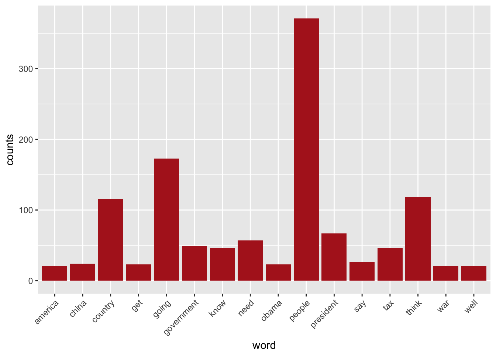


```r
dem_bar <- cand_counts %>% 
  filter(party == "democrats", counts > 25) %>% #filter first
  ggplot(aes(x = word, y = counts)) # set up x/y axes
dem_bar <- dem_bar + geom_bar(stat = "identity", fill = "dodgerblue") 
dem_bar <- dem_bar + theme(axis.text.x=element_text(angle=45, hjust=1)) 
dem_bar
```

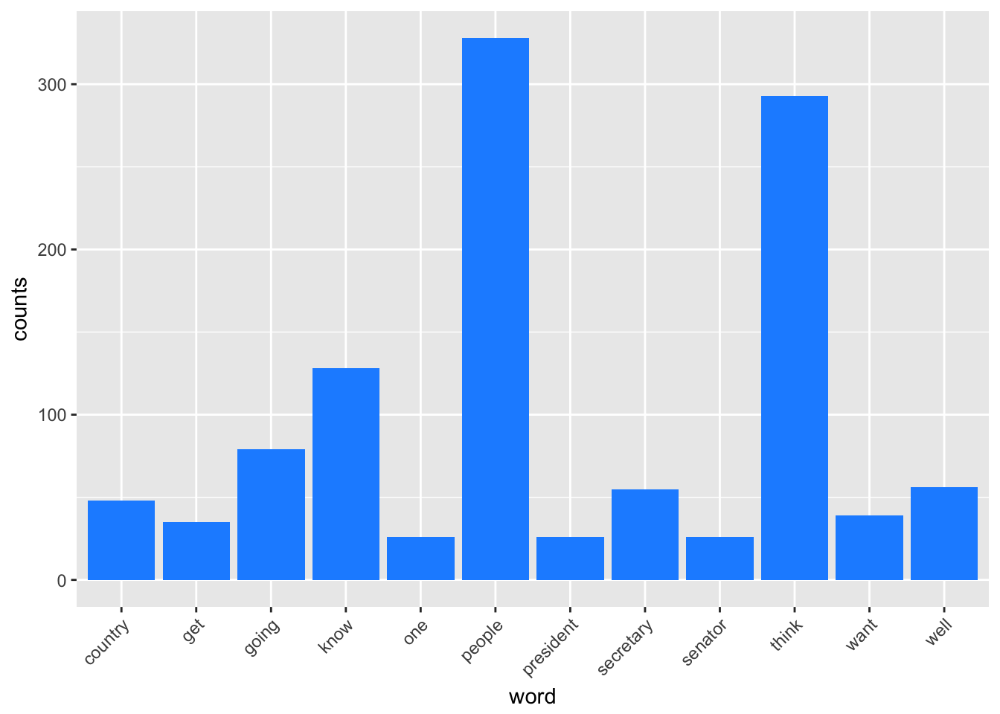

# Characteristic words for each candidate 

Step 1: load my function for calculating log-likelihood. You'll need to update the file path here


```r
source("log-likelihood.R")
```

Step 2: need to tidy our data


```r
# library(tidyr)
to_ll <- debates %>% select(speaker, word, counts) %>% group_by(word, speaker) %>% 
    summarise(count_sum = sum(counts)) %>% spread(speaker, count_sum) %>% select(2:15, 
    word = word)
to_ll[is.na(to_ll)] <- 0
```

Step 3: run the log likelihood function! Input: `to_ll` dataframe


```r
# FYI: this takes a while.
from_ll <- LL(to_ll, threshold = 25, sig.level = 10.83)
```

```
Error in if (speaker.word == 0) speaker.word <- 1e-04: argument is of length zero
```

Step 4: take the `from_ll` dataframe as output, and rank by speakers, keep only the top 25, and those in our "in" groups for each party

```r
top10_by_speaker <- from_ll %>% group_by(speaker) %>% arrange(desc(LL)) %>% 
    mutate(num_rank = percent_rank(LL), row_rank = row_number(desc(num_rank))) %>% 
    filter(LL > 0, row_rank < 11, speaker %in% c(gop_in, dem_in))
```

```
Error in eval(expr, envir, enclos): object 'from_ll' not found
```

Step 4: plot it!

```r
ggplot(top10_by_speaker, aes(x = speaker, y = row_rank)) + geom_label(aes(label = top10_by_speaker$word, 
    fill = top10_by_speaker$speaker), color = "white", fontface = "bold", size = 5) + 
    theme_bw() + theme(legend.position = 1, plot.title = element_text(size = 18), 
    axis.title.y = element_text(margin = margin(0, 10, 0, 0))) + labs(title = "Most Characteristic Words/Phrases per Person") + 
    xlab("") + ylab("Ranking") + scale_fill_manual(values = beyonce_palette(74)) + 
    annotation_custom(cartman, xmin = 0.5, xmax = 1.5, ymin = 0, ymax = -4) + 
    annotation_custom(stan, xmin = 1.5, xmax = 2.5, ymin = 0, ymax = -4) + annotation_custom(kyle, 
    xmin = 2.5, xmax = 3.5, ymin = 0, ymax = -4) + annotation_custom(kenny, 
    xmin = 3.5, xmax = 4.5, ymin = 0, ymax = -4) + annotation_custom(butters, 
    xmin = 4.5, xmax = 5.5, ymin = 0, ymax = -4) + annotation_custom(randy, 
    xmin = 5.5, xmax = 6.5, ymin = 0, ymax = -4)
```

```
Error in ggplot(top10_by_speaker, aes(x = speaker, y = row_rank)): object 'top10_by_speaker' not found
```


# Word length

boxplots of average word length per GOP candidate across debates 


```r
cand_counts <- cand_counts %>% select(counts, everything())
expand_counts <- cand_counts[rep(row.names(cand_counts), cand_counts$counts), 
    2:9]
```


```r
gop_word_length <- ggplot(data = subset(in_cands, party == "republicans"), aes(x = reorder(speaker, 
    avg_length), y = avg_length, colour = speaker)) + geom_boxplot(show.legend = FALSE, 
    outlier.size = 3) + scale_colour_manual(values = beyonce_palette(74)) + 
    scale_x_discrete(name = "") + scale_y_continuous(name = "average word length") + 
    coord_flip()
gop_word_length
```

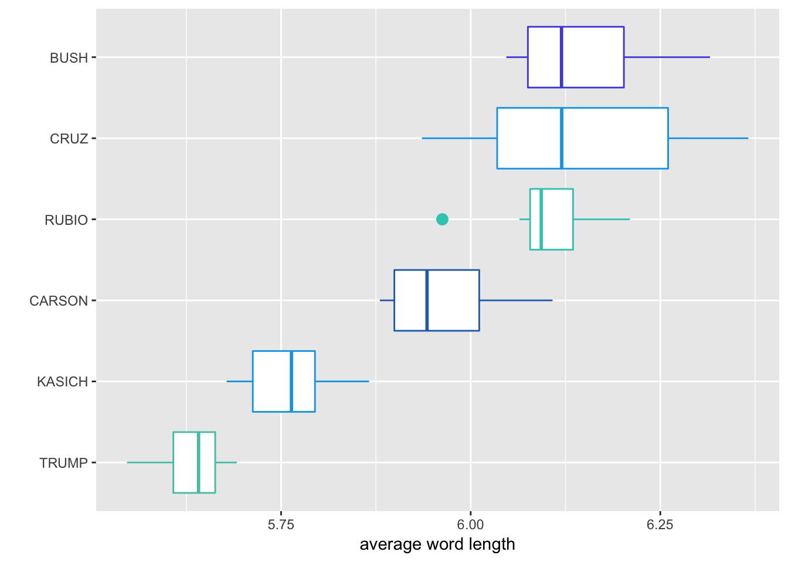


let's add a layer of points on top


```r
gop_word_length + geom_point(size = 3, show.legend = FALSE)
```

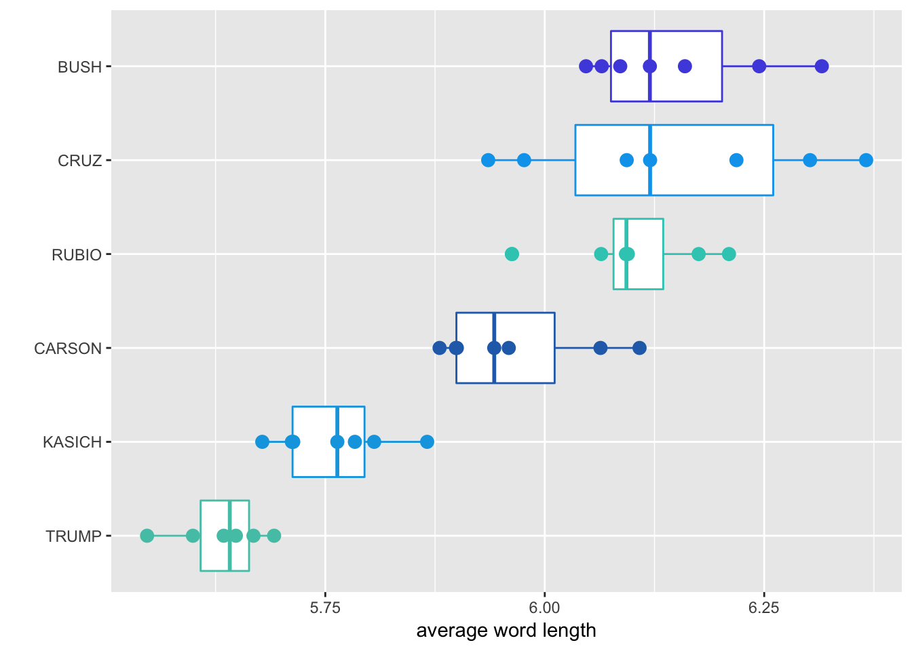


hard to see overlapping points though, add jitter and alpha for transparency


```r
gop_word_length + geom_jitter(size = 3, alpha = 0.5, show.legend = FALSE, width = 0.3, 
    height = 0)
```

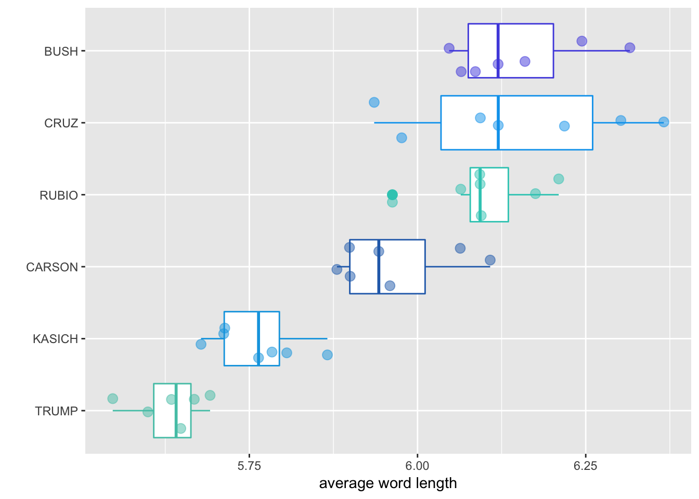


note: Trump is missing in debate 5

# Syllables per word

of total words spoken, what percent were 2-3-4-5+ syllable words

```r
ggplot(cand_counts, aes(x = syl_count, y = counts)) + geom_bar(stat = "identity") + 
    facet_wrap(~speaker)
```

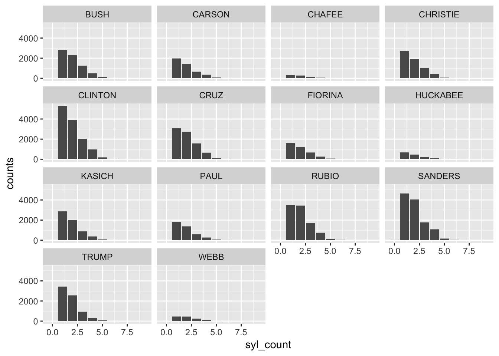


# Type/token ratio

Aesthetics I need: color/group by speaker; ttr on y-axis; debate number on x-axis
The geom I want: lines


```r
# install.packages('ggthemes') library(ggthemes)
ttr_plot <- ggplot(in_cands, aes(x = debate_num, y = ttr, color = speaker, group = speaker)) + 
    geom_line(lwd = 2) + geom_point(size = 3) + scale_colour_hc(name = "candidate") + 
    scale_x_discrete(name = "debate number") + scale_y_continuous(name = "type-token ratio")
ttr_plot
```

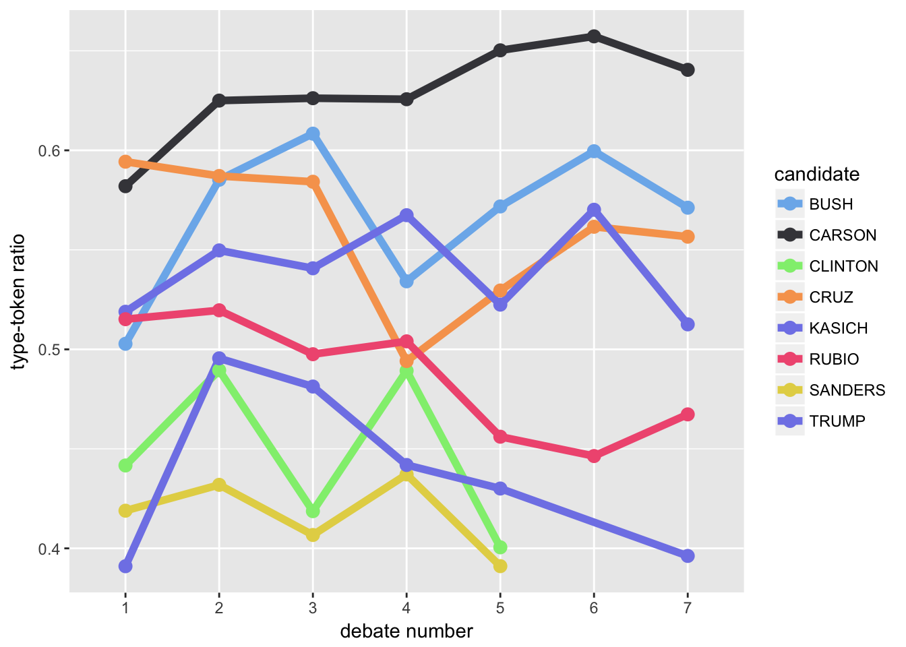


some extra fussing to add text labels and points, and themes, and change to date_time rather than debate number


```r
# need to rotate x-axis and expand x axis
library(ggrepel)
ggplot(in_cands, aes(x = factor(date_time), y = ttr, color = speaker, group = speaker)) + 
    geom_line(lwd = 1.5) + geom_point(size = 2.5) + scale_colour_hc(guide = FALSE) + 
    scale_x_discrete(name = "debate number") + scale_y_continuous(name = "type-token ratio") + 
    geom_text_repel(data = in_cands[in_cands$debate_num == 1, ], aes(label = speaker), 
        size = 4, show.legend = F) + theme_fivethirtyeight()
```

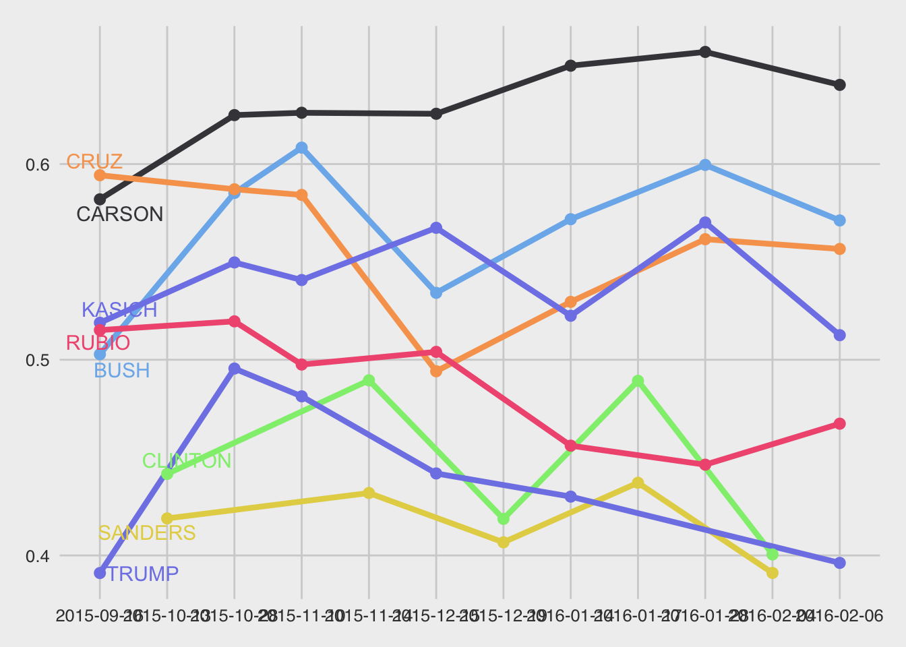


or add a geom_jitter


```r
ggplot(in_cands, aes(x = speaker, y = ttr, color = speaker, group = speaker)) + 
    geom_jitter(size = 2.5, width = 0.5, height = 0, show.legend = F) + scale_colour_hc() + 
    scale_x_discrete(name = "debate number") + facet_wrap(~party, scales = "free_x") + 
    ggtitle("Per-debate type-token ratios by party and candidate") + theme_fivethirtyeight()
```

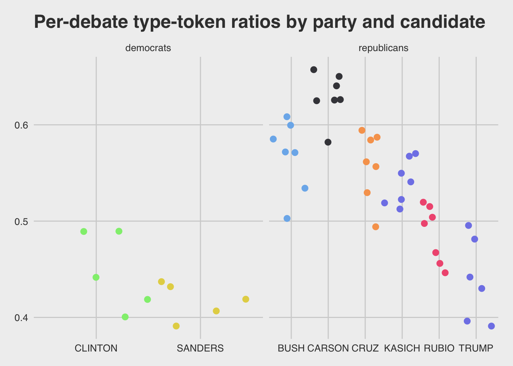


```r
cand_ts <- with(in_cands, xts(ttr, date_time))
dygraph(cand_ts)
```

<!--html_preserve--><div id="htmlwidget-0f47a7f270f89c8d266c" style="width:672px;height:480px;" class="dygraphs html-widget"></div>
<script type="application/json" data-for="htmlwidget-0f47a7f270f89c8d266c">{"x":{"attrs":{"labels":["second","V1"],"legend":"auto","retainDateWindow":false,"axes":{"x":{"pixelsPerLabel":60}}},"scale":"seconds","annotations":[],"shadings":[],"events":[],"format":"date","data":[["2015-09-16T00:00:00.000Z","2015-09-16T00:00:00.000Z","2015-09-16T00:00:00.000Z","2015-09-16T00:00:00.000Z","2015-09-16T00:00:00.000Z","2015-09-16T00:00:00.000Z","2015-10-13T00:00:00.000Z","2015-10-13T00:00:00.000Z","2015-10-28T00:00:00.000Z","2015-10-28T00:00:00.000Z","2015-10-28T00:00:00.000Z","2015-10-28T00:00:00.000Z","2015-10-28T00:00:00.000Z","2015-10-28T00:00:00.000Z","2015-11-10T00:00:00.000Z","2015-11-10T00:00:00.000Z","2015-11-10T00:00:00.000Z","2015-11-10T00:00:00.000Z","2015-11-10T00:00:00.000Z","2015-11-10T00:00:00.000Z","2015-11-14T00:00:00.000Z","2015-11-14T00:00:00.000Z","2015-12-15T00:00:00.000Z","2015-12-15T00:00:00.000Z","2015-12-15T00:00:00.000Z","2015-12-15T00:00:00.000Z","2015-12-15T00:00:00.000Z","2015-12-15T00:00:00.000Z","2015-12-19T00:00:00.000Z","2015-12-19T00:00:00.000Z","2016-01-14T00:00:00.000Z","2016-01-14T00:00:00.000Z","2016-01-14T00:00:00.000Z","2016-01-14T00:00:00.000Z","2016-01-14T00:00:00.000Z","2016-01-14T00:00:00.000Z","2016-01-17T00:00:00.000Z","2016-01-17T00:00:00.000Z","2016-01-28T00:00:00.000Z","2016-01-28T00:00:00.000Z","2016-01-28T00:00:00.000Z","2016-01-28T00:00:00.000Z","2016-01-28T00:00:00.000Z","2016-02-04T00:00:00.000Z","2016-02-04T00:00:00.000Z","2016-02-06T00:00:00.000Z","2016-02-06T00:00:00.000Z","2016-02-06T00:00:00.000Z","2016-02-06T00:00:00.000Z","2016-02-06T00:00:00.000Z","2016-02-06T00:00:00.000Z"],[0.50278940027894,0.581976112920738,0.594285714285714,0.518896833503575,0.515151515151515,0.39102932719954,0.441648590021692,0.418925344745602,0.585218702865762,0.625,0.587115666178624,0.549723756906077,0.519626168224299,0.495495495495495,0.608383233532934,0.626198083067093,0.584215591915303,0.540733197556008,0.497560975609756,0.481313703284258,0.489507299270073,0.431920199501247,0.534183082271147,0.62568306010929,0.494117647058824,0.567415730337079,0.504029304029304,0.441903019213175,0.418692228688805,0.406725380304243,0.571808510638298,0.650246305418719,0.529569892473118,0.52247191011236,0.45610278372591,0.430067314884069,0.489241803278689,0.437150837988827,0.599547511312217,0.657276995305164,0.561597281223449,0.57014157014157,0.446391030133146,0.400532268795742,0.391067166723491,0.571177504393673,0.640449438202247,0.556610169491525,0.512557077625571,0.467331118493909,0.396199859254046]]},"evals":[],"jsHooks":[]}</script><!--/html_preserve-->


# Say my name, say my name

let's see how many words each candidate used that referenced key democrats


```r
dems <- c("obama", "hillary", "bernie")
cand_counts %>% group_by(speaker) %>% filter(word %in% dems, party == "republicans")
```

```
Source: local data frame [93 x 9]
Groups: speaker [10]

   counts        date       party speaker_type  speaker    word  date_time
    <int>       <chr>       <chr>        <chr>    <chr>   <chr>     <date>
1       2 06 Feb 2016 republicans    candidate    TRUMP hillary 2016-02-06
2      10 06 Feb 2016 republicans    candidate     CRUZ   obama 2016-02-06
3       2 06 Feb 2016 republicans    candidate     CRUZ hillary 2016-02-06
4       1 06 Feb 2016 republicans    candidate CHRISTIE hillary 2016-02-06
5       7 06 Feb 2016 republicans    candidate    RUBIO hillary 2016-02-06
6       3 06 Feb 2016 republicans    candidate CHRISTIE   obama 2016-02-06
7       1 06 Feb 2016 republicans    candidate     BUSH hillary 2016-02-06
8       1 06 Feb 2016 republicans    candidate     CRUZ  bernie 2016-02-06
9       1 06 Feb 2016 republicans    candidate   CARSON hillary 2016-02-06
10      3 06 Feb 2016 republicans    candidate     BUSH   obama 2016-02-06
# ... with 83 more rows, and 2 more variables: word_length <int>,
#   syl_count <int>
```


but we are missing words like "obamacare"; let's try again


```r
dem_mentions <- cand_counts %>% mutate(obama = ifelse(str_detect(word, "obama"), 
    counts, 0), hillary = ifelse(str_detect(word, "hillary") | str_detect(word, 
    "secretary"), counts, 0), bernie = ifelse(str_detect(word, "sanders"), counts, 
    0)) %>% gather(key = mention_who, value = mention_count, obama:bernie) %>% 
    group_by(party, speaker, date_time, mention_who) %>% summarise(mention_sum = sum(mention_count)) %>% 
    mutate(mention_who = as.factor(mention_who))
dem_mentions
```

```
Source: local data frame [210 x 5]
Groups: party, speaker, date_time [70]

       party speaker  date_time mention_who mention_sum
       <chr>   <chr>     <date>      <fctr>       <dbl>
1  democrats  CHAFEE 2015-10-13      bernie           2
2  democrats  CHAFEE 2015-10-13     hillary           0
3  democrats  CHAFEE 2015-10-13       obama           1
4  democrats CLINTON 2015-10-13      bernie           5
5  democrats CLINTON 2015-10-13     hillary           5
6  democrats CLINTON 2015-10-13       obama          13
7  democrats CLINTON 2015-11-14      bernie           8
8  democrats CLINTON 2015-11-14     hillary           3
9  democrats CLINTON 2015-11-14       obama           3
10 democrats CLINTON 2015-12-19      bernie          10
# ... with 200 more rows
```


note assumptions I made about how GOPs refer by speaker to these folks
debate number on x, mentions on y


```r
library(wesanderson)  # for quirky colors
ggplot(data = subset(dem_mentions, party == "republicans"), aes(x = factor(date_time), 
    y = mention_sum, colour = mention_who, group = mention_who)) + geom_line() + 
    geom_point(size = 3) + facet_wrap(~speaker) + scale_colour_manual(values = wes_palette("Darjeeling"), 
    name = "") + scale_x_discrete(name = "") + scale_y_continuous(name = "number of mentions")
```

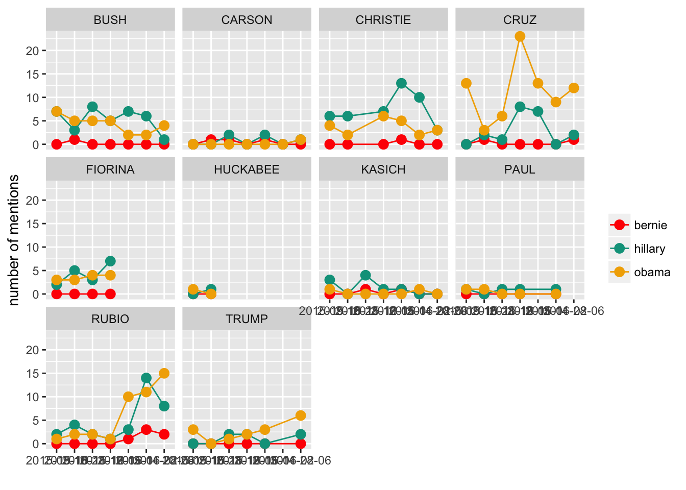


let's tidy this up a bit


```r
tidy_dem_mentions <- dem_mentions %>%
  right_join(cand_by_debate) %>% # dplyr merge 
  mutate(mention_prop = mention_sum/tokens) %>% # relative to that speakers' proportion of words
  filter(speaker %in% c(gop_in, dem_in)) 
```


```r
tidy_dem_mentions
```

```
Source: local data frame [153 x 16]
Groups: party, speaker, date_time [51]

       party speaker  date_time mention_who mention_sum debate_num
       <chr>   <chr>     <date>      <fctr>       <dbl>     <fctr>
1  democrats CLINTON 2015-10-13      bernie           5          1
2  democrats CLINTON 2015-10-13     hillary           5          1
3  democrats CLINTON 2015-10-13       obama          13          1
4  democrats CLINTON 2015-11-14      bernie           8          2
5  democrats CLINTON 2015-11-14     hillary           3          2
6  democrats CLINTON 2015-11-14       obama           3          2
7  democrats CLINTON 2015-12-19      bernie          10          3
8  democrats CLINTON 2015-12-19     hillary           2          3
9  democrats CLINTON 2015-12-19       obama           4          3
10 democrats CLINTON 2016-01-17      bernie          10          4
# ... with 143 more rows, and 10 more variables: tot_tokens <int>,
#   tot_speakers <int>, tokens <int>, types <int>, share_tokens <dbl>,
#   ttr <dbl>, avg_length <dbl>, avg_syl <dbl>, still_in <fctr>,
#   mention_prop <dbl>
```


date on x, mentions relative to total number of words spoken on y


```r
ggplot(data = subset(tidy_dem_mentions, party == "republicans"), aes(x = factor(date_time), 
    y = mention_prop, group = mention_who)) + geom_line(aes(colour = mention_who), 
    lwd = 2.5, alpha = 0.7) + geom_point(colour = "black", size = 1) + facet_wrap(~speaker) + 
    scale_colour_manual(values = wes_palette("Darjeeling"), name = "") + scale_x_discrete(name = "") + 
    scale_y_continuous(name = "mentions as proportion of total number of words spoken") + 
    theme_hc() + theme(axis.text.x = element_text(angle = 90, hjust = 1), axis.ticks = element_blank())
```

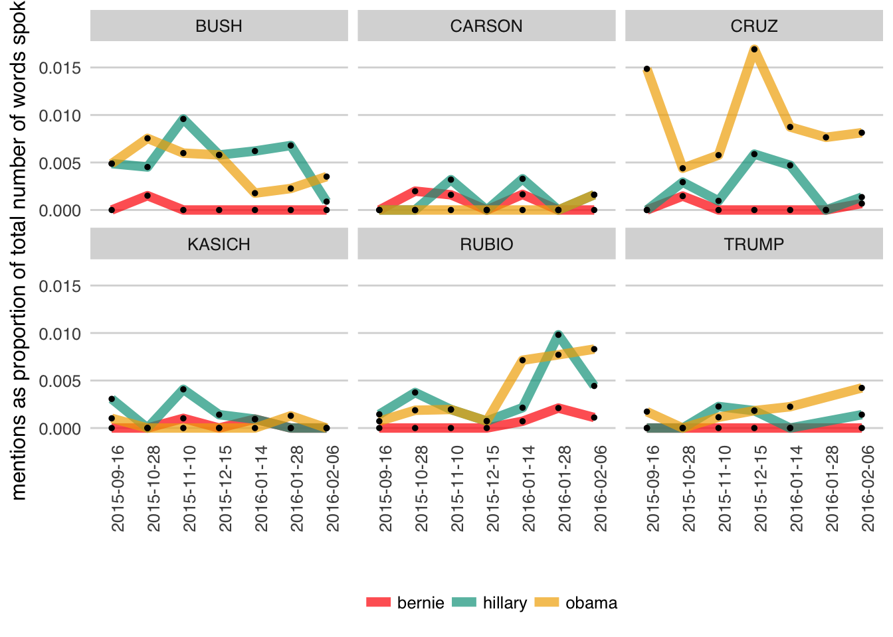


But let's face it, for the GOP the only person worth mentioning is...


```r
biggest_reagan_fan <- cand_counts %>% filter(party == "republicans" & speaker %in% 
    gop_in) %>% group_by(speaker, date_time) %>% mutate(reagan = ifelse(str_detect(word, 
    "reagan"), counts, 0)) %>% summarise(reagan_sum = sum(reagan))
biggest_reagan_fan
```

```
Source: local data frame [41 x 3]
Groups: speaker [?]

   speaker  date_time reagan_sum
     <chr>     <date>      <dbl>
1     BUSH 2015-09-16          5
2     BUSH 2015-10-28          0
3     BUSH 2015-11-10          2
4     BUSH 2015-12-15          1
5     BUSH 2016-01-14          0
6     BUSH 2016-01-28          1
7     BUSH 2016-02-06          2
8   CARSON 2015-09-16          2
9   CARSON 2015-10-28          1
10  CARSON 2015-11-10          0
# ... with 31 more rows
```


who is the biggest reagan fan?


```r
annotate <- ggplot2::annotate  # package tm masked this annotate command
ggplot(data = biggest_reagan_fan, aes(x = speaker, y = reagan_sum)) + geom_jitter(size = 4, 
    colour = "firebrick2", width = 0.6, height = 0.1, alpha = 0.8) + stat_summary(fun.y = sum, 
    fun.ymin = sum, fun.ymax = sum, geom = "crossbar", width = 0.6, colour = "dodgerblue") + 
    facet_wrap(~date_time, switch = "x", ncol = 6, scales = "free_x") + ggtitle("Which GOP candidate is the biggest Reagan fanboy?") + 
    theme_fivethirtyeight()
```

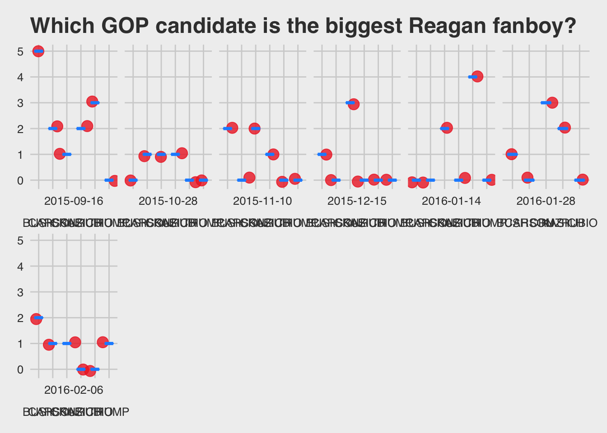


```r
mygop <- c("#0072B2", "#009E73", "#D55E00", "#CC79A7", "#F0E442", "#56B4E9")
tot_reagan <- biggest_reagan_fan %>% group_by(speaker) %>% summarise(tot_mentions = sum(reagan_sum))
gg <- ggplot(biggest_reagan_fan)
gg <- gg + geom_bar(aes(x = date_time, y = reagan_sum, fill = speaker), stat = "identity", 
    alpha = 0.8)
gg <- gg + scale_fill_manual(values = mygop)
gg <- gg + scale_y_continuous(expand = c(0, 0))
gg <- gg + facet_wrap(~speaker, switch = "x", ncol = 6, scales = "free_x")
gg <- gg + labs(x = NULL, y = NULL, title = "Reagan mentions")
gg <- gg + theme_fivethirtyeight()
gg <- gg + theme(panel.margin.x = unit(0.25, "cm"))
gg <- gg + theme(legend.position = "none")
gg <- gg + theme(panel.grid.major.x = element_blank())
gg
```

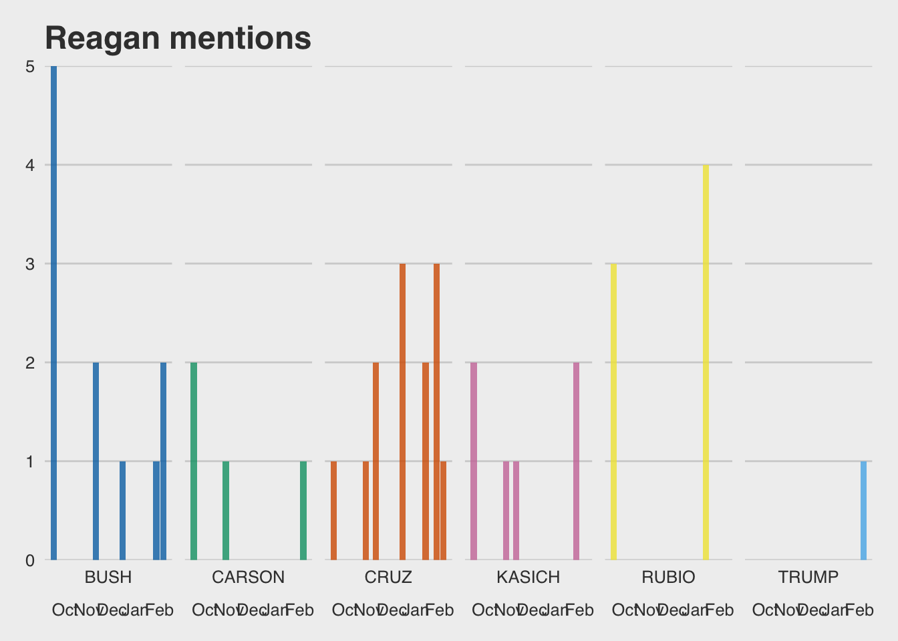

