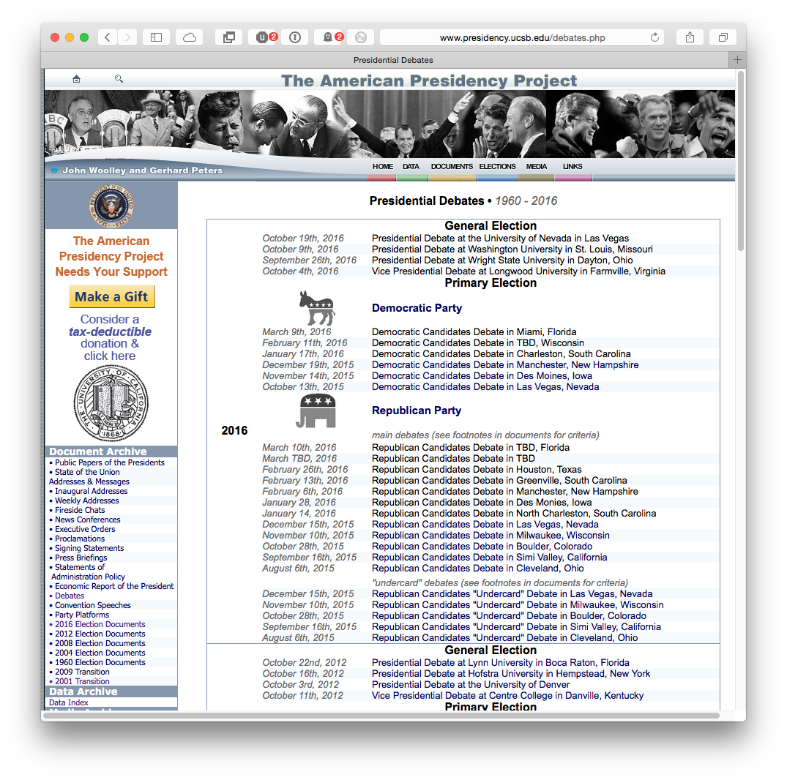

# Exploratory Data Analysis of Presidential Debate Language using Python and R

Many social science questions come down to some variation on: What do people say, and how do they say it? There are a lot of ways to approach these kinds of questions, including traditional content analysis and other qualitative research techniques. While extremely valuable, these techniques are time-consuming and often require substantial resources (both in terms of time and money) to "get right". Natural Language Processing is a branch of computer science focused on analyzing human language in a quantitative manner, and can be a useful tool in a wide variety of fields. 

A note on "subjectivity" vs. "objectivity": much noise is made about how much more "objective" computational techniques like natural language processing are than, say, manual content analysis, or a focus group. _This is largely untrue._ You will soon discover that there is a surprising amount of "wiggle room" when using NLP techniques, and it is unpleasantly easy for various biases to sneak into one's computational research. This is true both at the "micro" scale (which algorithms do you use, how do you apply them, etc.), but more also--- and more importantly--- at the "macro" scale, in terms of how one chooses which questions to ask, how to ask them, and what data to draw on for the answers. 

Rather than using "subjective" and "objective" as the yardsticks by which to differentiate computational linguistic analyses from traditional, manual analyses, think instead in terms of _reliability_. An automated analysis might be more or less biased than a manual analysis, depending on the details of how it's set up, but you _can_ be sure that the automated analysis will be more reliable (in the statistical sense of the word). In other words, if you run your program on the same data twice, you'll (generally) get the same answers each time.  Traditional qualitative research methodologies are largely about trying to achieve this sort of reliability in the face of inherently unreliable humans; sometimes it works, sometimes it doesn't.

Another advantage to computational analysis of language is that, if you suddenly get access to more more data, you can run your existing analytical pipeline on that new data, and, _ceteris paribus_, be assured that it will be applied in a consistent and repeatable manner. _That_, and the fact that your analysis can generally be run quickly and without the need to find more research assistants, is the major advantage to using computational methods for linguistic analysis over traditional techniques.

Note, however, that no computational technique, however convenient or sophisticated, can replace the need for you, the researcher, to _think about what you're doing_. You are always responsible for asking the right questions, choosing appropriate techniques, and interpreting their results in a contextually appropriate and meaningful way. Anybody who says anything different is trying to sell you something.

## -1. Getting ready

1. Install Python
2. Install a few packages:
    1. nltk
    2. requests
    3. beautifulsoup4
    4. matplotlib
    5. dateparser
    6. lxml
    7. networkx
3. Install R

Installing Python packages can be done from the command line:

`%> pip install nltk requests beautifulsoup4 dateparser lxml networkx`

You'll also need to download the CMU pronounciation dictionary for NLTK:

`%> python -m nltk.downloader cmudict`

And the Punkt sentence tokenizer:

`%> python -m nltk.downloader punkt`

And a list of English stopwords:

`%> python -m nltk.downloader dateparser`

## 0. Frame the question

We are interested in how language is used in presidential debates. Do Republicans talk about different things than Democrats? Does Candidate A say different things than Candidate B? 

Let's try and narrow things down a bit. Here are a few possible questions (_APH: let's work on tweaking this list as needed_):

1. Are the _topics_ discussed different between the two parties' debates? I.e., are Republicans and Democrats fundamentally talking about different subjects?
2. What about between candidates? Are some candidates talking about some topics more than others, or are they all basically talking about the same things?
3. Candidates referring to one another?
4. Speaking style. Is the language used by one party (or candidate) different in some way than the other party (or candidate)? This might mean:
    - Shorter/Longer words on average?
    - Shorter/Longer sentences on average?
    - More/less frequent words on average?
    - Certain words way more likely? (e.g., we might *a priori* think that "tremendous" would be far higher for Trump than anybody else)
    - Grammatical differences: more past tense? More present tense? More mentions of names?
5. Have any of the above _changed_ over the course of the debates?
6. What about the moderators? Some of the Republican candidates have gotten quite fussy about the moderators and their questions, and say that the Democratic candidates got "soft-ball" questions. Can we think of a way to look at that?

## 1. Wrangle some data

### Get that data

The [UCSB American Presidency Project](http://www.presidency.ucsb.edu) archives a large number of documents related to presidents: their speeches, their executive orders, and so on. It also archives documents related to presidential campaigns, including [debates](http://www.presidency.ucsb.edu/debates.php). For example, [here](http://www.presidency.ucsb.edu/ws/index.php?pid=111178) is a link to the Democratic party's debate from December 19, 2015. 

Looking at this page, we can immediately see that there are a large number of debate transcripts, so we'll want to narrow things down a bit. Let's take the four most recent debates from both the Democratic and Republican candidates.

### Extract the text
### Organize it by speaker
### Tokenization
### Normalization
#### Stop-words
#### Digits?
#### Names?

## 2. Start answering questions

- Maybe repeat the Trump syllable analysis?
- Jaccard overlap for self-similarity w/in politicians- does Marco Rubio stand out?
    - Also, plot over time and see if self-similarity changes